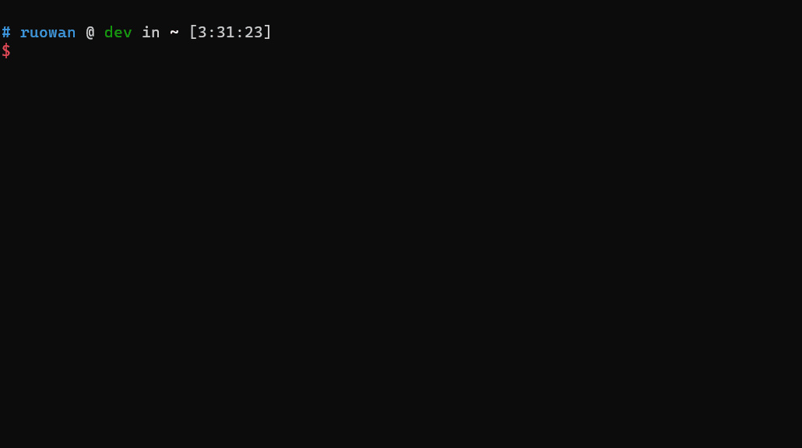

# Generate a basic API scenario file

## Prerequisite

We use `oav` tools to generate basic API scenario. `oav` analyze swagger file and use swagger example as API scenario steps. So first, you need to install the latest oav.

## Introduction

`oav` support rule based API scenario file generation. We use this command to generate API scenario file.

`oav generate-static-api-scenario --readme <readme> --tag <tag> --rules <generated-rules>`

- readme: swagger readme file.
- tag: which tag to generate. oav will analyze swagger file under the tag and generate API scenario.
- rules: Currently support two types. `resource-put-delete`, `operations-list`. Default: `resource-put-delete`
  - `resource-put-delete`: generate resource put and delete API scenario.
  - `operations-list`: generate operations list API scenario. `operations-list` is the simplest API which must be defined in swagger.

Example:



This command will load and analyze swagger and generate a basic API scenario file (`resource-put-delete`).

Result: the output contains two files

- scenarios/signalR.yaml: The API scenario file.
- readme.test.md: The entry for SDK test generation

The generated API scenario file: The generated API scenario file contains two steps. Create signalR and delete it. It's a basic API scenario and developer can add more step based on the basic API scenario file.

```
scope: ResourceGroup
testScenarios:
  - description: Microsoft.SignalRService/signalR SignalR_CreateOrUpdate
    steps:
      - step: SignalR_CreateOrUpdate
        exampleFile: ../examples/SignalR_CreateOrUpdate.json
      - step: SignalR_Delete
        exampleFile: ../examples/SignalR_Delete.json
```

If you pass rule option `operations-list`, you will get such API scenario file.

```
scope: ResourceGroup
testScenarios:
  - description: operationsList
    steps:
      - step: operationsList
        exampleFile: ../examples/Operations_List.json

```

## Reference

- [oav](https://github.com/Azure/oav/tree/develop)
