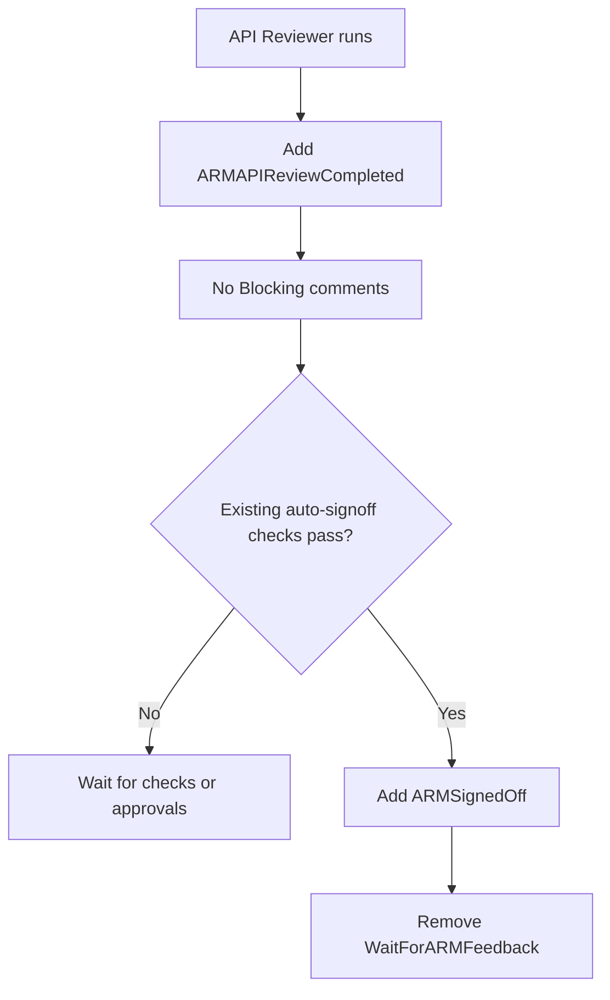
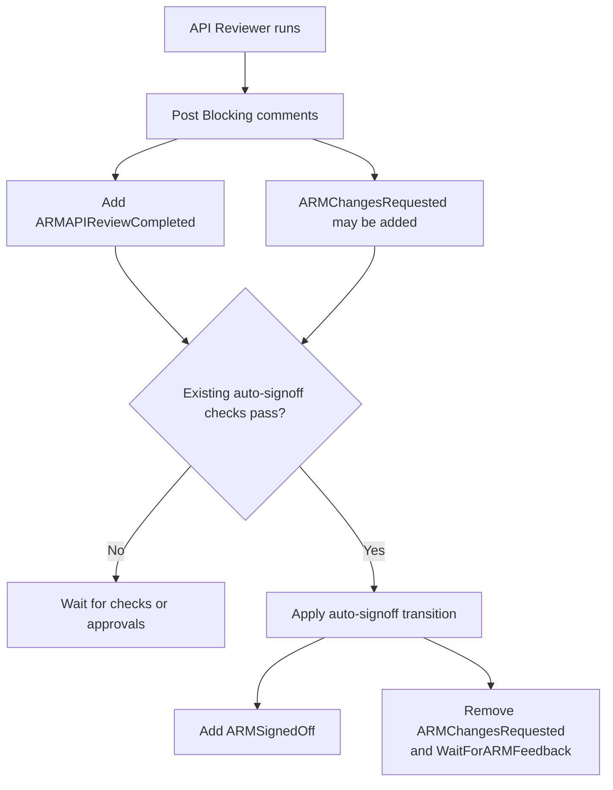
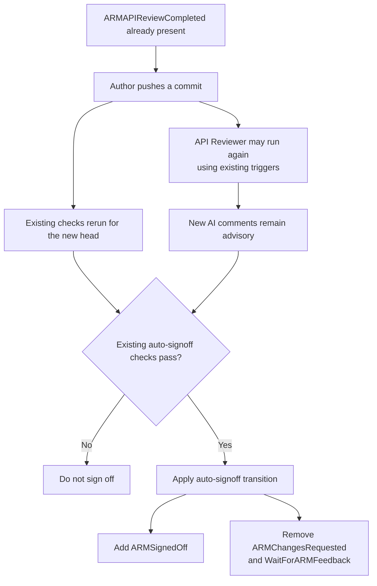

# ARM API Review and Auto-Signoff Coordination

## 1. Objective

Ensure the ARM API Reviewer completes before auto-signoff makes a decision.

For this phase, AI findings are advisory and do not block auto-signoff. The
team does not want AI comments to become an additional merge blocker yet.
The AI review can become a strict signoff requirement in the future.

## 2. Proposed design

Add one label:

```text
ARMAPIReviewCompleted
```

The API Reviewer adds the label whenever it completes a review.

The label means:

> The API Reviewer has completed at least one review for this PR.

It does not:

- approve the PR;
- stop the reviewer from running again; or
- make `ARMChangesRequested` an auto-signoff requirement.

No reviewed commit SHA needs to be stored because auto-signoff does not
distinguish current and stale AI findings.

## 3. Auto-signoff rules

Auto-signoff waits until `ARMAPIReviewCompleted` is present.

After that, it evaluates the existing deterministic and approval requirements:

- ARM review readiness;
- LintDiff and Avocado;
- breaking-change and versioning approvals;
- modeling and RPaaS requirements;
- suppression approval; and
- manual-signoff requirements.

`ARMChangesRequested` is not an auto-signoff input once
`ARMAPIReviewCompleted` is present.

When auto-signoff succeeds, it applies one label transition:

```text
Add:    ARMSignedOff
Remove: ARMChangesRequested
        WaitForARMFeedback
```

This makes the transition independent of `Summarize Checks`. Existing
`Summarize Checks` behavior remains a secondary reconciliation path.

## 4. Scenario 1: Review has no Blocking comments



**Result:** Auto-signoff runs only after AI review completion.

## 5. Scenario 2: Review has Blocking comments



**Result:** AI comments remain visible but advisory. They do not block
auto-signoff after the review completes.

## 6. Scenario 3: Author pushes another commit



**Result:** Later AI runs do not delay or veto auto-signoff. Current
deterministic checks decide the outcome.

## 7. Workflow coordination

```text
ARM API Reviewer completes
        |
        v
ARMAPIReviewCompleted is added
        |
        v
Universal Auto-Signoff reevaluates
        |
        v
Existing deterministic and approval checks decide signoff
```

The handoff must use reviewer workflow completion, not only the label event,
because a label added with `GITHUB_TOKEN` may not trigger another workflow.

If a later reviewer run adds `ARMChangesRequested` after signoff, its workflow
completion triggers auto-signoff again. Auto-signoff preserves
`ARMSignedOff` and removes the advisory `ARMChangesRequested` label.

## 8. Required changes

1. Have the API Reviewer add `ARMAPIReviewCompleted` after review completion.
2. Trigger Universal Auto-Signoff when the reviewer workflow completes.
3. Require `ARMAPIReviewCompleted` before evaluating auto-signoff.
4. Keep `ARMChangesRequested` advisory and exclude it from auto-signoff
   eligibility.
5. Apply `ARMSignedOff` and remove `ARMChangesRequested` and
   `WaitForARMFeedback` in one auto-signoff transition.
6. Preserve every existing reviewer trigger and deterministic approval check.
7. Test the three scenarios above, including a later reviewer run that adds
   `ARMChangesRequested` after signoff.
8. Validate with `ARMAutoSignedOff-Test` before changing production behavior.
