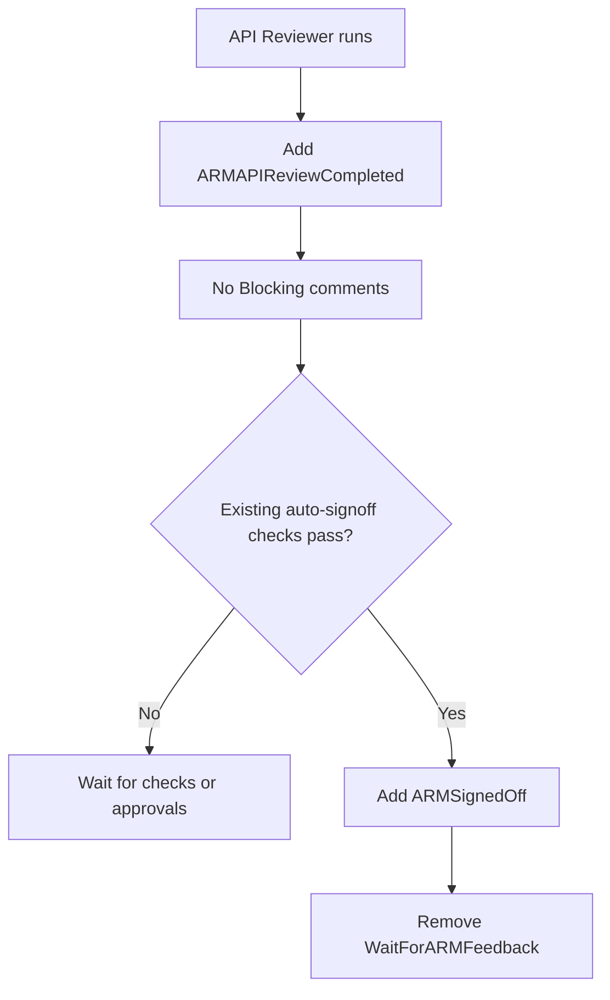
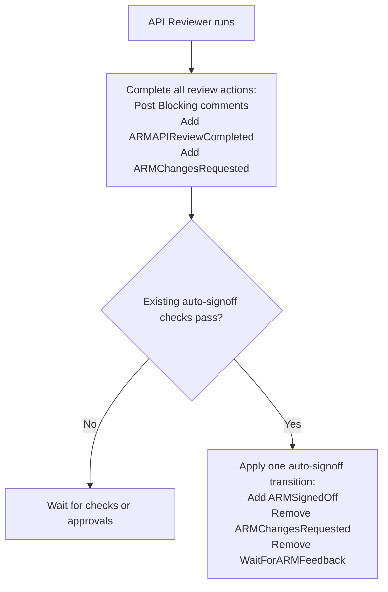
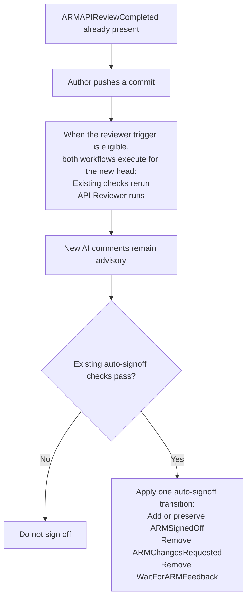

# ARM API Review and Auto-Signoff Coordination

## 1. Objective

Ensure the ARM API Reviewer completes before auto-signoff makes a decision.

For this phase, AI findings are advisory and do not block auto-signoff. The
team does not want AI comments to become an additional merge blocker yet.
The AI review can become a strict signoff requirement in the future.

## 2. Proposed design

Add one label:

```text
ARMAPIReviewCompleted
```

The API Reviewer adds the label whenever it completes a review.

The label means:

> The API Reviewer has completed at least one review for this PR.

It does not:

- approve the PR;
- stop the reviewer from running again; or
- make AI findings blocking.

## 3. Auto-signoff rules

Auto-signoff:

1. Waits until `ARMAPIReviewCompleted` is present.
2. Applies the existing deterministic, approval, and readiness checks.
3. Treats automated AI findings as advisory.

When all auto-signoff requirements pass, the workflow makes the following label
updates:

```text
Add:    ARMSignedOff
Remove: ARMChangesRequested
        WaitForARMFeedback
```

This makes the transition independent of `Summarize Checks`. Existing
`Summarize Checks` behavior remains a secondary reconciliation path.

## 4. Scenario 1: Review has no Blocking comments



**Result:** Auto-signoff runs only after AI review completion.

## 5. Scenario 2: Review has Blocking comments



**Result:** AI comments remain visible but advisory. They do not block
auto-signoff after the review completes.

## 6. Scenario 3: Author pushes and the reviewer runs again



**Result:** Later AI runs do not delay or veto auto-signoff. Current
deterministic checks decide the outcome.

## 7. Edge cases

| Edge case                                                                                                       | Handling                                                                                                 |
| --------------------------------------------------------------------------------------------------------------- | -------------------------------------------------------------------------------------------------------- |
| The reviewer adds `ARMAPIReviewCompleted` with `GITHUB_TOKEN`, so the label event does not trigger auto-signoff | Trigger Universal Auto-Signoff from the reviewer's `workflow_run: completed` event.                      |
| The first AI review has not completed                                                                           | `ARMAPIReviewCompleted` is absent, so auto-signoff waits.                                                |
| AI review and deterministic checks complete at different times                                                  | Each completion triggers reevaluation; signoff occurs only after AI completion and existing checks pass. |
| The reviewer adds `ARMChangesRequested`                                                                         | The finding remains advisory; successful auto-signoff removes the label.                                 |
| An explicit AI review adds `ARMChangesRequested` after signoff                                                  | Reviewer completion triggers auto-signoff again, which preserves signoff and removes the advisory label. |
| `Summarize Checks` fails                                                                                        | Auto-signoff performs its own label cleanup, so the final state does not depend on `Summarize Checks`.   |
| The AI reviewer fails before completing                                                                         | Do not add `ARMAPIReviewCompleted`; auto-signoff waits for a completed review.                           |
| `ARMAPIReviewCompleted` is added manually                                                                       | Require trusted reviewer workflow evidence before accepting the label.                                   |
| A stale workflow completes after the PR changes                                                                 | Re-fetch current PR labels and head statuses before applying signoff.                                    |

## 8. Required changes

1. Have the API Reviewer add `ARMAPIReviewCompleted` and publish a trusted
   PR-number artifact after review completion.
2. Add an `ARM API Review: Automated Workflow` `workflow_run: completed`
   trigger to Universal Auto-Signoff.
3. Use the PR-number artifact to fetch the PR's current labels and head
   statuses.
4. Require `ARMAPIReviewCompleted` before evaluating auto-signoff.
5. Keep `ARMChangesRequested` advisory and exclude it from auto-signoff
   eligibility.
6. Apply `ARMSignedOff` and remove `ARMChangesRequested` and
   `WaitForARMFeedback` in one auto-signoff transition.
7. Preserve every existing reviewer trigger and deterministic approval check.
8. Test the three scenarios above, including a later reviewer run that adds
   `ARMChangesRequested` after signoff.
9. Validate with `ARMAutoSignedOff-Test` before changing production behavior.
