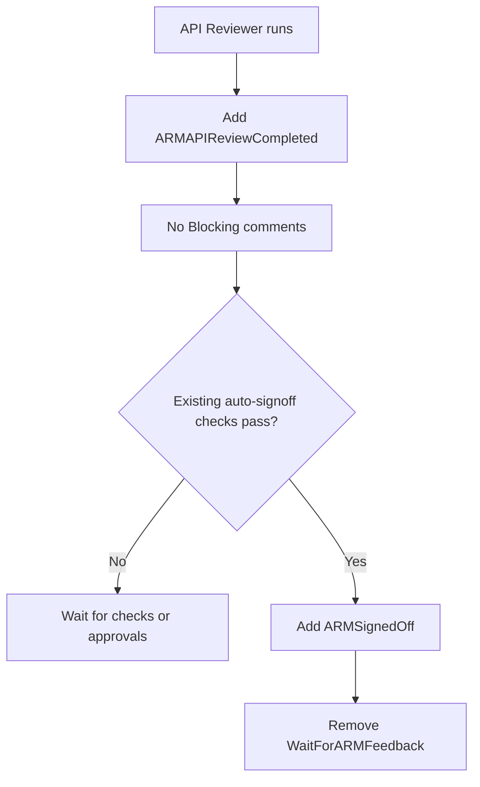
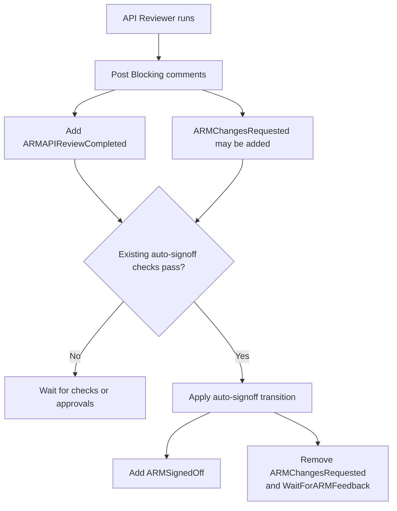
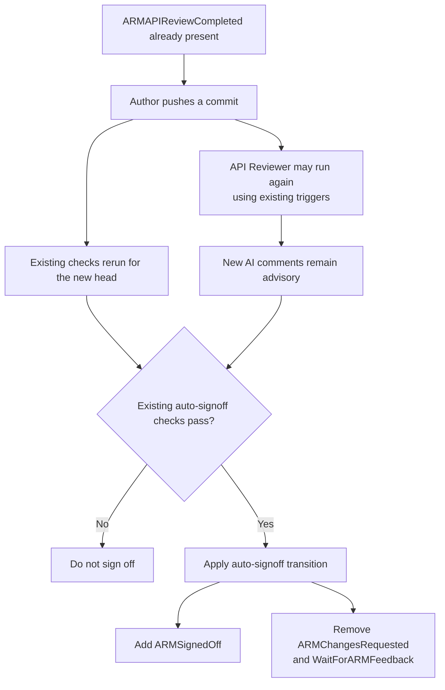
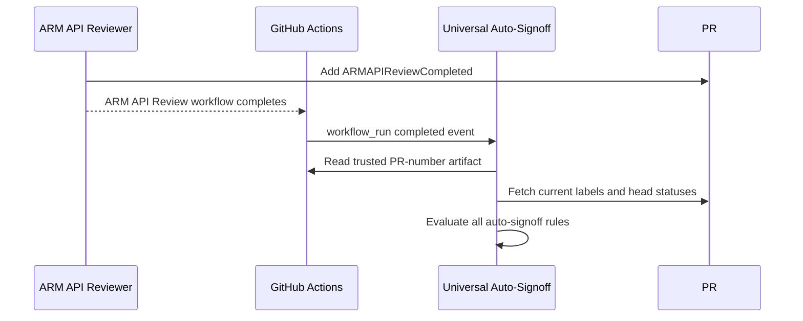

# ARM API Review and Auto-Signoff Coordination

## 1. Objective

Ensure the ARM API Reviewer completes before auto-signoff makes a decision.

For this phase, AI findings are advisory and do not block auto-signoff. The
team does not want AI comments to become an additional merge blocker yet.
The AI review can become a strict signoff requirement in the future.

## 2. Proposed design

Add one label:

```text
ARMAPIReviewCompleted
```

The API Reviewer adds the label whenever it completes a review.

The label means:

> The API Reviewer has completed at least one review for this PR.

It does not:

- approve the PR;
- stop the reviewer from running again; or
- make `ARMChangesRequested` an auto-signoff requirement.

No reviewed commit SHA needs to be stored because auto-signoff does not
distinguish current and stale AI findings.

## 3. Auto-signoff rules

Auto-signoff is eligible only when all of these conditions are true:

1. `ARMAPIReviewCompleted` is present.
2. `ARMReview` is present.
3. `NotReadyForARMReview` is absent.
4. `ARMManualSignoffRequired` is absent.
5. If `SuppressionReviewRequired` is present, `Approved-Suppression` is also
   present.
6. The latest `Swagger LintDiff` status on the current PR head is successful.
7. The latest `Swagger Avocado` status on the current PR head is successful.

`ARMChangesRequested` is advisory and does not affect eligibility after
`ARMAPIReviewCompleted` is present.

When auto-signoff succeeds, it applies one label transition:

```text
Add:    ARMSignedOff
Remove: ARMChangesRequested
        WaitForARMFeedback
```

This makes the transition independent of `Summarize Checks`. Existing
`Summarize Checks` behavior remains a secondary reconciliation path.

## 4. Scenario 1: Review has no Blocking comments



**Result:** Auto-signoff runs only after AI review completion.

## 5. Scenario 2: Review has Blocking comments



**Result:** AI comments remain visible but advisory. They do not block
auto-signoff after the review completes.

## 6. Scenario 3: Author pushes another commit



**Result:** Later AI runs do not delay or veto auto-signoff. Current
deterministic checks decide the outcome.

## 7. Workflow coordination



The `ARMAPIReviewCompleted` label stores state but does not trigger the
auto-signoff workflow. A label added with `GITHUB_TOKEN` normally does not
start another workflow.

Universal Auto-Signoff instead adds this trigger:

```yaml
workflow_run:
  workflows: ["ARM API Review: Automated Workflow"]
  types: [completed]
```

The API Reviewer publishes the target PR number as a trusted workflow artifact.
Universal Auto-Signoff reads that artifact from the completed run, fetches the
PR's current labels and head statuses, and then evaluates the rules in
Section 3. This supports reviewer runs started by PR events, `/arm-review`, or
manual dispatch without relying on a label-generated event.

If a later reviewer run adds `ARMChangesRequested` after signoff, its workflow
completion triggers auto-signoff again. Auto-signoff preserves
`ARMSignedOff` and removes the advisory `ARMChangesRequested` label.

## 8. Required changes

1. Have the API Reviewer add `ARMAPIReviewCompleted` and publish a trusted
   PR-number artifact after review completion.
2. Add an `ARM API Review: Automated Workflow` `workflow_run: completed`
   trigger to Universal Auto-Signoff.
3. Use the PR-number artifact to fetch the PR's current labels and head
   statuses.
4. Require `ARMAPIReviewCompleted` before evaluating auto-signoff.
5. Keep `ARMChangesRequested` advisory and exclude it from auto-signoff
   eligibility.
6. Apply `ARMSignedOff` and remove `ARMChangesRequested` and
   `WaitForARMFeedback` in one auto-signoff transition.
7. Preserve every existing reviewer trigger and deterministic approval check.
8. Test the three scenarios above, including a later reviewer run that adds
   `ARMChangesRequested` after signoff.
9. Validate with `ARMAutoSignedOff-Test` before changing production behavior.
