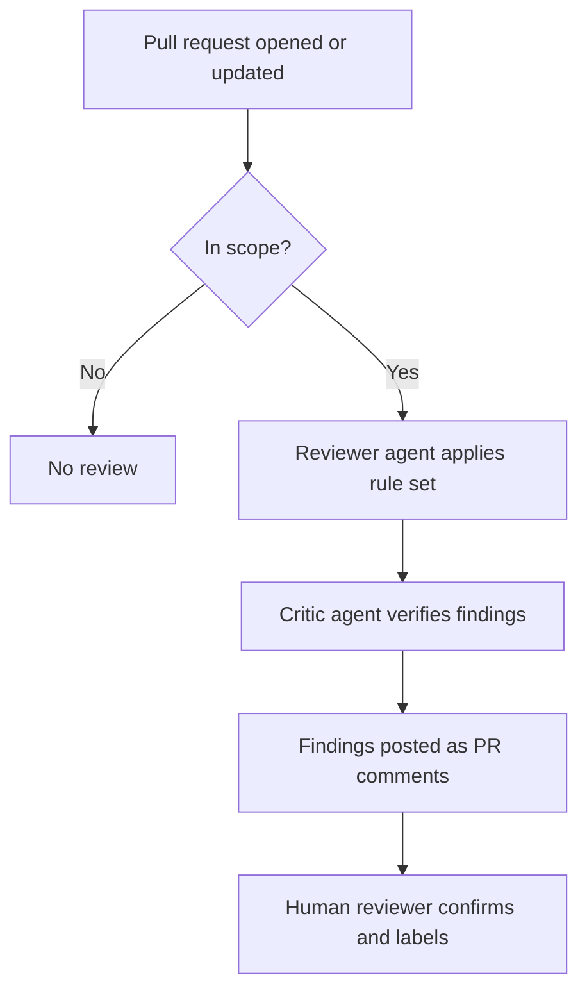

<!-- cspell:words MSRC skipToken tspconfig -->

# ARM API Reviewer: impact and current state

The [ARM API Reviewer agent](api-reviewer-agent.md) reviews Azure Resource
Manager API specifications against the Azure REST API Guidelines and the ARM
Resource Provider Contract. It runs automatically on pull requests in
`Azure/azure-rest-api-specs` and `Azure/azure-rest-api-specs-pr`, and on demand
from VS Code.

This page reports what the agent has done since it was introduced, how its
feedback compares with human review, and what is still being improved. Every
figure is drawn from pull request data in the two specification repositories.

**Contents**

- [At a glance](#at-a-glance)
- [How a review runs](#how-a-review-runs)
- [Reach](#reach)
- [What the agent finds](#what-the-agent-finds)
- [Compared with human review](#compared-with-human-review)
- [Delivering on the documented scope](#delivering-on-the-documented-scope)
- [What a review costs](#what-a-review-costs)
- [Known limitations and planned work](#known-limitations-and-planned-work)
- [How these numbers were produced](#how-these-numbers-were-produced)

---

## At a glance

Since **22 April 2026**, across both specification repositories:

| Measure                | Value |
| ---------------------- | ----: |
| Review comments posted | 2,896 |
| Distinct findings      | 2,024 |
| Pull requests reviewed |   412 |
| Developers reached     |   288 |
| Resource providers     |   119 |
| Service areas          |   140 |
| Blocking findings      |   472 |
| Security findings      |    68 |

Three points summarize the impact:

- **Reviews arrive in minutes, not days.** An automated review completes in a
  median of 14 minutes, and 91 percent finish within 30 minutes.
- **Feedback shifted toward design.** Comparing May through July year over year,
  contract-risk issues rose from 22 percent of review feedback to 56 percent.
- **Authors get more signal per pull request.** An agent-reviewed change
  received 8.4 review items on average, against 3.7 for human-only review the
  year before. Counting design feedback alone, 7.3 against 3.3.

---

## How a review runs

The agent proposes; a person decides. Findings are posted as ordinary pull
request comments that an author can accept, question, or reject. Label changes
and sign-off remain with the human reviewer.

A second agent, the Critic, independently re-verifies each finding against the
specification before it is posted. Its purpose is precision: a wrong comment on
a public pull request costs more than a missed one.

---

## Reach

| Measure                                 | Value |
| --------------------------------------- | ----: |
| Repositories                            |     2 |
| Pull requests reviewed                  |   412 |
| ... in `azure-rest-api-specs`           |   216 |
| ... in `azure-rest-api-specs-pr`        |   196 |
| Pull requests with at least one finding |   343 |
| Distinct pull request authors           |   288 |
| Resource providers                      |   119 |
| Service areas                           |   140 |

**Adoption is broad rather than concentrated.** Of the 288 developers whose pull
requests the agent reviewed, 212 appear only once. This is a large population of
occasional contributors, which is exactly the group that benefits most from
consistent, immediate guidance.

**A review that finds nothing is a useful result.** 69 of the 412 pull requests
were reviewed with no finding raised. On a clean change that is the correct
outcome, and it gives the author early confidence rather than a wait.

---

## What the agent finds

### By severity

| Severity   | Findings | Share |                      |
| ---------- | -------: | ----: | -------------------- |
| Blocking   |      472 | 23.3% | ███████████          |
| Warning    |      864 | 42.7% | ████████████████████ |
| Suggestion |      688 | 34.0% | ████████████████     |

Roughly one finding in four is blocking. The agent is not flooding authors with
must-fix items; most feedback is advisory.

### By issue type

| Issue type                     | Findings | Share |                      |
| ------------------------------ | -------: | ----: | -------------------- |
| Schema and property design     |      502 | 24.8% | ████████████████████ |
| Documentation and examples     |      221 | 10.9% | █████████            |
| Resource modeling              |      193 |  9.5% | ████████             |
| Suppressions and tooling       |      173 |  8.5% | ███████              |
| Long-running operations        |      162 |  8.0% | ██████               |
| Operations and HTTP semantics  |      156 |  7.7% | ██████               |
| Versioning and compatibility   |      154 |  7.6% | ██████               |
| Naming, enums, and identifiers |       80 |  4.0% | ███                  |
| Security and secrets           |       68 |  3.4% | ███                  |
| SDK and client impact          |       20 |  1.0% | █                    |
| Review readiness and CI        |        4 |  0.2% | █                    |

Categories cover 86 percent of findings. The remainder are left uncategorized
rather than assigned by guesswork.

### Contract risk

**665 findings** concern issues that are expensive to correct after an API
version ships: resource modeling, versioning and compatibility, HTTP semantics,
and long-running operations. **222 were blocking**, across **229 pull requests**.

These are the findings that justify the agent. A naming inconsistency can be
fixed in the next version. A resource model that cannot be extended, or a
breaking change shipped into a stable version, cannot.

### Security

**68 findings** concerned secrets, credentials, or write-only data exposure.
**32 were blocking**, spanning **46 pull requests** across **21 resource
providers**.

> [!NOTE]
> **Example.** Pull request #44639 remediated an active MSRC case. The agent
> flagged that the remediation itself placed credential-bearing iSCSI CHAP data
> on a new response path. A security fix that introduced a second exposure was
> caught before it merged.

This count is a floor. It includes only findings whose rule or title is
explicitly about secrets or credentials; genuine security issues may sit among
the uncategorized findings.

---

## Compared with human review

To measure the difference the agent makes, we compared two matched three-month
windows: **May through July 2025**, when review was human-only, against **May
through July 2026**, with the agent running.

### Volume of design feedback

| Measure                    | Human 2025 | Agent 2026 |
| -------------------------- | ---------: | ---------: |
| Changes reviewed           |        529 |        259 |
| Design findings per change |        3.3 |        5.2 |
| All findings per change    |        3.7 |        5.7 |

The table above isolates each channel. In practice the reviewer works alongside
the agent, so an author on an agent-reviewed change receives both:

| Feedback on one change | Human 2025 | Agent-reviewed 2026 |
| ---------------------- | ---------: | ------------------: |
| All review items       |        3.7 |                 8.4 |
| Design items only      |        3.3 |                 7.3 |

The agent contributes 5.2 design items of that total; the rest comes from the
human reviewer, who is still reading the same change.

### Where the feedback is aimed

This is the more important result. The mix of feedback changed, not just the
volume.

| Category                      | Human 2025 | Agent 2026 | Change |
| ----------------------------- | ---------: | ---------: | -----: |
| Schema and property design    |         78 |        132 |   1.7x |
| Resource modeling             |         29 |         96 |   3.2x |
| Versioning and compatibility  |         22 |         89 |   4.0x |
| Operations and HTTP semantics |         20 |         80 |   4.0x |
| Long-running operations       |         11 |         54 |   5.0x |
| Security and secrets          |          8 |         23 |   2.7x |
| Review readiness and CI       |         30 |         38 |   1.3x |
| Documentation and examples    |         39 |         21 |   0.5x |
| Naming, enums, identifiers    |         35 |         19 |   0.5x |

_Findings per 100 changes reviewed. Rates rather than raw counts, because the two
periods reviewed different volumes._

**Design and correctness categories rose. Polish categories fell.** Contract-risk
feedback went from **22 percent** of all review output to **56 percent**.

The agent has not stopped reporting documentation and naming issues. Since
April, documentation and examples is its second-largest category at 221
findings. What changed is emphasis: per change reviewed, more of the feedback
now addresses contract risk and less addresses polish.

> [!IMPORTANT]
> These comparisons are directional. Human comments are terse and
> context-dependent, so 23 percent of them resist categorization, against almost
> none of the agent's, which carry an explicit rule identifier. Those
> unclassified comments are excluded rather than redistributed, so the gaps shown
> are an upper bound. See [How these numbers were produced](#how-these-numbers-were-produced).

---

## Delivering on the documented scope

The [agent documentation](api-reviewer-agent.md) states what the agent reviews
and which rule areas it covers. Findings data confirms each claim.

### Files reviewed

| Documented scope         | Findings |
| ------------------------ | -------: |
| TypeSpec (`.tsp`)        |    1,096 |
| OpenAPI (Swagger) JSON   |      373 |
| `readme.md` suppressions |      154 |
| Example payloads         |      145 |
| `tspconfig.yaml`         |       13 |

Every file type in the documented scope has produced real findings. TypeSpec
leads, which matches the repository's ongoing migration from handwritten Swagger
to TypeSpec.

### Rule areas covered

| Documented rule area    | Observed findings |
| ----------------------- | ----------------: |
| ARM resources           |               193 |
| Suppressions            |               173 |
| Long-running operations |               162 |
| Versioning              |               154 |
| Naming                  |                80 |
| Security                |                68 |

_Counts are by issue category. TypeSpec is measured separately, by file, in the
table above, because TypeSpec findings span every category rather than forming
one of their own._

Every rule area named in the documentation is represented. The agent is
operating across its full stated scope rather than concentrating on a narrow
subset of easily detected issues.

---

## What a review costs

Each automated run records its own resource usage. These figures cover 126 runs
between 7 and 24 August 2026.

| Measure         |    Median |    Highest |
| --------------- | --------: | ---------: |
| Wall-clock time |    14 min |    126 min |
| AI credits      |       121 |        364 |
| Model requests  |        40 |        146 |
| Tokens          | 3,158,498 | 10,879,609 |

- **91 percent of reviews finish within 30 minutes**, and 53 percent within 15.
- **Cost scales with pull request size.** The range spans roughly 21 to 364
  credits. There is no single price per review, only a curve against how much
  changed.
- **Findings cost about 46 AI credits each**, based on the pull requests where
  run data and findings can be matched.

> [!NOTE]
> 95 percent of tokens consumed are cache reads, because the agent re-reads the
> same rule set on every run. Raw token counts therefore overstate the cost; AI
> credits are the meaningful unit.

---

## Known limitations and planned work

The agent is in active development. Known gaps are tracked as public issues.

### Current limitations

| Limitation                                | Impact                                                                                                                                                                                        | Tracking                                                             |
| ----------------------------------------- | --------------------------------------------------------------------------------------------------------------------------------------------------------------------------------------------- | -------------------------------------------------------------------- |
| Paging parameters on collection GET       | The agent can flag `$top` and `$skipToken` on LIST operations, although the ARM pagination contract sanctions them. The affected rule accounts for 18 findings, under 1 percent of the total. | [#45675](https://github.com/Azure/azure-rest-api-specs/issues/45675) |
| Attribution preamble is inconsistent      | The visible "posted by the agent" banner is sometimes missing, so authors may not immediately recognize a comment as automated.                                                               | [#45013](https://github.com/Azure/azure-rest-api-specs/issues/45013) |
| Label precedence after automated sign-off | A blocking finding raised after automated ARM sign-off can leave labels inconsistent with the open concern.                                                                                   | [#45397](https://github.com/Azure/azure-rest-api-specs/issues/45397) |
| Example payload severity calibration      | Unknown enum literals in examples can be over-flagged when the enum is extensible.                                                                                                            | [#43747](https://github.com/Azure/azure-rest-api-specs/issues/43747) |
| Occasional data-fetch retry loops         | A malformed shell command could be retried without changing approach, stalling a review.                                                                                                      | [#44356](https://github.com/Azure/azure-rest-api-specs/issues/44356) |

### Planned coverage

| Enhancement                                             | Tracking                                                             |
| ------------------------------------------------------- | -------------------------------------------------------------------- |
| Integrate the TypeSpec Suppression Review check         | [#44582](https://github.com/Azure/azure-rest-api-specs/issues/44582) |
| Expand `@extension(...)` enforcement in TypeSpec source | [#43359](https://github.com/Azure/azure-rest-api-specs/issues/43359) |
| Inspect `x-ms-skip-url-encoding` on path parameters     | [#43349](https://github.com/Azure/azure-rest-api-specs/issues/43349) |

### By design

The agent does not modify specification files, generate SDKs, author TypeSpec
projects, or fix CI failures. It reviews and reports; people decide. See
[Scope and Limitations](api-reviewer-agent.md#scope-and-limitations).

**Found something wrong?** Open an issue in
[Azure/azure-rest-api-specs](https://github.com/Azure/azure-rest-api-specs/issues/new)
with the pull request link and the comment. Reports of incorrect findings are
the most direct way to improve the agent.

---

## How these numbers were produced

**Sources.** All figures come from pull request comments and workflow run
records in `Azure/azure-rest-api-specs` and `Azure/azure-rest-api-specs-pr`.
Agent comments are identified by the hidden marker each one carries. No sampling
is used; every comment in the window is counted.

**Windows.** Three windows appear in this page and are not interchangeable:

| Window                   | Used for                     | Scope                                         |
| ------------------------ | ---------------------------- | --------------------------------------------- |
| 22 Apr - 24 Aug 2026     | Reach, findings, and scope   | Every agent review since introduction         |
| May - Jul, 2025 and 2026 | Comparison with human review | Matched three-month year-over-year comparison |
| 7 - 24 Aug 2026          | Review cost                  | Automated workflow runs, which began 7 August |

The comparison counts 259 agent-reviewed changes for May through July. The reach
figures count 412 pull requests since April. Both are correct; they measure
different periods and apply different de-duplication.

**Counting rules.**

- Findings are de-duplicated by pull request, rule, file, and heading, so
  repeat reviews of the same pull request are not double counted.
- Review summaries and follow-up replies are excluded; only actionable findings
  are counted.
- Findings are categorized by the rule identifier the agent cites, falling back
  to the finding title. Whole-comment keyword matching is deliberately not used,
  as it misclassifies findings whose text happens to mention a category term.

**Limits to keep in mind.**

- Categories cover 86 percent of agent findings and 77 percent of human
  comments. The uncategorized remainder is excluded, not redistributed.
- The year-over-year comparison spans two different years. Specification volume,
  service mix, and reviewer staffing all changed between them; the agent is not
  the only variable.
- AI credits are a billing unit, not a currency amount. Converting to cost
  depends on the applicable agreement.
- Cost figures cover the automated workflow only. Interactive reviews run on
  developer machines and do not emit usage records.

---

## Related resources

- [Using the ARM API Reviewer Agent](api-reviewer-agent.md) - setup, triggers,
  labels, and full scope
- [Azure REST API Guidelines](https://github.com/microsoft/api-guidelines/blob/vNext/azure/Guidelines.md)
- [Breaking changes guidelines](Breaking%20changes%20guidelines.md)
- [Uniform versioning](uniform-versioning.md)
