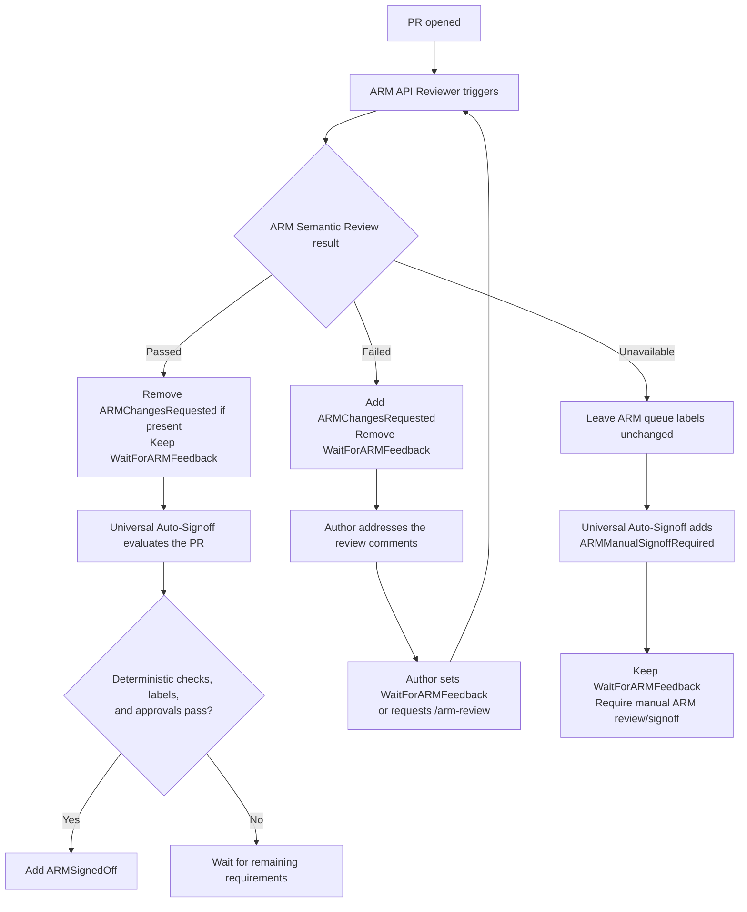

# ARM Semantic Review and Auto-Signoff

## Overview

The Universal ARM Auto-Signoff pilot decides whether a PR can be signed off
using deterministic checks, workflow labels, and required approvals. Checks
such as Swagger LintDiff and Swagger Avocado are well suited to this job: they
apply known rules consistently and catch issues that can be identified directly
from the specification or repository structure.

Deterministic checks do not cover every part of an ARM API review. They cannot
always determine the intent of an API change, whether a model accurately
represents service behavior, or whether a service-specific exception is
reasonable. These semantic and gray-area decisions still require context.

The ARM API Reviewer has been effective at finding these issues and giving
manual reviewers focused, actionable feedback. The goal of this design is to
bring that result into auto-signoff. A PR should be auto-signed off only when:

- the ARM API Reviewer completes a clean semantic review;
- the existing deterministic checks pass; and
- the required labels and approvals are in place.

This reduces routine manual review without allowing auto-signoff to bypass
semantic API design issues.

## ARM Semantic Review

The ARM API Reviewer continues to post comments as it does today. After each
run, it also publishes an `ARM Semantic Review` result for the exact commit it
reviewed. Universal Auto-Signoff uses this result to decide whether it can
continue.

- **Passed:** The full PR was reviewed and no Blocking issues were found.
- **Failed:** The reviewer found one or more verified Blocking issues.
- **Unavailable:** The review was scoped, incomplete, degraded, stale, or
  otherwise could not produce a reliable result.

Only Passed allows Universal Auto-Signoff to continue. Failed returns the PR to
the author. Unavailable keeps the PR in the manual ARM review queue and prevents
automatic signoff.

## Proposed flow

`WaitForARMFeedback` places the PR in the ARM review queue. Setting it after
addressing the comments starts the next review cycle. An authorized user can
also request a review with `/arm-review`.

Authors can make and push multiple fixes before returning the PR to the queue.
There is no review counter or retry limit.

## Stop automatic signoff

Add the `ARMManualSignoffRequired` label when a PR needs a human decision or
should not be signed off automatically.

While this label is present, Universal Auto-Signoff must not add
`ARMSignedOff`. After the manual review, the reviewer can remove the label to
return the PR to automatic signoff or complete the ARM signoff manually.

## Large and scoped reviews

The reviewer currently uses a scoped review when a PR changes more than 50
files under `specification/` or more than 5,000 specification lines. It reviews
the highest-risk subset and reports what was not covered.

The semantic result records:

- whether the review was **full** or **scoped**; and
- whether it completed normally or was **incomplete** or **degraded**.

A scoped review can be complete for the files it examined without covering the
whole PR. It therefore cannot produce a Passed result. The PR must be split,
reviewed again at full scope, or signed off manually.

## Failure and race handling

| Case                                             | Handling                                                                                                                 |
| ------------------------------------------------ | ------------------------------------------------------------------------------------------------------------------------ |
| LintDiff or Avocado finishes before the reviewer | Auto-signoff waits for the ARM Semantic Review result.                                                                   |
| The reviewer completes                           | A `workflow_run` handoff publishes the semantic result and starts auto-signoff reevaluation.                             |
| The PR changes after review                      | The previous result is ignored because it names a different commit.                                                      |
| A stale review finishes late                     | Its output is discarded after the workflow detects that the PR head changed.                                             |
| The PR changes after the signoff decision        | The label updater rechecks the live head before applying signoff.                                                        |
| A bot-added label does not start the reviewer    | Initial and repeat reviews continue to use the existing triggers; this design does not introduce another label handoff.  |
| The reviewer does not produce a valid result     | The result is Unavailable; auto-signoff adds `ARMManualSignoffRequired` and the PR remains in `WaitForARMFeedback`.      |
| The reviewer runs again after Unavailable        | A newer result may be published, but `ARMManualSignoffRequired` continues to block auto-signoff until manually resolved. |
