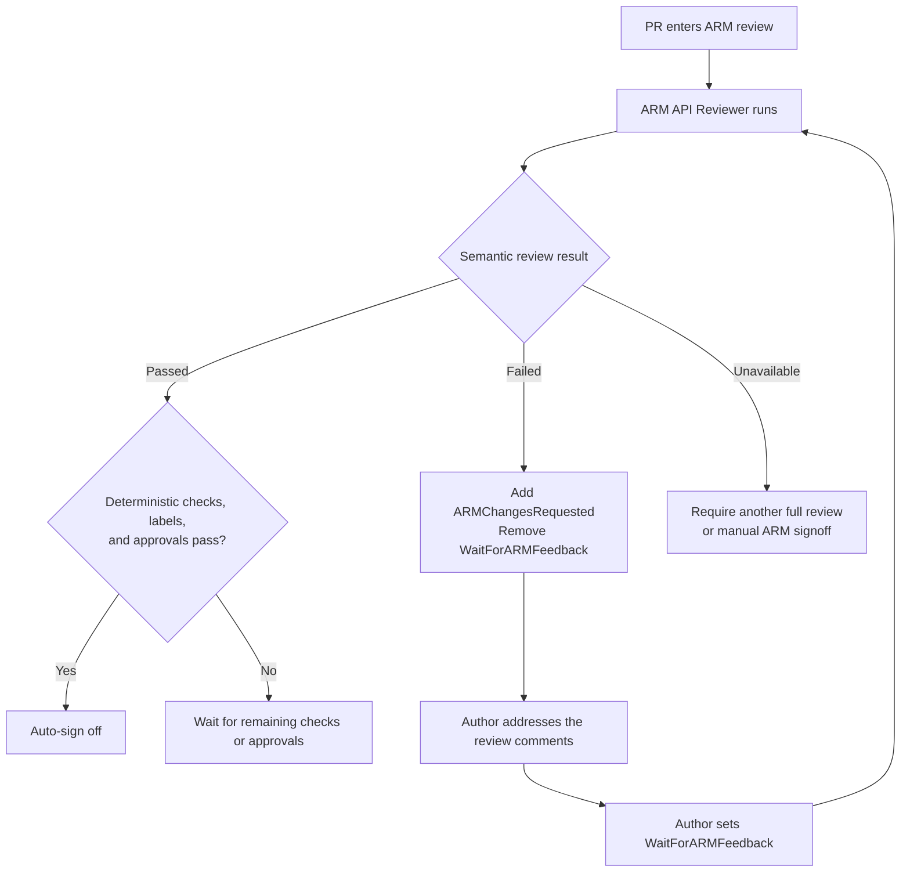

# ARM Semantic Review and Auto-Signoff

## Overview

The Universal ARM Auto-Signoff pilot decides whether a PR can be signed off
using deterministic checks, workflow labels, and required approvals. Checks
such as Swagger LintDiff and Swagger Avocado are well suited to this job: they
apply known rules consistently and catch issues that can be identified directly
from the specification or repository structure.

Deterministic checks do not cover every part of an ARM API review. They cannot
always determine the intent of an API change, whether a model accurately
represents service behavior, or whether a service-specific exception is
reasonable. These semantic and gray-area decisions still require context.

The ARM API Reviewer has been effective at finding these issues and giving
manual reviewers focused, actionable feedback. The goal of this design is to
bring that result into auto-signoff. A PR should be auto-signed off only when:

- the ARM API Reviewer completes a clean semantic review;
- the existing deterministic checks pass; and
- the required labels and approvals are in place.

This reduces routine manual review without allowing auto-signoff to bypass
semantic API design issues.

## ARM Semantic Review

`ARM Semantic Review` is the machine-readable outcome of the ARM API Reviewer
for the current PR head. It translates the reviewer's comments and execution
state into a result that auto-signoff can evaluate.

The result is one of:

- **Passed:** a full review completed and found no Blocking issues.
- **Failed:** the reviewer reported one or more Blocking issues.
- **Unavailable:** the review was scoped, incomplete, degraded, stale, or did
  not produce a trustworthy result.

Only **Passed** allows auto-signoff to continue. Failed and Unavailable results
require another review or manual ARM signoff.

## Proposed flow

`WaitForARMFeedback` places the PR in the ARM review queue. Setting it after
addressing the comments starts the next review cycle. An authorized user can
also request a review with `/arm-review`.

Authors can make and push multiple fixes before returning the PR to the queue.
There is no review counter or retry limit.

## Auto-signoff decision

Auto-signoff proceeds only when all three groups of requirements are satisfied:

### Semantic review

- ARM Semantic Review passed for the current PR head.
- `ARMChangesRequested` is absent.

### Deterministic validation

- Swagger LintDiff passed.
- Swagger Avocado passed.

### Workflow state and approvals

- The PR is ready for ARM review.
- Any required suppression or breaking-change approval is present.
- Manual ARM signoff is not required.

`ARMChangesRequested` remains a visible veto in addition to the semantic
result. This prevents label or workflow timing differences from allowing a PR
with unresolved Blocking feedback to be signed off.

## Large and scoped reviews

The reviewer currently uses a scoped review when a PR changes more than 50
files under `specification/` or more than 5,000 specification lines. It reviews
the highest-risk subset and reports what was not covered.

The semantic result records:

- whether the review was **full** or **scoped**; and
- whether it completed normally or was **incomplete** or **degraded**.

A scoped review can be complete for the files it examined without covering the
whole PR. It therefore cannot produce a Passed result. The PR must be split,
reviewed again at full scope, or signed off manually.

## Failure and race handling

| Case                                                | Handling                                                                                       |
| --------------------------------------------------- | ---------------------------------------------------------------------------------------------- |
| LintDiff or Avocado finishes before the reviewer    | Auto-signoff waits for the ARM Semantic Review result.                                         |
| The reviewer completes                              | A `workflow_run` handoff publishes the semantic result and triggers auto-signoff reevaluation. |
| The PR changes after review                         | The previous semantic result is ignored because it does not apply to the current head.         |
| A stale review finishes late                        | Its output is discarded after the workflow detects that the PR head changed.                   |
| The semantic result and labels disagree             | `ARMChangesRequested` vetoes signoff.                                                          |
| The PR changes after the signoff decision           | The label updater rechecks the live head before applying signoff.                              |
| A bot-added label does not trigger another workflow | The reviewer-to-signoff handoff uses `workflow_run`, not the label event.                      |
| The reviewer does not produce a valid result        | Missing, malformed, incomplete, or degraded evidence becomes Unavailable and fails closed.     |

## Implementation outline

1. Produce a structured reviewer result tied to the PR and reviewed head.
2. Add an `ARM Semantic Review` status workflow that consumes the reviewer
   result.
3. Require a Passed semantic result and the absence of
   `ARMChangesRequested` in Universal Auto-Signoff.
4. Keep the existing `WaitForARMFeedback` and `/arm-review` review paths.
5. Test clean, blocked, stale-head, scoped, incomplete, and repeated review
   cases.
6. Keep the integration pilot-only before changing `ARMSignedOff`.
