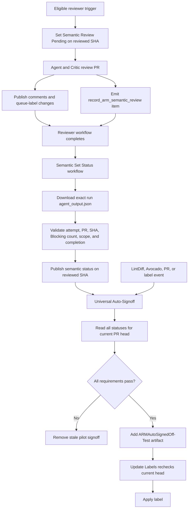

# ARM Semantic Review and Universal Auto-Signoff

## Purpose

This guide explains the pilot integration between the ARM API Reviewer and
Universal Auto-Signoff. The legacy ARM Auto SignOff workflows remain the
production signoff path while Universal runs in parallel.

The policy is intentionally small:

```text
ARM Semantic Review passed for the current PR head
AND Swagger LintDiff passed for the current PR head
AND Swagger Avocado passed for the current PR head
AND current labels and approvals allow signoff
= add ARMAutoSignedOff-Test
```

Only `Passed` authorizes the pilot label. Missing, Pending, Changes requested,
and Review incomplete all block it. Universal never changes `ARMSignedOff`.

## Mental model

```text
ARM API Reviewer
    produces one structured semantic item in agent_output.json

ARM Semantic Review - Set Status
    validates the item and publishes a commit status on its SHA

Universal Auto-Signoff
    reads statuses for the current PR head and decides

Update Labels
    applies the decision if the PR head is still current
```

The status workflow may publish a result for an older SHA. That is safe:
Universal Auto-Signoff reads statuses only for the PR's current SHA.

## Components

### ARM API Reviewer

Source:
[arm-api-review.md](../.github/workflows/arm-api-review.md)

Generated workflow:
[arm-api-review.lock.yml](../.github/workflows/arm-api-review.lock.yml)

Responsibilities:

- review the cumulative PR diff at a pinned head SHA;
- use the Critic to verify findings;
- reconcile current findings with existing PR discussion;
- publish comments and ARM queue-label changes;
- emit one `record_arm_semantic_review` item.

### Semantic policy

[arm-semantic-review.ts](../.github/workflows/src/arm-auto-signoff/arm-semantic-review.ts)

Responsibilities:

- parse exactly one structured semantic item;
- validate run attempt, PR number, SHA, Blocking count, scope, and completion;
- map the evidence to Passed, Changes requested, or Review incomplete;
- interpret GitHub commit-status states;
- select the newest semantic status for a SHA.

This file is pure policy and parsing. It makes no GitHub API calls.

### Semantic Set Status orchestration

Workflow:
[arm-semantic-review-status.yaml](../.github/workflows/arm-semantic-review-status.yaml)

Implementation:
[arm-semantic-review-status.ts](../.github/workflows/src/arm-auto-signoff/arm-semantic-review-status.ts)

Responsibilities:

- trigger from the exact completed reviewer run;
- download that run's `agent_output.json`;
- read trusted PR/SHA correlation artifacts;
- validate the semantic item once;
- publish `ARM Semantic Review` on the reviewed SHA;
- upload PR/SHA correlation for Universal Auto-Signoff.

Only this workflow has `statuses: write`.

### Universal Auto-Signoff

Workflow:
[arm-universal-auto-signoff.yaml](../.github/workflows/arm-universal-auto-signoff.yaml)

Decision logic:
[arm-universal-auto-signoff.ts](../.github/workflows/src/arm-auto-signoff/arm-universal-auto-signoff.ts)

Responsibilities:

- resolve the current PR and current head SHA;
- read Semantic Review, LintDiff, and Avocado statuses for that SHA;
- evaluate current labels and approvals;
- manage the pilot `ARMAutoSignedOff-Test` label and add the manual-review label
  when semantic evidence is incomplete.

Universal has only `statuses: read`.

### Label application

[update-labels.ts](../.github/workflows/src/update-labels.ts) applies label
artifacts. When a producer supplies a head-SHA artifact, it confirms that the PR
is still open and still has that head before mutating labels.

## End-to-end flow



## Structured semantic item

The agent emits:

```json
{
  "type": "record_arm_semantic_review",
  "run_attempt": "1",
  "issue_number": "123",
  "head_sha": "abc123abc123abc123abc123abc123abc123abcd",
  "blocking_count": "0",
  "scope": "full",
  "completeness": "complete"
}
```

Fields:

| Field            | Meaning                                                          |
| ---------------- | ---------------------------------------------------------------- |
| `run_attempt`    | Reviewer workflow attempt that produced the item                 |
| `issue_number`   | Reviewed PR                                                      |
| `head_sha`       | Reviewed commit                                                  |
| `blocking_count` | Verified Blocking findings still applicable after reconciliation |
| `scope`          | Whether the complete PR or a size-limited subset was reviewed     |
| `completeness`   | Whether the review completed normally, incompletely, or degraded  |

The reviewer custom safe-output job exists because gh-aw requires a job for a
typed custom output. It has no token permissions and performs no authoritative
validation.

## Semantic status publication

`ARM Semantic Review - Set Status` receives the exact reviewer run ID through
`workflow_run`.

It:

1. lists that run's artifact names once;
2. reads trusted `head-sha` and `issue-number` artifacts;
3. downloads that run's `agent` artifact;
4. finds exactly one semantic item;
5. validates the attempt, PR, SHA, Blocking count, scope, and completion;
6. publishes a status on the semantic item's SHA.

Outcome mapping:

| Evidence                                                                                      | Status                       |
| --------------------------------------------------------------------------------------------- | ---------------------------- |
| Full, complete review with `blocking_count = 0`                                                | `success`: Passed            |
| Full, complete review with `blocking_count > 0`                                                | `failure`: Changes requested |
| Scoped, incomplete, or degraded review, regardless of `blocking_count`                         | `error`: Review incomplete   |
| Workflow failure, missing output, malformed output, duplicate item, or mismatched correlation | `error`: Review incomplete   |
| Canceled reviewer run                                                                         | Leave Pending unchanged      |
| Missing trusted PR/SHA artifacts                                                              | Leave status unchanged       |

The status is head-bound:

```text
SHA:         reviewed SHA
Context:     ARM Semantic Review
State:       success | failure | error | pending
Target URL:  exact reviewer run and attempt
```

## Stale-result protection

Set Status publishes only while the PR is open and its current head matches the
reviewed SHA. A completion for a closed PR or stale head leaves the existing
status unchanged.

Universal independently reads statuses only for the current head SHA:

```text
Reviewer publishes Passed on SHA A
PR head is now SHA B
Universal reads statuses only for SHA B
No Semantic Passed exists on B
Universal does not sign off
```

## Universal decision

Universal fetches all commit statuses for the current head SHA and selects the
newest entry for:

- `ARM Semantic Review`;
- `Swagger LintDiff`;
- `Swagger Avocado`.

Decision:

```text
Semantic Review is missing or Pending
    -> wait and remove stale pilot signoff

Semantic Review requested changes
    -> remove pilot signoff

Semantic Review is incomplete
    -> add ARMManualSignoffRequired
    -> retain WaitForARMFeedback
    -> remove pilot signoff

ARMManualSignoffRequired is present
    -> no pilot signoff

LintDiff or Avocado is not successful
    -> no pilot signoff

required approval is missing
    -> no pilot signoff

otherwise
    -> add ARMAutoSignedOff-Test
```

`ARMAutoSignedOff-Test` records the pilot decision without changing production
signoff. `ARMManualSignoffRequired` remains an explicit human veto and is never
removed automatically.

## Event-order examples

### Avocado completes first

```text
Semantic = Pending
Avocado = Passed
Universal runs
Semantic is not Passed
No signoff

Reviewer completes
Set Status publishes Semantic = Passed
Universal runs again
All statuses pass
Signoff can proceed
```

### Reviewer completes first

```text
Set Status publishes Semantic = Passed
Universal runs
Avocado is pending
No signoff

Avocado completes
Universal runs again
All statuses pass
Signoff can proceed
```

### New commit during review

```text
Reviewer publishes result on SHA A
Current PR head is SHA B
Universal reads B
No semantic status for B
No signoff
```

### Same-SHA rerun

```text
Old status on A = Passed
New review starts on A
New Pending entry becomes newest
Universal waits
Set Status publishes the new final result
```

### Missing or malformed semantic output

```text
Set Status publishes Review incomplete on reviewed SHA
Universal adds ARMManualSignoffRequired
No automatic signoff
```

## Why this design

### Commit status instead of labels

Commit statuses are SHA-bound. PR labels are not.

### Commit status instead of artifact-only lookup

Any later event can read the current SHA's status without searching reviewer-run
history or downloading old artifacts.

### Dedicated Set Status workflow

It matches LintDiff and Avocado:

```text
producer workflow
    -> Set Status workflow
    -> Universal evaluator
```

It also keeps `statuses: write` out of Universal.

### One authoritative validation

Validation occurs only in Set Status. The reviewer produces the typed item; Set
Status validates and publishes it.

## Security and reliability properties

- no untrusted PR code is checked out;
- only write-access users or the trusted bot can trigger reviewer writes;
- Set Status consumes the exact completed reviewer run ID;
- the semantic item is bound to the workflow attempt, PR number, and SHA;
- malformed, missing, duplicate, mismatched, scoped, incomplete, or degraded
  output fails closed;
- only `success` permits signoff;
- Universal always reads the current head SHA;
- delayed label artifacts are rechecked against the live PR head;
- Universal has `statuses: read`;
- only Set Status has `statuses: write`.

## Accepted tradeoffs

### The model is the semantic source of truth

The same verified findings drive:

- comments authors act on;
- `ARMChangesRequested`;
- semantic Blocking count.

Set Status validates structure and correlation; it does not independently
re-review semantic correctness.

### Coupling to gh-aw agent output

Set Status expects:

```text
artifact name: agent
file: agent_output.json
items[] with type record_arm_semantic_review
```

A gh-aw format change can break extraction. That failure produces Review
incomplete and cannot authorize signoff.

### PR-level comment and label races

Comments and queue labels are not transactional. A canceled run can publish
some outputs before cancellation. Reconciliation reduces duplicate comments,
and the current-SHA semantic gate prevents stale auto-signoff.

### Workflow chain depth

```text
ARM API Reviewer
    -> ARM Semantic Review - Set Status
    -> ARM Universal Auto-Signoff
    -> Update Labels
```

This reaches GitHub's supported `workflow_run` chain depth. Do not add another
downstream `workflow_run` workflow after Update Labels.

## Operational prerequisites

- ensure `ARMAutoSignedOff-Test` and `ARMManualSignoffRequired` exist;
- mirror the ARM reviewer workflow to `azure-rest-api-specs-pr`;
- document who may remove manual hold labels;
- monitor incomplete/degraded rates and label transitions after rollout.

## How to understand the implementation

Read in this order:

1. [arm-semantic-review-status.yaml](../.github/workflows/arm-semantic-review-status.yaml)
2. [finalizeArmSemanticReview](../.github/workflows/src/arm-auto-signoff/arm-semantic-review-status.ts)
3. [parseSemanticReviewResult](../.github/workflows/src/arm-auto-signoff/arm-semantic-review.ts)
4. [arm-universal-auto-signoff.ts](../.github/workflows/src/arm-auto-signoff/arm-universal-auto-signoff.ts)
5. tests:
   - [arm-semantic-review.test.ts](../.github/workflows/test/arm-auto-signoff/arm-semantic-review.test.ts)
   - [arm-semantic-review-status-workflow.test.ts](../.github/workflows/test/arm-auto-signoff/arm-semantic-review-status-workflow.test.ts)
   - [arm-universal-auto-signoff.test.ts](../.github/workflows/test/arm-auto-signoff/arm-universal-auto-signoff.test.ts)

For each scenario, ask:

```text
What SHA did the reviewer inspect?
What semantic status exists on that SHA?
What is the PR's current SHA?
What statuses does Universal see on the current SHA?
Can signoff proceed?
```

## Review checklist

- [ ] Clean review publishes Passed.
- [ ] Blocking review publishes Changes requested.
- [ ] Scoped, incomplete, and degraded reviews publish Review incomplete.
- [ ] Missing or malformed item publishes Review incomplete.
- [ ] Wrong attempt, PR, or SHA publishes Review incomplete.
- [ ] Canceled review leaves Pending.
- [ ] New SHA cannot use old SHA's Passed result.
- [ ] Same-SHA rerun publishes Pending before reevaluation.
- [ ] Universal remains status-read-only.
- [ ] Delayed label application rechecks the live head.
- [ ] Passing evidence adds `ARMAutoSignedOff-Test` without changing `ARMSignedOff`.
- [ ] Later failures remove the pilot label.
- [ ] Review incomplete adds the manual-review label without changing ARM queue labels.
- [ ] Private repository copy is updated in coordination.
