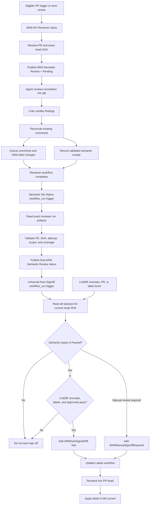

# ARM Semantic Review and Universal Auto-Signoff

## Purpose

This document explains how the ARM API Reviewer integrates with Universal ARM
Auto-Signoff, why the implementation uses both workflow artifacts and commit
statuses, which alternatives were considered, and what risks remain.

It is also a reading guide for someone who is new to GitHub Actions, workflow
coordination, and automated signoff policy.

The implementation is currently a pilot. Universal Auto-Signoff manages
`ARMAutoSignedOff-Test`; it does not yet replace the production
`ARMSignedOff` process.

## Start with this mental model

The whole design can be reduced to one sentence:

> The ARM API Reviewer produces evidence for one workflow run, trusted code
> converts that evidence into a result for one commit SHA, and Universal
> Auto-Signoff signs off only when every required result for the current SHA
> passes.

There are two representations of the semantic result:

| Representation    | Mental model                                         | Lifetime                         |
| ----------------- | ---------------------------------------------------- | -------------------------------- |
| Workflow artifact | "This reviewer run observed this result."            | Associated with one workflow run |
| Commit status     | "This is the current semantic state of this commit." | Associated with one commit SHA   |

The artifact is an intermediate handoff. The commit status is the durable input
that every later auto-signoff evaluation reads.

## Vocabulary

### PR head SHA

The immutable Git commit at the tip of the pull request.

All evidence used for one auto-signoff decision must refer to the same head SHA.
A result for an older SHA cannot authorize a newer SHA.

### Workflow run

One execution of a GitHub Actions workflow. A rerun has the same run ID and a
new run attempt.

### Workflow artifact

Data associated with one workflow run. In this design, artifacts carry:

- the PR number;
- the reviewed head SHA; and
- the semantic-review receipt.

Artifacts are not the long-lived auto-signoff state.

### Commit status

A GitHub status attached to a commit SHA and named by a context, for example:

```text
ARM Semantic Review = success
Swagger LintDiff    = success
Swagger Avocado     = success
```

GitHub retains status history. When the same context is published more than
once for one SHA, the newest entry is treated as current.

### ARM queue labels

The existing human-review state includes:

- `NotReadyForARMReview`
- `WaitForARMFeedback`
- `ARMChangesRequested`
- `ARMSignedOff`

`ARMManualSignoffRequired` is the proposed hard stop that prevents automatic
signoff when a human decision is required.

## Components

### ARM API Reviewer

Source:
[arm-api-review.md](../.github/workflows/arm-api-review.md)

Generated workflow:
[arm-api-review.lock.yml](../.github/workflows/arm-api-review.lock.yml)

Responsibilities:

- review the cumulative PR diff at an exact head SHA;
- use the Critic to verify findings;
- reconcile findings with existing PR discussion;
- publish comments and update ARM queue labels;
- record a structured semantic result.

### Semantic state model

[arm-semantic-review.ts](../.github/workflows/src/arm-auto-signoff/arm-semantic-review.ts)

Responsibilities:

- parse and validate model output;
- encode and parse semantic receipts;
- map evidence to semantic outcomes;
- evaluate trusted file-count and line-count coverage;
- interpret the latest semantic commit status.

This module contains pure state and parsing logic. It does not orchestrate
GitHub workflows.

### Semantic workflow orchestration

[arm-semantic-review-workflow.ts](../.github/workflows/src/arm-auto-signoff/arm-semantic-review-workflow.ts)

Responsibilities:

- validate the agent's result against the live PR;
- finalize a completed reviewer workflow;
- reject stale and superseded runs;
- independently verify automated-review coverage;
- publish the final `ARM Semantic Review` commit status.

### Semantic status workflow

[arm-semantic-review-status.yaml](../.github/workflows/arm-semantic-review-status.yaml)

Responsibilities:

- trigger directly from the completed ARM API Reviewer run;
- invoke semantic finalization with `statuses: write`;
- upload trusted PR and SHA correlation artifacts;
- provide the completion event that triggers Universal Auto-Signoff.

### Universal Auto-Signoff

Workflow:
[arm-universal-auto-signoff.yaml](../.github/workflows/arm-universal-auto-signoff.yaml)

Decision logic:
[arm-universal-auto-signoff.ts](../.github/workflows/src/arm-auto-signoff/arm-universal-auto-signoff.ts)

Responsibilities:

- read statuses for the current head SHA;
- evaluate semantic review, LintDiff, Avocado, labels, and approvals;
- upload label-action artifacts.

Universal Auto-Signoff has `statuses: read`. Status publication is isolated in
the semantic status workflow.

### Label application

Workflow:
[update-labels.yaml](../.github/workflows/update-labels.yaml)

Implementation:
[update-labels.ts](../.github/workflows/src/update-labels.ts)

Responsibilities:

- consume trusted label artifacts;
- recheck the live PR head when the producer supplied a head-SHA artifact;
- apply label additions and removals.

## End-to-end flow



## Detailed workflow

### 1. Start the reviewer

The reviewer can start from:

- an eligible PR open, synchronize, or ready-for-review event;
- adding `WaitForARMFeedback`;
- an authorized `/arm-review` comment; or
- manual workflow dispatch.

The reviewer has one concurrency group per PR with:

```yaml
cancel-in-progress: true
```

A newer eligible trigger replaces an active reviewer run for the same PR.
Unrelated comments receive run-specific concurrency groups and do not cancel an
active review.

### 2. Correlate the PR and set Pending

Before agent execution, trusted pre-activation code:

1. validates the target PR number;
2. reads the exact current head SHA;
3. uploads `issue-number=<number>` and `head-sha=<sha>` artifacts;
4. publishes:

```text
SHA:         <current head SHA>
Context:     ARM Semantic Review
State:       pending
Description: ARM API semantic review is pending
Target URL:  exact reviewer run and attempt
```

Publishing Pending is important when the same SHA is reviewed again. It prevents
an older Passed status from continuing to authorize signoff while the new review
is in progress.

### 3. Perform semantic review

The reviewer evaluates:

```text
base SHA -> current head SHA
```

It reviews the cumulative PR, not only the most recent commit.

The reviewer:

- identifies semantic API-design findings;
- asks the Critic to verify findings;
- reads existing workflow-owned and human-authored discussion;
- reconciles current findings with prior comments;
- posts only net-new or relocated findings;
- resolves fixed workflow-owned findings.

An unresolved verified Blocking finding still counts when its reconciliation
action is `SKIP-COVERED`. "No new comment was posted" does not mean the PR is
clean.

### 4. Update the ARM queue state

The reviewer applies these rules:

| Review result                                                    | Queue behavior                                                  |
| ---------------------------------------------------------------- | --------------------------------------------------------------- |
| Scoped, incomplete, or degraded                                  | Preserve existing queue labels                                  |
| Full and complete, with applicable verified Blocking findings    | Add `ARMChangesRequested`; remove `WaitForARMFeedback`          |
| Full and complete, with no applicable verified Blocking findings | Remove stale `ARMChangesRequested`; retain `WaitForARMFeedback` |
| Critic unavailable                                               | Preserve existing queue labels                                  |

Partial reviews preserve the human queue even when they identify Blocking
findings. They cannot make a complete queue-state decision.

### 5. Record the semantic receipt

After reconciliation and summary generation, the agent calls one structured
safe output with:

```text
PR number
reviewed head SHA
scope: full | scoped
completeness: complete | incomplete | degraded
number of verified Blocking findings still applicable
```

Example artifact name:

```text
arm-semantic-review=1.123.abc123abc123abc123abc123abc123abc123abcd.full.complete.0
```

Fields:

```text
1             workflow attempt
123           PR number
abc123...     reviewed head SHA
full          review scope
complete      review completeness
0             currently applicable verified Blocking findings
```

A trusted safe-output job validates the receipt and uploads it. The agent does
not directly publish a final Passed status.

### 6. Wait for the whole reviewer workflow

The generated reviewer workflow includes:

- agent execution;
- threat detection;
- custom semantic receipt validation;
- comment and label safe-output processing; and
- a final conclusion job.

The dedicated Semantic Set Status workflow finalizes the result only after the
reviewer emits `workflow_run: completed`.

This boundary is intended to prevent Passed from becoming visible while the
reviewer is still publishing comments or labels.

### 7. Finalize the semantic result

`ARM Semantic Review - Set Status` is triggered with the exact completed ARM
reviewer run. It calls `finalizeArmSemanticReview`.

It verifies:

- the reviewer run's artifacts are listed once and reused for both correlation
  and receipt finalization;
- the reviewer actually executed;
- the PR number and head SHA are valid;
- the PR is still open;
- the reviewed SHA is still the current head;
- a newer run or attempt did not supersede this one;
- the receipt belongs to this PR, SHA, and run attempt;
- the changed-file inventory is not truncated;
- no more than 50 specification files changed;
- no more than 5,000 specification lines changed.

Trusted code independently evaluates size and truncation. It does not rely only
on the model's `scope` value.

### 8. Publish the final commit status

| Semantic outcome       | GitHub state | Description pattern                |
| ---------------------- | ------------ | ---------------------------------- |
| Passed                 | `success`    | `Passed: ...`                      |
| Changes requested      | `failure`    | `Changes requested: ...`           |
| Manual review required | `error`      | `Manual review required: ...`      |
| Review incomplete      | `error`      | `Review incomplete: ...`           |
| Pending                | `pending`    | Review is running or must be rerun |

`Manual review required` is used for deterministic coverage limits such as:

- oversized PRs;
- scoped review;
- truncated changed-file inventory.

`Review incomplete` is used for retryable or technical failures such as:

- reviewer workflow failure;
- missing receipt;
- malformed receipt;
- degraded full review.

After finalization, the status workflow uploads the validated PR number and head
SHA as correlation artifacts. Universal Auto-Signoff is triggered by completion
of `ARM Semantic Review - Set Status`.

### 9. Evaluate auto-signoff

The normal auto-signoff decision runs on every Universal Auto-Signoff event:

- semantic status completion;
- LintDiff completion;
- Avocado completion;
- PR update;
- relevant label addition or removal.

It fetches all commit statuses for the current head SHA, then selects the newest
status for each required context:

- `ARM Semantic Review`
- `Swagger LintDiff`
- `Swagger Avocado`

Effective policy:

```text
if semantic outcome is Manual review required:
    add ARMManualSignoffRequired
    do not sign off

if semantic outcome is not Passed:
    do not sign off

if ARMChangesRequested is present:
    do not sign off

if ARMManualSignoffRequired is present:
    do not sign off

if LintDiff or Avocado is not successful:
    do not sign off

if required approval is missing:
    do not sign off

otherwise:
    add ARMAutoSignedOff-Test
```

Only Passed is positive authorization. Missing, Pending, Failure, and Review
incomplete all fail closed.

### 10. Apply labels safely

Universal Auto-Signoff uploads label artifacts instead of directly mutating
labels.

When the producer includes a trusted head-SHA artifact, Update Labels reads the
live PR again. It discards the label action if:

- the PR is closed; or
- the PR head moved.

This prevents a decision calculated for one commit from changing labels on a
later commit.

## Event-order examples

### Reviewer completes before Avocado

```text
Reviewer starts       -> Semantic = Pending
Reviewer completes    -> Semantic Set Status publishes Passed
Auto-Signoff evaluates -> Avocado still pending, no signoff
Avocado completes     -> Auto-Signoff rereads all current-SHA statuses
All pass              -> Add pilot auto-signoff label
```

### Avocado completes before reviewer

```text
Reviewer starts       -> Semantic = Pending
Avocado completes     -> Auto-Signoff sees Pending, no signoff
Reviewer completes    -> Semantic Set Status publishes Passed
Auto-Signoff rereads Avocado and LintDiff
All pass              -> Add pilot auto-signoff label
```

### New commit arrives during review

```text
Reviewer is reviewing SHA A
PR moves to SHA B
Finalizer sees current head != reviewed SHA
SHA A result is ignored
SHA B requires its own semantic review
```

### Same SHA is retriggered

```text
Old result for SHA A = Passed
New review starts for SHA A
New Pending entry becomes the newest semantic status
Auto-Signoff waits
New final result replaces Pending as the newest entry
```

### Oversized PR

```text
Trusted code counts > 50 specification files or > 5,000 changed lines
Semantic result = Manual review required
Auto-Signoff does not proceed
ARMManualSignoffRequired is added
```

## Why this design was chosen

### Independent workflows complete in any order

The reviewer, LintDiff, and Avocado are independent workflows. A durable
SHA-bound status lets any completion event reevaluate the same current state.

### Labels are not SHA-bound

The absence of `ARMChangesRequested` does not prove that:

- the reviewer ran;
- the reviewer finished;
- the review covered the whole PR; or
- the result belongs to the current commit.

### Workflow conclusion is not the semantic result

A reviewer workflow can finish successfully while:

- finding Blocking issues;
- reviewing only part of a PR;
- producing incomplete semantic evidence.

### Model output should not directly authorize signoff

The model emits evidence. Trusted code verifies correlation and deterministic
coverage before publishing the durable status.

### Finalization should occur after reviewer completion

Publishing Passed inside the agent job can expose success before comment and
label publishing completes. `workflow_run: completed` provides a later
coordination boundary.

## Alternative designs and tradeoffs

| Design                                                         | Advantages                                                                                                     | Tradeoffs                                                                                       |
| -------------------------------------------------------------- | -------------------------------------------------------------------------------------------------------------- | ----------------------------------------------------------------------------------------------- |
| **Current: receipt, dedicated Set Status, then commit status** | SHA-bound, reusable by every trigger, fail-closed, least-privilege status writer, matches LintDiff and Avocado | Adds one workflow hop and another workflow to maintain                                          |
| Finalize inside Universal Auto-Signoff                         | Fewer workflow files                                                                                           | Gives Universal `statuses: write` on every trigger and mixes publication with policy evaluation |
| One combined workflow                                          | Strong ordering and direct outputs                                                                             | Tightly couples AI review, linters, labels, retries, and every trigger                          |
| Label-only handshake                                           | Simple and visible                                                                                             | Labels are mutable PR state, not SHA-bound; bot-label events can be unreliable                  |
| Artifact-only lookup                                           | No commit status needed                                                                                        | Every event must search historical runs and artifacts; expiration and supersession are complex  |
| Publish final status inside reviewer                           | Fewer workflow steps                                                                                           | Risks exposing Passed before comments and labels finish                                         |
| GitHub Check Run                                               | Rich UI and potentially stronger producer identity                                                             | More API and permission complexity; may require a dedicated GitHub App                          |
| Reusable `workflow_call` pipeline                              | Typed outputs and strong ordering                                                                              | Difficult to retrofit around independent triggers and manual review commands                    |

## Trust boundaries

### Untrusted or partially trusted

- PR content;
- specification files;
- PR description and comments;
- model reasoning;
- model-supplied semantic fields.

### Trusted

- workflow source from the base/default branch;
- pre-activation PR and SHA lookup;
- workflow artifacts uploaded by privileged/default-branch workflows;
- semantic receipt validation;
- trusted file-count and line-count evaluation;
- commit-status publication;
- final live-head check before correlated label application.

## Risk assessment

### Rollout blocker: `ARMManualSignoffRequired` does not exist

At the time of writing, GitHub returns 404 for the repository label
`ARMManualSignoffRequired`, and it is not defined in checked-in label
configuration.

Expected failure:

```text
Semantic outcome = Manual review required
Universal uploads label artifact
Update Labels attempts to add nonexistent label
Label application fails
```

Semantic safety is preserved because the result is not Passed, but the intended
manual-review routing does not appear.

Before rollout:

1. Create `ARMManualSignoffRequired` in both spec repositories.
2. Decide whether it should be listed in
   [protected-labels.yml](../.github/protected-labels.yml).
3. Document who may add and remove it.

### High before production: commit-status provenance is not authenticated

Auto-signoff trusts the newest status whose context is `ARM Semantic Review`.
It does not verify:

- the status creator;
- the target workflow URL;
- the workflow name;
- that the run belongs to this repository;
- that the run has a valid semantic receipt.

Any workflow or identity with `statuses: write` could publish a competing
success status.

This is lower impact while the pilot controls only `ARMAutoSignedOff-Test`, but
it should be hardened before controlling production `ARMSignedOff`.

Possible mitigations:

- validate the status creator;
- require a target URL matching a trusted Actions run;
- resolve the run and verify its workflow name;
- publish through a dedicated GitHub App or Check Run identity.

### High or medium: semantic truth still comes from model output

Trusted code validates shape, correlation, and coverage. It does not
independently prove:

- that the review was complete;
- that `blocking_count` matches the findings;
- that a Blocking finding was not omitted;
- that the receipt agrees with queued label changes.

The live `ARMChangesRequested` check provides defense in depth, but inconsistent
model output plus failed label output could theoretically produce Passed.

Possible mitigations:

- derive Blocking count from structured finding outputs;
- cross-check the receipt against safe-output items;
- require a Passed receipt to agree with the queued label transition;
- reject Passed when safe-output processing reports failed items.

### Medium: manual override removal is not protected

The current protected-label workflow watches only `labeled`, not `unlabeled`.

An unauthorized user with label permissions could remove a manually applied
`ARMManualSignoffRequired`. If semantic status is Passed, automation may then
proceed.

Possible mitigations:

- enforce authorization on `unlabeled`;
- record the hold in a trusted status or review record;
- require an authorized actor to clear the hold.

### Medium: stale reviewer runs can mutate PR-level queue labels

Semantic statuses are SHA-bound. Reviewer safe outputs for
`ARMChangesRequested` and `WaitForARMFeedback` are direct PR-level mutations.

A narrow race remains:

```text
Old run verifies head SHA
New commit arrives
Old run applies queue label mutation
```

The semantic gate still prevents unsafe auto-signoff, but the human queue can
become confusing.

Possible mitigation: route reviewer queue-label changes through a correlated
artifact workflow with a final head-SHA check.

### Medium, pending confirmation: partial safe-output failure

The generated safe-output job exposes:

- `items_failed`;
- `items_succeeded`;
- `process_safe_outputs_status`.

The finalizer does not inspect those outputs.

Confirm whether gh-aw can complete the workflow successfully when individual
comment or label items fail. If it can, reject Passed whenever safe-output
processing reports failed or canceled items.

### Medium operational risk: private-repository parity

The ARM reviewer source states that public and private repository copies must
remain byte-identical.

Rollout must update `Azure/azure-rest-api-specs-pr` in coordination with this
repository.

### Medium operational constraint: workflow-run chain depth

The success path is:

```text
ARM API Reviewer
    -> ARM Semantic Review - Set Status
    -> ARM Universal Auto-Signoff
    -> Update Labels
```

This uses the same three-level `workflow_run` chain pattern as LintDiff and
Avocado and reaches GitHub's supported chaining limit. Do not insert another
downstream `workflow_run` workflow after Update Labels; it may not run.

### Missing correlation artifacts

If the reviewer run does not contain trusted PR and head-SHA artifacts, the
status workflow leaves semantic status unchanged. It does not substitute the
PR's current head because that could attach an older run's result to a newer
commit.

### Low: timestamp ordering

The latest status is selected by `updated_at`.

If two entries have identical timestamp resolution, ordering relies on GitHub's
return order and stable sorting. A status ID or run-attempt comparison would be
a stronger tiebreaker.

### Low: canceled-run comment duplication

Cancellation is not transactional. A canceled safe-output publisher may have
already posted some comments. The replacement run reconciles marked findings,
which reduces but cannot eliminate duplication.

This is primarily a PR-noise risk, not an auto-signoff safety risk.

### Low: manual-review label persists

`ARMManualSignoffRequired` is intentionally never removed automatically.

If an oversized PR is later reduced and receives a clean full review, a human
must clear the label before auto-signoff can proceed.

This is safe, but should be documented for authors and reviewers.

## How to learn this design from zero

Do not start by reading the generated workflow or every test. Build the model in
layers.

### Layer 1: learn the policy

Write this decision rule on paper:

```text
Semantic Passed
AND LintDiff Passed
AND Avocado Passed
AND required labels and approvals allow signoff
= auto-signoff
```

Everything else is implementation detail supporting this rule.

Questions to answer:

- What is a positive authorization?
- Which states merely block?
- Which states require human routing?
- Which result must be tied to a commit?

### Layer 2: learn the identities

Track four IDs:

```text
PR number
head SHA
workflow run ID
workflow attempt
```

Use this table:

| Identity    | What it distinguishes                  |
| ----------- | -------------------------------------- |
| PR number   | The review conversation and labels     |
| Head SHA    | The exact code/specification snapshot  |
| Run ID      | One workflow execution                 |
| Run attempt | A rerun of the same workflow execution |

Most race conditions are an accidental mismatch among these identities.

### Layer 3: learn durable versus transient state

Classify each signal:

| Signal           | Scope                        |
| ---------------- | ---------------------------- |
| Receipt artifact | One workflow run and attempt |
| Commit status    | One commit SHA               |
| Label            | Entire PR until changed      |
| Comment          | Entire PR discussion         |

Then ask:

> Is this state being used outside the scope where it is valid?

That question explains why labels alone are insufficient and why old artifacts
must not authorize new commits.

### Layer 4: trace only the happy path

Read these files in order:

1. [arm-api-review.md](../.github/workflows/arm-api-review.md), focusing only on:
   - trigger and concurrency;
   - Pending status;
   - Step 7;
   - Step 9.
2. [arm-semantic-review-status.yaml](../.github/workflows/arm-semantic-review-status.yaml)
3. [arm-semantic-review.ts](../.github/workflows/src/arm-auto-signoff/arm-semantic-review.ts)
4. [arm-semantic-review-workflow.ts](../.github/workflows/src/arm-auto-signoff/arm-semantic-review-workflow.ts)
5. [arm-universal-auto-signoff.yaml](../.github/workflows/arm-universal-auto-signoff.yaml)
6. [arm-universal-auto-signoff.ts](../.github/workflows/src/arm-auto-signoff/arm-universal-auto-signoff.ts)

Ignore the generated lock file at first.

While reading, follow one example:

```text
Full review, no findings, LintDiff and Avocado pass
```

Write down every state transition.

### Layer 5: add one failure at a time

Use this order:

1. Blocking finding.
2. Avocado finishes before reviewer.
3. New commit during review.
4. Same-SHA retrigger.
5. Oversized PR.
6. Critic unavailable.
7. Missing receipt.
8. Canceled run.
9. Stale label artifact.

For each scenario, answer:

```text
What is the current head SHA?
What is the latest semantic status for that SHA?
What labels are present?
Can auto-signoff proceed?
Who or what triggers reevaluation?
```

### Layer 6: read tests as executable examples

After the state model is clear, read:

- [arm-semantic-review.test.ts](../.github/workflows/test/arm-auto-signoff/arm-semantic-review.test.ts)
- [arm-universal-auto-signoff.test.ts](../.github/workflows/test/arm-auto-signoff/arm-universal-auto-signoff.test.ts)
- [context.test.ts](../.github/workflows/test/context.test.ts)
- [update-labels.test.ts](../.github/workflows/test/update-labels.test.ts)

Read test names first. They provide a scenario inventory.

### Layer 7: inspect the generated workflow last

Use [arm-api-review.lock.yml](../.github/workflows/arm-api-review.lock.yml) only
to answer compiler-specific questions:

- Which jobs depend on which jobs?
- Which permissions does each generated job receive?
- When does the safe-output publisher run?
- Which failures are `continue-on-error`?

Do not use the generated YAML as the first source for understanding policy.

## How to reason about tradeoffs with no prior knowledge

### Step 1: state the non-negotiable invariants

For this design:

```text
Never auto-sign off without Semantic Passed for the current SHA.
Never reuse an older SHA's Passed result.
Never treat a partial review as a full review.
Never let unvalidated model output directly authorize signoff.
Human override must win over automation.
```

Tradeoffs may change implementation complexity. They must not violate these
invariants.

### Step 2: list failure modes before solutions

Examples:

- workflows finish in a different order;
- a new commit arrives mid-review;
- a run is canceled;
- a label event does not trigger another workflow;
- an artifact is missing;
- a status is stale;
- the agent reports inconsistent fields;
- label application is delayed;
- the PR is too large to review fully.

Design from failure cases, not only from the happy path.

### Step 3: choose fail-open or fail-closed

For signoff and security decisions, prefer fail-closed:

```text
Missing semantic result -> no signoff
Malformed receipt       -> no signoff
Stale SHA               -> ignore result
Partial review          -> manual review
```

For user experience, distinguish retryable from permanent/manual cases so
fail-closed does not automatically mean "send everything to a human."

### Step 4: identify the authority for every field

Use a table:

| Field               | Source         | Can it be trusted? | Verification                  |
| ------------------- | -------------- | ------------------ | ----------------------------- |
| PR number           | Event plus API | Mostly             | Re-fetch PR                   |
| Head SHA            | PR API         | Yes in trusted job | Compare before publication    |
| Scope               | Agent          | No by itself       | Recompute trusted size limits |
| Blocking count      | Agent          | Partially          | Cross-check recommended       |
| Workflow conclusion | GitHub         | Yes                | Read `workflow_run`           |
| Manual hold         | Label          | Mutable            | Protect actor and removal     |

If you cannot name the authority, the design has a trust gap.

### Step 5: separate evidence, decision, and effect

```text
Evidence: reviewer receipt, statuses, labels, approvals
Decision: auto-signoff policy function
Effect: label mutation
```

Keeping these separate makes retry, auditing, and stale-result protection
easier.

### Step 6: reason about time

Draw a timeline:

```text
T1 reviewer starts
T2 Avocado finishes
T3 new commit arrives
T4 reviewer finishes
T5 label updater runs
```

At every point ask:

> Which SHA does this operation refer to?

This catches most distributed-workflow races.

### Step 7: evaluate alternatives on explicit axes

Score each design from 1 to 5:

| Axis             | Question                                                      |
| ---------------- | ------------------------------------------------------------- |
| Correctness      | Can stale or partial evidence authorize signoff?              |
| Security         | Can untrusted input or a broad token affect the decision?     |
| Ordering         | Does the design work regardless of workflow completion order? |
| Observability    | Can a reviewer understand why signoff did or did not occur?   |
| Recovery         | Can a failed run be retried safely?                           |
| Complexity       | How many workflows, data forms, and APIs must be understood?  |
| Maintainability  | Is policy centralized and tested?                             |
| Operational cost | What must be provisioned and kept in sync?                    |

Do not choose "simplest" without specifying which axis is being simplified.

### Step 8: document accepted residual risk

A design does not need zero risk. It needs explicit risk ownership.

Example:

```text
Accepted for pilot:
  occasional duplicate comment after cancellation

Not accepted for production:
  unauthenticated producer of a Passed status
```

### Step 9: use a decision worksheet

For every unresolved choice, fill in:

```text
Decision:
Options:
Invariant affected:
Failure mode:
Security boundary:
Operational impact:
Recommended option:
Why:
What would make us revisit it:
```

This lets you make defensible tradeoffs without already being an expert.

## Suggested exercises

### Exercise 1: trace a clean PR

Create a table with:

```text
Event
Current SHA
Semantic status
LintDiff
Avocado
Labels
Decision
```

Fill it from reviewer start through pilot signoff.

### Exercise 2: break the ordering

Repeat the table with Avocado finishing first. The final decision should be the
same.

### Exercise 3: change the SHA

Insert a new commit before reviewer completion. Verify every older result is
ignored.

### Exercise 4: challenge each trust boundary

Ask:

- What if the model lies about scope?
- What if another workflow publishes `ARM Semantic Review = success`?
- What if a user removes the manual hold?
- What if a label artifact arrives late?

If the answer is unclear, add a check or document the residual risk.

## Review checklist

Before enabling production signoff:

- [ ] Create `ARMManualSignoffRequired` in both repositories.
- [ ] Decide and enforce who may add and remove the manual hold.
- [ ] Mirror the ARM reviewer workflow to `azure-rest-api-specs-pr`.
- [ ] Authenticate the semantic status producer.
- [ ] Confirm safe-output partial-failure semantics.
- [ ] Cross-check semantic receipt against actual published findings and labels.
- [ ] Test same-SHA reruns, new-SHA races, cancellation, and artifact loss in CI.
- [ ] Document how authors return a PR from manual review to automation.
- [ ] Replace the pilot label only after observing stable behavior.

## Bottom line

The design is intentionally fail-closed and is suitable for a pilot:

- semantic evidence is tied to an exact SHA;
- only Passed allows auto-signoff;
- stale and superseded results are ignored;
- partial coverage routes to manual review;
- delayed correlated label changes recheck the live head.

Before controlling production `ARMSignedOff`, address the missing manual-review
label, producer provenance, safe-output consistency, and private-repository
parity.
