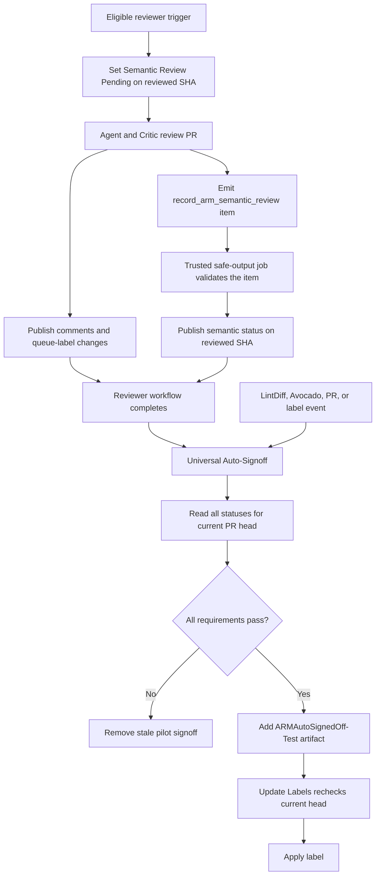

# ARM Semantic Review and Universal Auto-Signoff

## Purpose

This guide explains the pilot integration between the ARM API Reviewer and
Universal Auto-Signoff. The legacy ARM Auto SignOff workflows remain the
production signoff path while Universal runs in parallel.

The policy is intentionally small:

```text
ARM Semantic Review passed for the current PR head
AND Swagger LintDiff passed for the current PR head
AND Swagger Avocado passed for the current PR head
AND current labels and approvals allow signoff
= add ARMAutoSignedOff-Test
```

Only `Passed` authorizes the pilot label. Missing, Pending, Changes requested,
and Review incomplete all block it. Universal never changes `ARMSignedOff`.

## Mental model

```text
ARM API Reviewer
    produces one structured semantic item in agent_output.json
    validates it in a trusted safe-output job
    publishes a commit status on the reviewed SHA

Universal Auto-Signoff
    reads statuses for the current PR head and decides

Update Labels
    applies the decision if the PR head is still current
```

The reviewer may finish after the PR head changes. That is safe: the publisher
rejects stale heads, and Universal Auto-Signoff reads statuses only for the
current PR head.

## Components

### ARM API Reviewer

Source:
[arm-api-review.md](../.github/workflows/arm-api-review.md)

Generated workflow:
[arm-api-review.lock.yml](../.github/workflows/arm-api-review.lock.yml)

Responsibilities:

- review the cumulative PR diff at a pinned head SHA;
- use the Critic to verify findings;
- reconcile current findings with existing PR discussion;
- publish comments and ARM queue-label changes;
- emit one `record_arm_semantic_review` item.

### Semantic policy

[arm-semantic-review.ts](../.github/workflows/src/arm-auto-signoff/arm-semantic-review.ts)

Responsibilities:

- parse exactly one structured semantic item;
- validate run attempt, PR number, SHA, Blocking count, scope, and completion;
- map the evidence to Passed, Changes requested, or Review incomplete;
- interpret GitHub commit-status states;
- select the newest semantic status for a SHA.

This file is pure policy and parsing. It makes no GitHub API calls.

### Semantic status publication

[arm-semantic-review-workflow.ts](../.github/workflows/src/arm-auto-signoff/arm-semantic-review-workflow.ts)

Responsibilities:

- run as the reviewer's trusted `record_arm_semantic_review` safe-output job;
- read that run's `agent_output.json` and trusted PR/SHA correlation artifacts;
- validate the semantic item once;
- independently enforce automated-review coverage limits;
- publish `ARM Semantic Review` on the reviewed SHA;
- avoid overwriting a newer review or rerun.

Only the reviewer `pre_activation`, `record_arm_semantic_review`, and `conclusion` jobs have
`statuses: write`. The agent itself still has read-only GitHub tools.

### Universal Auto-Signoff

Workflow:
[arm-universal-auto-signoff.yaml](../.github/workflows/arm-universal-auto-signoff.yaml)

Decision logic:
[arm-universal-auto-signoff.ts](../.github/workflows/src/arm-auto-signoff/arm-universal-auto-signoff.ts)

Responsibilities:

- resolve the current PR and current head SHA;
- read Semantic Review, LintDiff, and Avocado statuses for that SHA;
- evaluate current labels and approvals;
- manage the pilot `ARMAutoSignedOff-Test` label and add the manual-review label
  when the review was scoped or the PR exceeded automated review limits.

Universal has only `statuses: read`.

### Label application

[update-labels.ts](../.github/workflows/src/update-labels.ts) applies label
artifacts. When a producer supplies a head-SHA artifact, it confirms that the PR
is still open and still has that head before mutating labels.

## End-to-end flow



## Structured semantic item

The agent emits:

```json
{
  "type": "record_arm_semantic_review",
  "blocking_count": "0",
  "scope": "full",
  "completeness": "complete",
  "incomplete_reason": "none"
}
```

Fields:

| Field               | Meaning                                                          |
| ------------------- | ---------------------------------------------------------------- |
| `blocking_count`    | Verified Blocking findings still applicable after reconciliation |
| `scope`             | Whether the complete PR or a size-limited subset was reviewed     |
| `completeness`      | Whether the intended review completed                            |
| `incomplete_reason` | `none` when complete; otherwise the specific failure category     |

The model does not supply the run attempt, PR number, or head SHA. The custom
safe-output job reads those values from the current run and trusted artifacts,
so model output cannot redirect status publication.

## Semantic status publication

The `record_arm_semantic_review` safe-output job runs inside the exact reviewer
run that produced the item.

It:

1. lists that run's artifact names once;
2. reads trusted `head-sha` and `issue-number` artifacts;
3. reads the run attempt from the workflow environment;
4. finds exactly one semantic item in the safe-output payload;
5. validates the attempt, PR, SHA, Blocking count, scope, completion, and
   incomplete reason;
6. confirms that the PR is open and still points to the reviewed SHA;
7. independently verifies review coverage against the trusted changed-file
   list;
8. publishes a status on the reviewed SHA.

Outcome mapping:

| Evidence                                                                                      | Status                       |
| --------------------------------------------------------------------------------------------- | ---------------------------- |
| Full, complete review with `blocking_count = 0`                                                | `success`: Passed            |
| Full, complete review with `blocking_count > 0`                                                | `failure`: Changes requested |
| Incomplete review, regardless of `blocking_count`                                             | `error`: Review incomplete   |
| Scoped review, or coverage limits exceeded by the trusted file list                           | `error`: Manual review required |
| Malformed output, duplicate item, or a failure while validating or publishing                 | `error`: Review incomplete   |
| Agent failure, omitted semantic item, noop, or canceled reviewer run                          | `error`: Review incomplete, published by the `conclusion` job |
| Missing trusted PR/SHA artifacts                                                              | Leave status unchanged       |

Both `error` outcomes share one commit-status state and are told apart by the description
prefix (`Manual review required: ` or `Review incomplete: `). Only Manual review required is a
property of the PR itself, so only it adds the sticky `ARMManualSignoffRequired` label.
Review incomplete is a transient failure that a re-run can fix.

### Resolving a Pending status that was never published

`pre_activation` posts Pending before the agent starts, but `record_arm_semantic_review` only
runs when the agent emitted a semantic item and threat detection passed. The `conclusion` job
runs after every other job regardless of their results. Its pre-step reads the trusted
`head-sha` artifact and, only when this exact run and attempt still owns the newest
`ARM Semantic Review` status and it is Pending, publishes
`Review incomplete: reviewer did not publish a result`. A newer run or attempt, or a result the
record job already published, is never overwritten. The step has `continue-on-error: true`
because pre-steps run before gh-aw's own failure reporting.

The status is head-bound:

```text
SHA:         reviewed SHA
Context:     ARM Semantic Review
State:       success | failure | error | pending
Target URL:  exact reviewer run and attempt
```

## Stale-result protection

The safe-output publisher runs only while the PR is open and its current head
matches the reviewed SHA. A completion for a closed PR or stale head leaves the
existing status unchanged.

Universal independently reads statuses only for the current head SHA:

```text
Reviewer publishes Passed on SHA A
PR head is now SHA B
Universal reads statuses only for SHA B
No Semantic Passed exists on B
Universal does not sign off
```

A newer run for the same PR cancels an in-flight one (`cancel-in-progress`), and the publisher
checks for a newer run only immediately before it writes. Events the trigger gate would skip,
such as a push to a draft PR or to a PR without `WaitForARMFeedback`, get a run-scoped
concurrency group, so they cannot cancel a valid in-flight review.

## Universal decision

Universal fetches all commit statuses for the current head SHA and selects the
newest entry for:

- `ARM Semantic Review`;
- `Swagger LintDiff`;
- `Swagger Avocado`.

Decision:

```text
Semantic Review is missing or Pending
    -> wait and remove stale pilot signoff

Semantic Review requested changes
    -> remove pilot signoff

Semantic Review is incomplete
    -> no pilot signoff, no label change; a re-run can fix it

Semantic Review requires manual review (scoped or oversized PR)
    -> add ARMManualSignoffRequired
    -> retain WaitForARMFeedback
    -> remove pilot signoff

ARMManualSignoffRequired is present
    -> no pilot signoff

LintDiff or Avocado is not successful
    -> no pilot signoff

required approval is missing
    -> no pilot signoff

otherwise
    -> add ARMAutoSignedOff-Test
```

`ARMAutoSignedOff-Test` records the pilot decision without changing production
signoff. `ARMManualSignoffRequired` remains an explicit human veto and is never
removed automatically.

## Event-order examples

### Avocado completes first

```text
Semantic = Pending
Avocado = Passed
Universal runs
Semantic is not Passed
No signoff

Reviewer completes
Reviewer publishes Semantic = Passed
Universal runs again
All statuses pass
Signoff can proceed
```

### Reviewer completes first

```text
Reviewer publishes Semantic = Passed
Universal runs
Avocado is pending
No signoff

Avocado completes
Universal runs again
All statuses pass
Signoff can proceed
```

### New commit during review

```text
Reviewer publishes result on SHA A
Current PR head is SHA B
Universal reads B
No semantic status for B
No signoff
```

### Same-SHA rerun

```text
Old status on A = Passed
New review starts on A
New Pending entry becomes newest
Universal waits
Reviewer publishes the new final result
```

### Missing or malformed semantic output

```text
Malformed emitted item -> reviewer publishes Review incomplete
No emitted item, noop, or failed/canceled reviewer -> conclusion job publishes Review incomplete
In either case, Universal cannot sign off and adds no label
```

## Why this design

### Commit status instead of labels

Commit statuses are SHA-bound. PR labels are not.

### Commit status instead of artifact-only lookup

Any later event can read the current SHA's status without searching reviewer-run
history or downloading old artifacts.

### Direct reviewer publication

The trusted safe-output job already has the exact agent output, run attempt, PR,
and SHA. Publishing there removes one workflow and one artifact handoff while
keeping `statuses: write` out of Universal.

### One authoritative validation

Validation occurs only in the trusted safe-output job. The model produces the
typed item; the job validates and publishes it.

## Security and reliability properties

- no untrusted PR code is checked out;
- only write-access users or the trusted bot can trigger reviewer writes;
- the semantic item is bound to the workflow attempt, PR number, and SHA;
- malformed, missing, duplicate, mismatched, scoped, or incomplete output
  fails closed;
- only `success` permits signoff;
- Universal always reads the current head SHA;
- delayed label artifacts are rechecked against the live PR head;
- Universal has `statuses: read`;
- only trusted reviewer jobs have `statuses: write`.

## Accepted tradeoffs

### The model is the semantic source of truth

The same verified findings drive:

- comments authors act on;
- `ARMChangesRequested`;
- semantic Blocking count.

The safe-output job validates structure and correlation; it does not
independently re-review semantic correctness.

### Coupling to gh-aw agent output

The custom safe-output job expects:

```text
artifact name: agent
file: agent_output.json
items[] with type record_arm_semantic_review
```

A gh-aw format change can break extraction. A malformed emitted item produces
Review incomplete; a job that cannot start is resolved to Review incomplete by the
`conclusion` job. Neither can authorize signoff.

### PR-level comment and label races

Comments and queue labels are not transactional. A canceled run can publish
some outputs before cancellation. Reconciliation reduces duplicate comments,
and the current-SHA semantic gate prevents stale auto-signoff.

### Workflow chain depth

```text
ARM API Reviewer
    -> ARM Universal Auto-Signoff
    -> Update Labels
```

Removing the Set Status workflow shortens the `workflow_run` chain and leaves
more headroom below GitHub's supported chain-depth limit.

## Operational prerequisites

- ensure `ARMAutoSignedOff-Test` and `ARMManualSignoffRequired` exist;
- mirror the ARM reviewer workflow to `azure-rest-api-specs-pr`;
- document who may remove manual hold labels;
- monitor incomplete rates, stuck Pending statuses, and label transitions after
  rollout.

## How to understand the implementation

Read in this order:

1. [arm-api-review.md](../.github/workflows/arm-api-review.md)
2. [publishArmSemanticReviewStatus](../.github/workflows/src/arm-auto-signoff/arm-semantic-review-workflow.ts)
3. [parseSemanticReviewResult](../.github/workflows/src/arm-auto-signoff/arm-semantic-review.ts)
4. [arm-universal-auto-signoff.ts](../.github/workflows/src/arm-auto-signoff/arm-universal-auto-signoff.ts)
5. tests:
   - [arm-semantic-review.test.ts](../.github/workflows/test/arm-auto-signoff/arm-semantic-review.test.ts)
   - [arm-api-review-workflow.test.ts](../.github/workflows/test/arm-api-review-workflow.test.ts)
   - [arm-universal-auto-signoff.test.ts](../.github/workflows/test/arm-auto-signoff/arm-universal-auto-signoff.test.ts)

For each scenario, ask:

```text
What SHA did the reviewer inspect?
What semantic status exists on that SHA?
What is the PR's current SHA?
What statuses does Universal see on the current SHA?
Can signoff proceed?
```

## Review checklist

- [ ] Clean review publishes Passed.
- [ ] Blocking review publishes Changes requested.
- [ ] Incomplete reviews publish Review incomplete.
- [ ] Scoped or oversized reviews publish Manual review required.
- [ ] Malformed emitted item publishes Review incomplete.
- [ ] Missing item, noop, or failed/canceled reviewer is resolved to Review incomplete by the
      `conclusion` job and blocks signoff, without overwriting a newer run's status.
- [ ] Model-supplied correlation is ignored; missing or invalid trusted
      correlation leaves status unchanged.
- [ ] New SHA cannot use old SHA's Passed result.
- [ ] Same-SHA rerun publishes Pending before reevaluation.
- [ ] Universal remains status-read-only.
- [ ] Delayed label application rechecks the live head.
- [ ] Passing evidence adds `ARMAutoSignedOff-Test` without changing `ARMSignedOff`.
- [ ] Later failures remove the pilot label.
- [ ] Manual review required adds the manual-review label without changing ARM queue labels;
      Review incomplete adds no label.
- [ ] Private repository copy is updated in coordination.
