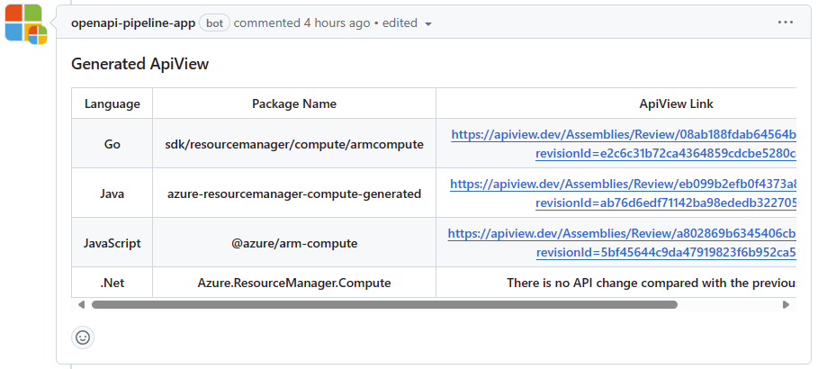

# CI Fix Guide

Short link: [aka.ms/ci-fix]

This guide provides detailed troubleshooting instructions for the [automated validation tooling] checks running on
[Azure REST API specs PR]s submitted to this repo.

If you need help with your specs PR, please first thoroughly read the [aka.ms/azsdk/pr-getting-help] document.

# Table of Contents

- [CI Fix Guide](#ci-fix-guide)
- [Table of Contents](#table-of-contents)
- [Prerequisites](#prerequisites)
- [Checks troubleshooting guides](#checks-troubleshooting-guides)
  - [`CredScan`](#credscan)
  - [`PoliCheck`](#policheck)
  - [`SDK azure-powershell`](#sdk-azure-powershell)
  - [`SDK azure-sdk-for-*` checks, like `SDK azure-sdk-for-go`](#sdk-azure-sdk-for--checks-like-sdk-azure-sdk-for-go)
  - [`Swagger APIView`](#swagger-apiview)
    - [If an expected APIView was not generated, follow the step below to troubleshoot.](#if-an-expected-apiview-was-not-generated-follow-the-step-below-to-troubleshoot)
    - [Diagnosing APIView failure for SDK Language (not Swagger or TypeSpec)](#diagnosing-apiview-failure-for-sdk-language-not-swagger-or-typespec)
  - [`Swagger ApiDocPreview`](#swagger-apidocpreview)
  - [`Swagger Avocado`](#swagger-avocado)
    - [Get help fixing Avocado validation failures](#get-help-fixing-avocado-validation-failures)
    - [Run avocado locally](#run-avocado-locally)
  - [`Swagger BreakingChange` and `BreakingChange(Cross-Version)`](#swagger-breakingchange-and-breakingchangecross-version)
    - [Run `oad` locally](#run-oad-locally)
  - [`Swagger LintDiff` and `Swagger Lint(RPaaS)`](#swagger-lintdiff-and-swagger-lintrpaas)
  - [`Swagger LintDiff` for TypeSpec: troubleshooting guides](#swagger-lintdiff-for-typespec-troubleshooting-guides)
    - [`Record<unknown>` causes `AvoidAdditionalProperties` and `PropertiesTypeObjectNoDefinition`](#recordunknown-causes-avoidadditionalproperties-and-propertiestypeobjectnodefinition)
    - [`RequestBodyMustExistForPutPatch`](#requestbodymustexistforputpatch)
    - [`PatchPropertiesCorrespondToPutProperties`](#patchpropertiescorrespondtoputproperties)
    - [`@singleton` causes `EvenSegmentedPathForPutOperation` and `XmsPageableForListCalls`](#singleton-causes-evensegmentedpathforputoperation-and-xmspageableforlistcalls)
    - [`AvoidAnonymousParameter`, `AvoidAnonymousTypes`, `IntegerTypeMustHaveFormat`](#avoidanonymousparameter-avoidanonymoustypes-integertypemusthaveformat)
    - [`AvoidAnonymousTypes` inside a 202 response](#avoidanonymoustypes-inside-a-202-response)
    - [`OAuth2Auth` causes `XmsEnumValidation`](#oauth2auth-causes-xmsenumvalidation)
    - [`ProvisioningStateMustBeReadOnly`](#provisioningstatemustbereadonly)
    - [`PatchBodyParameterSchema`](#patchbodyparameterschema)
  - [`Swagger ModelValidation`](#swagger-modelvalidation)
  - [`Swagger PrettierCheck`](#swagger-prettiercheck)
    - [Prettier reference](#prettier-reference)
  - [`Swagger SemanticValidation`](#swagger-semanticvalidation)
  - [`Swagger SpellCheck`](#swagger-spellcheck)
  - [`TypeSpec Validation`](#typespec-validation)
    - [Run `tsv` locally](#run-tsv-locally)
  - [`license/cla`](#licensecla)
- [Suppression Process](#suppression-process)
- [Checks not covered by this guide](#checks-not-covered-by-this-guide)
- [Obsolete checks](#obsolete-checks)


# Prerequisites

Most guides here require for you to have `npm` installed, which you can get by installing [Node.js](https://nodejs.org/en/download).

# Checks troubleshooting guides

## `CredScan`

This check is owned by One Engineering System. See [1ES CredScan] for help.

## `PoliCheck`

This check is owned by One Engineering System. See [1ES PoliCheck] for help.

## `SDK azure-powershell`

> [!IMPORTANT]
>
> - This check is never blocking merging of a spec PR, even if it fails.
> - The `SDK azure-powershell` check is owned by the `Azure.Core` team,
    not the Azure SDK team.

The owner of this check is Yeming Liu from the `Azure.Core` team.
Please reach out to him with any questions.

## `SDK azure-sdk-for-*` checks, like `SDK azure-sdk-for-go`

> [!IMPORTANT]
>
> - The `SDK azure-sdk-for-*` checks are owned by the Shanghai division of the Azure SDK team,
    not the core Redmond Azure SDK team.
> - Only `SDK azure-sdk-for-go` check failure will block a specs PR, because this check serves as a canary for the
    entire `SDK azure-sdk-for-*` group of checks.

If you have an issue or with any of checks listed in the first column of the table below:

| Check name                        | Owner          | GitHub login                                                  |
|-----------------------------------|----------------| ------------------------------------------------------------- |
| `SDK azure-sdk-for-go`            | Chenjie Shi    | [tadelesh](https://github.com/tadelesh)                       |
| `SDK azure-sdk-for-java`          | Weidong Xu     | [weidongxu-microsoft](https://github.com/weidongxu-microsoft) |
| `SDK azure-sdk-for-js`            | Qiaoqiao Zhang | [qiaozha](https://github.com/qiaozha)                         |
| `SDK azure-sdk-for-net`           | Wei Hu         | [live1206](https://github.com/live1206)                       |
| `SDK azure-sdk-for-net-track2`    | Wei Hu         | [live1206](https://github.com/live1206)                       |
| `SDK azure-sdk-for-python`        | Yuchao Yan     | [msyyc](https://github.com/msyyc)                             |

Do the following:

1. Attempt to diagnose the issue yourself:
    1. Look at the affected PR's `checks` tab for the failing check.
    1. Click on the `View Azure DevOps build log for more details.` link from that tab and inspect the devOps logs.
       For example, for `SDK azure-sdk-for-go` check look into the `SDK azure-sdk-fo-go` job, `SDK Automation` task logs.
1. If your investigation denotes this is likely a bug in the check itself and not your PR, reach out
  to the owner of the check per the aforementioned table.

## `Swagger APIView`

Various APIViews are generated as part of the Azure REST API specs PR build. Among these are TypeSpec and Swagger as well as any other language that is being generated in the run. When everything is successful you should see a comment box similar to the picture below showing the APIViews generated for TypeSpec or Swagger, plus all other languages being generated.



### If an expected APIView was not generated, follow the step below to troubleshoot.

- On the CI check click on `details` > `View Azure DevOps build log for more details` to view the devOps logs.
- Investigate the CI job for the languge with error. TypeSpec and Swagger APIViews are generated as part of the `AzureRestApiSpecsPipeline` stage in the `TypeSpecAPIView` and `SwaggerAPIView` jobs respectively, while APIViews for other SDK languges are generated in their respective language jobs in the `SDK Automation` stage.
- Ensure that all previous checks in the job are green before proceeding.

### Diagnosing APIView failure for SDK Language (not Swagger or TypeSpec)

1. Check for an unexpected skip of the `Publish SDK APIView Artifact to Pipeline Artifacts` and `Generate SDK APIView` step.
2. Look in `SDK Automation` step to verify that the API token generation completed successfully.
3. Search logs for `Read Temp File`
4. Below `Read Temp File` find the .json object and search within to locate the `apiViewArtifact` property.
5. If not present, the APIView parser for the language failed to generate the `APIView Token Artifacts`.
6. Please contact [APIView Support Teams Channel] for assistance.

## `Swagger ApiDocPreview`

If you see `Swagger ApiDocPreview` check fail with a failure [like this one](https://github.com/Azure/azure-rest-api-specs/pull/24841/checks?check_run_id=15056283615):

| Rule | Message |
|-|-|
| ❌ RestBuild error | "logUrl":"https://apidrop.visualstudio.com/Content%20CI/_build/results?buildId=373646&view=logs&j=fd490c07-0b22-5182-fac9-6d67fe1e939b",<br/>"detail":"Run.ps1 failed with exit code 1 " |

Refer to [troubleshooting REST API documentation](https://eng.ms/docs/products/azure-developer-experience/design/api-docs-troubleshooting).

## `Swagger Avocado`

> [!IMPORTANT]
> `Swagger Avocado` check is not a blocking for merging your PR, even if it fails.
> It is left to the discretion of the PR reviewer if the Avocado failure actually
> needs to be addressed or suppressed.

### Get help fixing Avocado validation failures

Refer to [Avocado README](https://github.com/Azure/avocado/blob/master/README.md) for detailed description of validations and how-to-fix guidance.

### Run avocado locally

``` powershell
npm install -g @azure/avocado

avocado
```

When type avocado in command line, avocado will validate in the current directory.

Note: When running in OpenAPI spec PR pipeline, Avocado only report errors with file updates in the PR, but ignore the errors existing in base. However when running Avocado against local directory, it reports all errors existing in the files.

- Run all specs: Clone the repo `azure/azure-rest-api-specs` and run "avocado" in folder `azure/azure-rest-api-specs`.
- Run single service specs: create a folder `specification`. and move your service specs folder in `specification`. run "avocado"

## `Swagger BreakingChange` and `BreakingChange(Cross-Version)`

See [aka.ms/azsdk/pr-brch-deep](https://aka.ms/azsdk/pr-brch-deep). If you want a quick read, see only [the `summary` section](https://aka.ms/azsdk/pr-brch-deep#summary).

### Run `oad` locally

To repro issues with "breaking changes" checks, you can locally run the tool that powers them: [Azure/openapi-diff](https://github.com/Azure/openapi-diff), aka `oad`:

``` powershell
npm install -g @azure/oad
oad compare <old-spec-path> <new-spec-path>
```

Please see [readme](https://github.com/Azure/openapi-diff/blob/main/README.md) for how to install or run tool in details.
Refer to [Oad Docs](https://github.com/Azure/openapi-diff/tree/main/docs) for detailed description of all oad rules.


## `Swagger LintDiff` and `Swagger Lint(RPaaS)`

The [LintDiff validation tool](https://github.com/Azure/azure-openapi-validator) runs linting rules against specification difference. Two specifications are compared: the specification as it would be when proposed PR is merged, vs the specification as seen before the PR is merged.

Refer to [openapi-authoring-automated-guidelines](https://github.com/Azure/azure-rest-api-specs/blob/master/documentation/openapi-authoring-automated-guidelines.md) for detailed description of all lint rules and how-to-fix guidance.
If that guidance is not enough, please also refer to the [LintDiff rules.md doc](https://github.com/Azure/azure-openapi-validator/blob/main/docs/rules.md). It links to `.md` files related to given error, containing instructions how to fix them.

To reproduce LintDiff failures locally, see [CONTRIBUTING.md / How to locally reproduce a LintDiff failure occurring on a PR](https://github.com/Azure/azure-openapi-validator/blob/main/CONTRIBUTING.md#how-to-locally-reproduce-a-lintdiff-failure-occurring-on-a-pr).

## `Swagger LintDiff` for TypeSpec: troubleshooting guides

https://github.com/Azure/azure-rest-api-specs/wiki/Swagger-LintDiff-for-TypeSpec

## `Swagger ModelValidation`

To repro issues with `Swagger ModelValidation` locally:

``` powershell
npm install -g oav
oav validate-example <openapi-spec-path>
```

Please see [readme](https://github.com/Azure/oav/blob/bd04e228b4181c53769ed88e561dec5212e77253/README.md) for how to install or run tool in details.
Refer to [Semantic and Model Violations Reference](https://github.com/Azure/azure-rest-api-specs/blob/main/documentation/Semantic-and-Model-Violations-Reference.md) for detailed description of validations and how-to-fix guidance.
Refer to [Swagger-Example-Generation](https://github.com/Azure/oav/blob/develop/documentation/example-generation.md) for example automatic generation.

## `Swagger PrettierCheck`

First, ensure you have fulfilled `Prerequisites` as explained above.

To update all the spec files for a given service run the following:

``` powershell
# To fix all the files in the repo run from the root of the repo
cd <local_repo_clone_root>

# OPTIONAL STEP: To fix a particular service OpenAPI spec cd to that directory like
cd specification/contosowidgetmanager

# Install the dependencies to the local 'node_modules' folder.
npm install

# Run 'prettier --check' to verify the problems can be reproduced locally
npx prettier --check **/*.json

# Run 'prettier --write' to fix the problems.
npx prettier --write **/*.json
```

Then please commit and push changes made by prettier.

### Prettier reference

- [`prettier` npm package](https://www.npmjs.com/package/prettier)
- [Source: Swagger-Prettier-Check.ps1](https://github.com/Azure/azure-rest-api-specs/blob/main/eng/scripts/Swagger-Prettier-Check.ps1)
- [Pipeline: Swagger PrettierCheck](https://dev.azure.com/azure-sdk/public/_build?definitionId=6405)

## `Swagger SemanticValidation`

To repro issues with `Swagger SemanticValidation` locally:

``` powershell
npm install -g oav
oav validate-spec <openapi-spec-path>
```

Please see [readme](https://github.com/Azure/oav/blob/bd04e228b4181c53769ed88e561dec5212e77253/README.md) for how to install or run tool in details.
Refer to [Semantic and Model Violations Reference](https://github.com/Azure/azure-rest-api-specs/blob/main/documentation/Semantic-and-Model-Violations-Reference.md) for detailed description of validations and how-to-fix guidance.

## `Swagger SpellCheck`

If you receive a spelling failure either fix the spelling to match or if there are words that need to be suppressed for your service then add the word to the override list in [cspell.json](https://github.com/Azure/azure-rest-api-specs/blob/main/cSpell.json). Either
add to your existing section or create a new section for your specific spec or service family if the work is more generally used in lots of files under your service.

``` yaml
 "overrides": [
    ... example of specific file override
    {
        "filename": "**/specification/hdinsight/resource-manager/Microsoft.HDInsight/preview/2015-03-01-preview/cluster.json",
        "words": [
            "saskey"
        ]
    }
    ... example of specific service family override
    {
        "filename": "**/specification/cognitiveservices/**/*.json",
        "words": [
            "flac",
            "mpga"
        ]
    }
```

Words are case-insensitive so use lower case for the word list.

If you need more information on see [cspell configuration](https://cspell.org/configuration/).

*Note*: We are trying to move away from one shared dictionary file so try and avoid editing custom-words.txt in the root as it will likely go away in the future.

## `TypeSpec Validation`

https://github.com/Azure/azure-rest-api-specs/wiki/TypeSpec-Validation

## `license/cla`

This check is owned by One Engineering System. See [1ES GitHub inside Microsoft] for help.

# Suppression Process

In case there are validation errors reported against your service that you believe do not apply,
we have a suppression process you can follow to permanently remove these reported errors for your specs.
Refer to the [suppression guide](https://aka.ms/pr-suppressions) for detailed guidance.

# Checks not covered by this guide

If you have an issue with a check that is not covered by this guide and the help at [aka.ms/azsdk/pr-getting-help],
see [aka.ms/azsdk/support].

# Obsolete checks

Following checks have been removed from the validation toolchain as of August 2023.

- API Readiness Check
- Service API Readiness Test
- Traffic validation

[1ES CredScan]: https://eng.ms/docs/cloud-ai-platform/devdiv/one-engineering-system-1es/1es-docs/1es-pipeline-templates/features/sdlanalysis/credscan
[1ES GitHub inside Microsoft]: https://eng.ms/docs/more/github-inside-microsoft/policies/cla
[1ES PoliCheck]: https://eng.ms/docs/cloud-ai-platform/devdiv/one-engineering-system-1es/1es-docs/1es-pipeline-templates/features/sdlanalysis/policheck
[aka.ms/azsdk/pr-getting-help]: https://aka.ms/azsdk/pr-getting-help
[aka.ms/azsdk/support]: https://aka.ms/azsdk/support
[aka.ms/ci-fix]: https://aka.ms/ci-fix
[APIView Support Teams Channel]: https://teams.microsoft.com/l/channel/19%3A3adeba4aa1164f1c889e148b1b3e3ddd%40thread.skype/APIView?groupId=3e17dcb0-4257-4a30-b843-77f47f1d4121&tenantId=72f988bf-86f1-41af-91ab-2d7cd011db47
[automated validation tooling]: https://eng.ms/docs/products/azure-developer-experience/design/api-specs/api-tooling
[Azure REST API specs PR]: https://eng.ms/docs/products/azure-developer-experience/design/api-specs-pr/api-specs-pr
[TypeSpec Discussions Teams channel]: https://teams.microsoft.com/l/channel/19%3A906c1efbbec54dc8949ac736633e6bdf%40thread.skype/TypeSpec%20Discussion%20%F0%9F%90%AE?groupId=3e17dcb0-4257-4a30-b843-77f47f1d4121&tenantId=72f988bf-86f1-41af-91ab-2d7cd011db47
