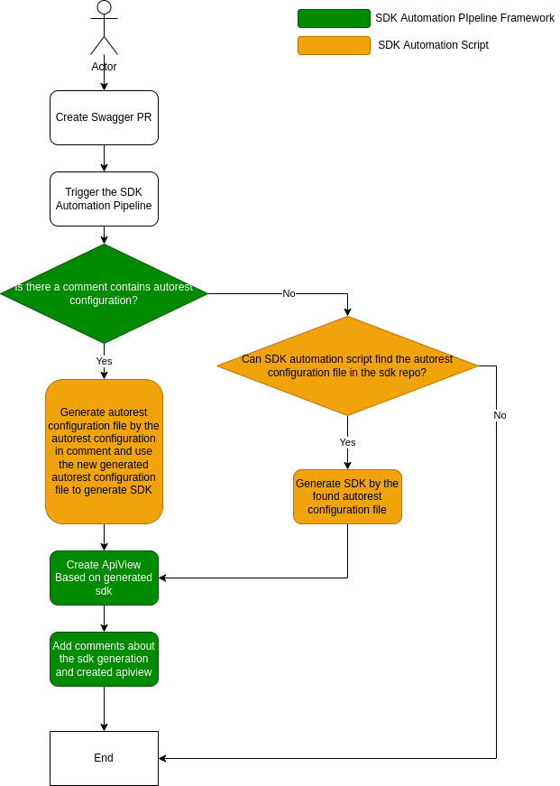

# Integrate DPG and ApiView in SDK Automation Pipeline
This document is targeting for everyone who wants to know all the implementation details of SDK automation pipeline.
It describes the details of integrating DPG and ApiView in SDK Automation Pipeline.

Before go through this document, please go through [Service Onboard DPG with Swagger CI Pipeline](README.md) to be familiar with the user experience in service team side. Also, you need to be familiar with [SDK Automation Pipeline Framework](../sdkautomation/README.md).

# WorkFlow


__Description:__
1. SDK Automation Pipeline is triggered in spec PR CI.
2. SDK Automation Pipeline Framework checks whether there is a comment containing autorest configuration in spec PR. If found, generate sdk by the autorest configuration in comment.
Otherwise, sdk automation pipeline will try to find if there is autorest configuration file in sdk repo. If found, generate sdk with the founded autorest configuration file. If not found, pipeline stops.
   1. When there is a comment containing autorest configuration, sdk automation pipeline will extract the autorest configuration from the comment, and let automation script use it to generate a new autorest configuration file, and use the new generated autorest configuration file to generate SDK.
      1. We need to make the comment as simple as possible. Currently, the common fields needed by all sdk are `output-folder` and `require` keyword.
      2. When getting the comment, automation script needs to parse it to extract needed information, and then use the extracted information to generate autorest configuration file in sdk repository.
      3. The value of `output-folder` is a relative path from sdk root folder. It is mainly used to extract information, such as service name, package name. In generating autorest configuration file in sdk repository, please replace it to the correct value.
      4. The value of `require` is a relative path to readme.md from spec root folder. In generating autorest configuration file in sdk repository, please concat relative path from package folder to sdk repo and `specFolder` in `generateInput.json`. For example:
         ```yaml
         require:
           - ../../../../../azure-rest-api-specs/specification/deviceupdate/data-plane/readme.md
         ```
         *You can also use the absolute path of spec repo, which can be resolved by yourself.*
      5. If there is other metadata in autorest configuration of spec PR comment, please copy them to autorest configuration file directly. (Although we only list little metadata service team can use in spec PR comment, we still need to support to add more metadata because the metadata listed in document maybe not enough.)
   2. When using the autorest configuration file found in sdk repository to generate SDK, SDK automation script need to modify the autorest configuration file in the SDK repo.
      1. If `require` block is used, change the `require` block to include the latest swagger `readme.md` in the PR.
      2. `input-file` will not be used. If the existing autorest configuration file uses `input-file`, we should change it to `require` before triggering the sdk automation pipeline, or add the autorest configuration in spec comment.
3. After generating SDK, SDK automation pipeline generates ApiView and then add comments about results to the Swagger PR.

# Future Work
Currently, we ask service team must add a comment containing autorest configuration in spec PR when new service onboards DPG.
In the future, we are going to integrate it with PowerAPP Workflow. Then service team can provide the necessary information in PowerAPP Workflow, and the information will be added to spec PR automatically. 