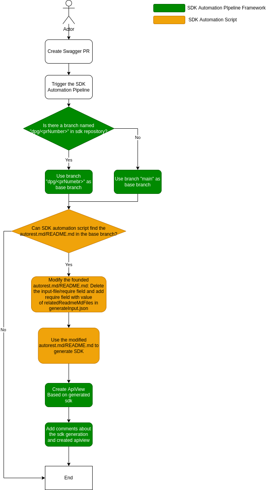

# Integrate DPG and ApiView in SDK Automation Pipeline
This document is targeting for everyone who wants to know all the implementation details of SDK automation pipeline.
It describes the details of integrating DPG and ApiView in SDK Automation Pipeline.

Before go through this document, please go through [Service Onboard DPG with Swagger CI Pipeline](README.md) to be familiar with the user experience in service team side. Also, you need to be familiar with [SDK Automation Pipeline Framework](../sdkautomation/README.md).

# WorkFlow


__Description:__
1. There is swagger PR triggering the SDK Automation Pipeline.
2. SDK Automation Pipeline Framework checks whether there is a branch named `swagger/<prNumber>` in sdk repository. If yes, the branch `swagger/<prNumber>` will be used as base branch to generate SDK. Otherwise, `main` branch will be used as base branch.
   1. `<prNumber>` is the swagger PR number.
   2. If there is branch `swagger/<prNumber>`, `main` branch is usually used and sometimes not. It depends on the `mainRepository` defined in [specificationRepositoryConfiguration](../../specificationRepositoryConfiguration.json).
3. SDK automation script will search for the corresponding autorest configuration file in sdk repository. If those files are not found, the pipeline automation script will output `{"packages": []}` in `generateOutput.json`, and stop the generation.
   1. A relative readme.md and changedFiles of the swagger PR can be get in `generateInput.json`, and automation script can use it to find the corresponding autorest configuration file in sdk repository.
   2. We will only use `require` to include swagger readme.md in autorest configuration file, and `input-file` should not be used in autorest configuration file in most times, but there are some exceptions:
      1. .Net SDK may continue to use `input-file` because existing HLC dataplane sdk may already use `input-file`.
      2. Multi-Client for Java, Python and JS cannot use `readme.md` in swagger directly because they use `batch` task, so using `input-file` is better.
4. SDK automation script will modify the autorest configuration file in the SDK repo`.
   1. Change the `require` block to include the latest swagger `readme.md` in the PR. The value can be joined by relative path from package folder to sdk root, `specFolder` and `relatedReadmeMdFiles` in `generateInput.json`. For example:
      ```yaml
      require:
        - ../../../../../azure-rest-api-specs/specification/deviceupdate/data-plane/readme.md
      ```
   2. For exceptions which still use `input-file`, replace the value of `input-file` to include the latest swagger in the PR. The value can be calculated similar as `require` block.
5. SDK automation pipeline generates SDK and ApiView with the modified autorest configuration file , and then add comments about results to the Swagger PR.

# Future Work
Currently, we ask service team to create branch `swagger/<prNumber>` and add/update autorest configuration file manually because the configuration file includes some necessary information to generate SDK.
In the future, we are going to integrate the sdk generation with PowerAPP Workflow. Then service team can provide the necessary information in PowerAPP Workflow, and pipeline can use the information to generate autorest configuration file automatically. 