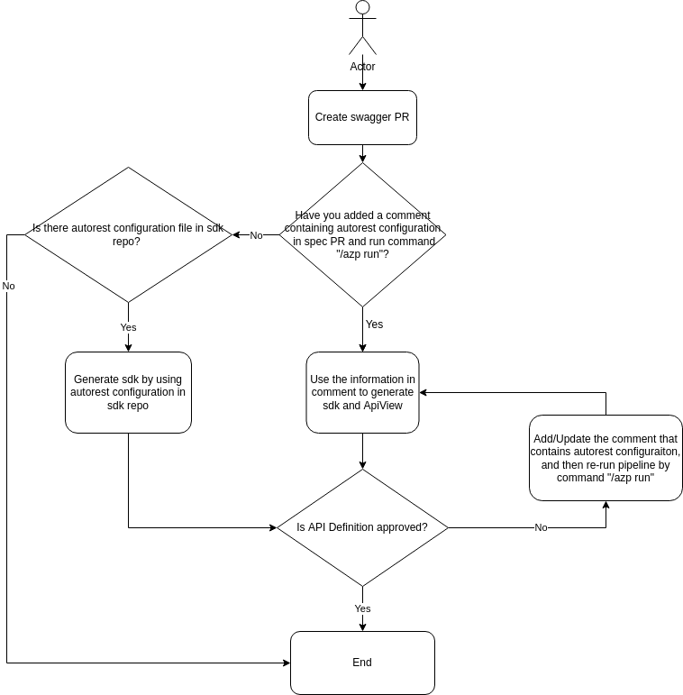
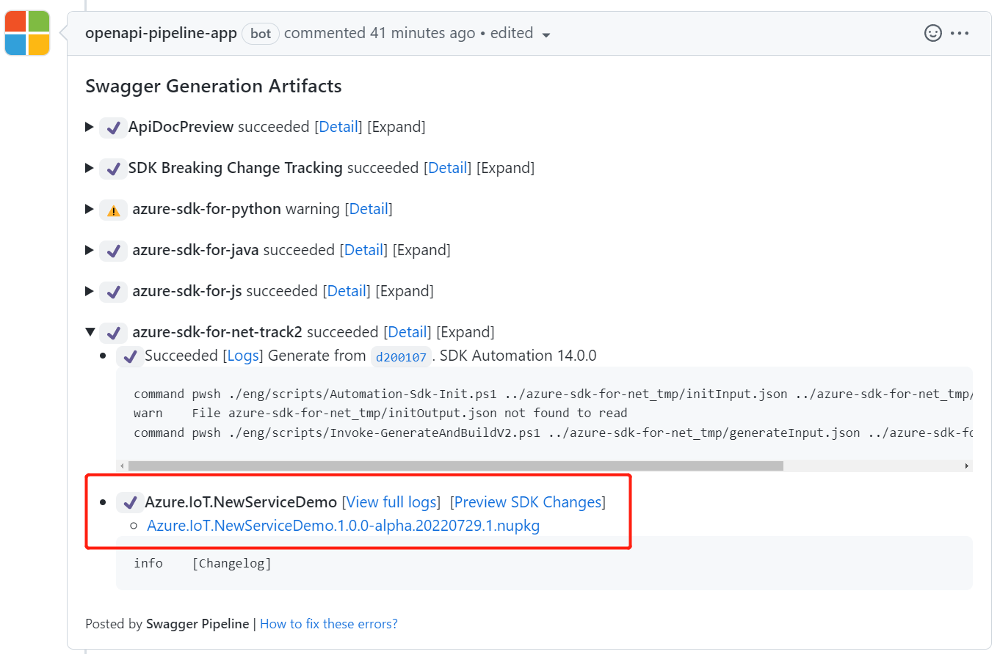
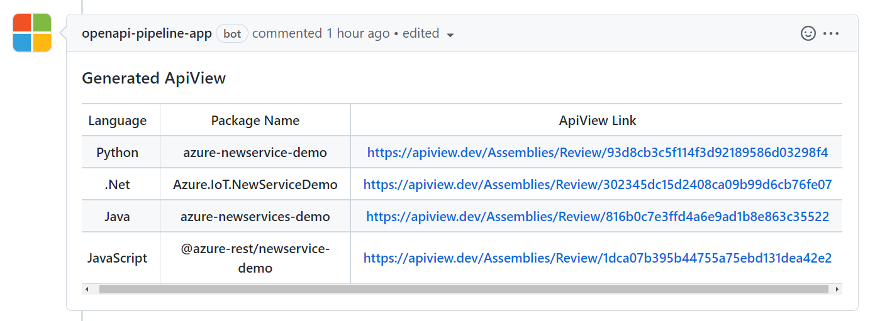

# Service Onboard DPG with Swagger CI Pipeline

Service Onboarding DPG with Swagger CI pipeline can help you get generated SDK and ApiView during the procedure of creating swagger PR.
The benefits are following:
1. API signature could be reviewed at the same time when we submit a Swagger PR. This could help to detect API issues at the early stage.
2. It enables service teams to access their SDKs even before their Swagger PR is merged.

This Document describes the process of how to onboard DPG with SDK automation pipeline. __This document is targeting for service team, who wants to onboard DPG.__ 

*If you want to go through details of pipeline implementation, please go to [Integrate DPG and ApiView in SDK Automation Pipeline](Integrate-dpg-and-apiview-in-sdk-automation-pipeline.md).*

## WorkFlow

__Description:__
1. Creates a swagger PR with [Guide to design and creation of Data Plane REST API and Client Libraries](https://aka.ms/azsdk/dpcodegen).
2. If you have added a comment, which contains autorest configuration, and run `/azp run` in the spec PR, the autorest configuration in the comment will be used to generate SDK.
Otherwise, pipeline will try to find autorest configuration file in sdk repository. If found, use the autorest configuration file to generate SDK. If not found, pipeline will stop.
   - Please refer to [Add autorest configuration in spec comment](./add-autorest-configuration-for-dataplane-sdk.md) on how to add autorest configuration in spec comment.
3. SDK and ApiView will be generated in spec CI pipeline, and you can find them in spec PR comment. Refer to the [Get your PR merged](https://eng.ms/docs/products/azure-developer-experience/design/api-specs-pr/api-specs-pr?tabs=dataplane) for next steps.
4. If any change needed, please update the autorest configuration in spec PR comment and regenerate the SDK by adding a comment `/azp run` to swagger PR.

## FAQ

1. Where can I find the generated sdk and corresponding ApiView?

   __Answer__: You can find them in spec PR comment. The generated SDK can be found in comment `Swagger Generation Artifacts`, and the corresponding ApiView Link can be found in comment `Generated ApiView`. Following screenshots comes from [example PR](https://github.com/Azure/azure-rest-api-specs/pull/20017)

   
   
 
3. What should I do when I encounter error in generating SDK in swagger PR CI pipeline?
   
   __Answer__: Please check the comment [Swagger Generation Artifacts] and the error message of failed pipeline. If you find the error messages ask you to fix autorest configuration comment or swagger, please fix it. If you cannot understand error message, please ask sdk owners for help with mail: azsdk-dpgsupport@microsoft.com.

4. What should I do when it creates ApiView Failed?

   __Answer__: If the ApiView is created failed, you can find there is an error message: `Create ApiView failed. Please ensure your github account in Azure/Microsoft is public and re-trigger the CI. If issue still exists, please ask PR assignee for help`. If you want to get the ApiView, 
please follow the action in error message, and make you github account's organization information public, then re-trigger the CI (You can re-trigger CI by comment `/azp run`, or close and reopen the PR). If it still cannot generate ApiView, please ask PR assignee for help. 

5. Is there ApiView generated when there is no sdk generated in sdk automation pipeline?

   __Answer__: No. Creating ApiView is based on the generated codes in sdk automation pipeline.
