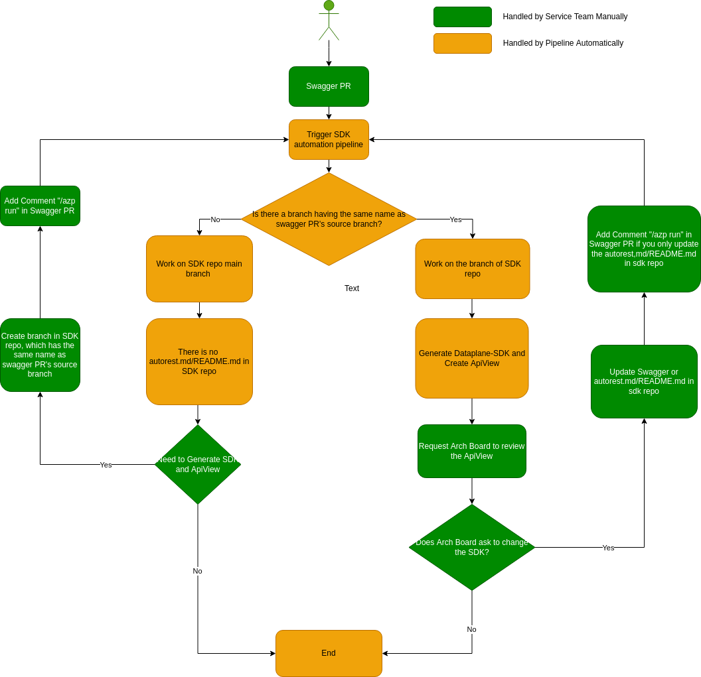
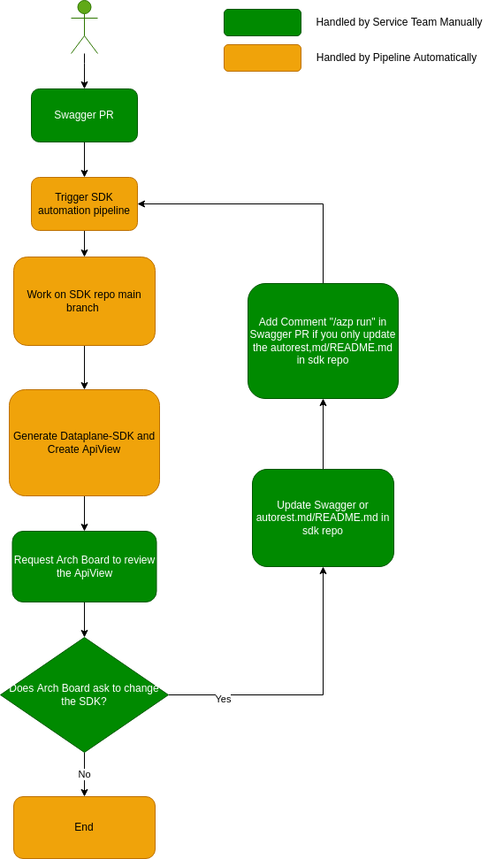

# Service Onboard DPG with Swagger CI Pipeline

Service Onboarding DPG with Swagger CI pipeline can help you get generated SDK and ApiView during the procedure of creating swagger PR.

This Document describes the process of onboarding DPG with SDK automation pipeline. This document is targeting for service team. 

*If you want to go through details of pipeline implementation, please go to [Integrate DPG and ApiView in SDK Automation Pipeline](Integrate-dpg-and-apiview-in-sdk-automation-pipeline.md).*

## WorkFlow

__Description:__
1. Creates a swagger PR.
2. If the service has onboarded DPG before, please go to step 4. Otherwise, please go to step 3.
3. Create branch with name `dpg/<prNumber>` in sdk repository, and add `autorest.md` or `README.md`. Then add a comment `/azp run` in swagger PR.
   1. `<prNumber>` is the PR number of swagger PR.
   2. About how to add `autorest.md` or `README.md`, please refer to [Add autorest configuration in sdk repository](./add-autorest-configuration-in-sdk-repository.md).
4. Swagger PR CI generates SDK and ApiView automatically, and you can find them in swagger PR comments.
5. Ask Arch Board to review the generated ApiView.
6. If Arch Board approves the ApiView, go to step 10. Otherwise, go to step 7.
7. Update Swagger if needed.
8. Update `autorest.md` or `README.md` if needed. Here, if there is a branch named `dpg/<prNumber>` in sdk repository, please update it in the branch. Otherwise update it in main branch.
9. Add a comment `/azp run` in swagger PR, and go to step 4.
10. Get the generated SDK and do some manual changes, such as adding samples/tests to it.
    1. Swagger PR CI creates a PR for generated SDK, and you can find it in comment `[Swagger Generation Artifacts]->[sdk-repository-name]->[Preview SDK changes]`. For example: `[Swagger Generation Artifacts]->[azure-sdk-for-js]->[Preview SDK changes]`.
    2. About what manual changes you need to do, please refer to [Next Steps After Generating Codes](./next-steps-after-generating-codes.md).
11. Create a PR to sdk repository and ask SDK owner to review it.

### WorkFlow for Onboarding New SDK

1. Service team creates a swagger PR, and sdk automation pipeline is triggered automatically.
2. SDK automation pipeline checks whether there is a branch having the same name as swagger PR's source branch.
   1. If not, the sdk automation works on main branch of SDK repository and finishes because the sdk is new SDK and it cannot find `autorest.md/README.md` in sdk repository. 
      If service team still wants to generate SDK and create ApiView, they can create the branch in SDK repo, which has the same name as swagger PR's source branch, and then add a comment "/azp run" in the swagger PR to re-trigger the SDK automation pipeline.
   2. If yes, SDK automation pipeline generates SDK and create ApiView based on the branch. If Arch Board ask to change the generated SDK, service team can update the swagger or autorest.md/README.md in sdk repository, and then re-trigger the pipeline to generate SDK and ApiView.

### WorkFlow for Updating Existing SDK

1. Service team creates a swagger PR, and sdk automation pipeline is triggered automatically.
2. SDK automation pipeline works on main branch of SDK repository and generates SDK and ApiView automatically. 
3. If Arch Board ask to change the generated SDK, service team can update the swagger or autorest.md/README.md in sdk repository, and then re-trigger the pipeline to generate SDK and ApiView.

## Other Information

1. There should be a basic readme.md together with swagger, and you can refer to the [sample](https://github.com/Azure/azure-rest-api-specs/tree/main/documentation/samplefiles-dp).
2. For .Net sdk, you need to create a sdk folder and `autorest.md` file under the target sdk folder if you want to generate sdk and ApiView in sdk automation pipeline.
   1. The sdk folder path should be in format `{ROOT_OF_SDK_FOLDER}/sdk/{ServiceFolder}/{NAMESPACE}`.
   2. The `autorest.md` path should be `{ROOT_OF_SDK_FOLDER}/sdk/{ServiceFolder}/{NAMESPACE}/src/autorest.md`. The template is [here](./.net/autorest.md). You can refer to [an existing SDK](https://github.com/Azure/azure-sdk-for-net/blob/main/sdk/deviceupdate/Azure.IoT.DeviceUpdate/src/autorest.md) as a sample.
3. For Java sdk, you need to create a sdk folder and `README.md` file under the target sdk folder if you want to generate sdk and ApiView in sdk automation pipeline.
   1. The sdk folder path should be in format `{ROOT_OF_SDK_FOLDER}/sdk/{ServiceFolder}/{PackageName}`.
   2. The `autorest.md` path should be `{ROOT_OF_SDK_FOLDER}/sdk/{ServiceFolder}/{PackageName}/swagger/README.md`. The template is [here](./java/README.md). You can refer to [an existing SDK](https://github.com/Azure/azure-sdk-for-java/blob/main/sdk/deviceupdate/azure-iot-deviceupdate/swagger/README.md) as a sample.
4. For Python sdk, you need to create a sdk folder and `README.md` file under the target sdk folder if you want to generate sdk and ApiView in sdk automation pipeline.
   1. The sdk folder path should be in format `{ROOT_OF_SDK_FOLDER}/sdk/{ServiceFolder}/{PackageName}`.
   2The `autorest.md` path should be `{ROOT_OF_SDK_FOLDER}/sdk/{ServiceFolder}/{PackageName}/swagger/README.md`. The template is [here](./python/README.md). You can refer to [an existing SDK](https://github.com/Azure/azure-sdk-for-python/blob/main/sdk/deviceupdate/azure-iot-deviceupdate/swagger/README.md) as a sample.
5. For JS sdk, you need to create a sdk folder and `README.md` file under the target sdk folder if you want to generate sdk and ApiView in sdk automation pipeline.
   1. The sdk folder path should be in format `{ROOT_OF_SDK_FOLDER}/sdk/{ServiceFolder}/{PackageName}`.
   2. The `autorest.md` path should be `{ROOT_OF_SDK_FOLDER}/sdk/{ServiceFolder}/{PackageName}/swagger/README.md`. The template is [here](./js/README.md). You can refer to [an existing SDK](https://github.com/Azure/azure-sdk-for-js/blob/main/sdk/deviceupdate/iot-device-update-rest/swagger/README.md) as a sample.