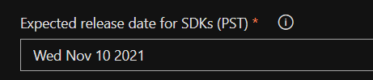
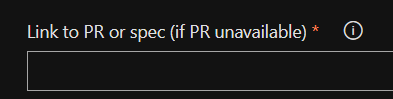
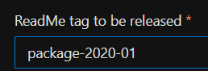
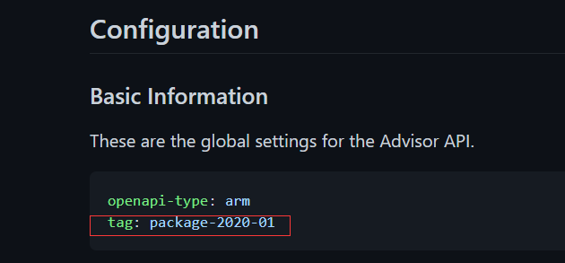
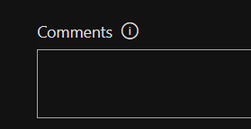

This file claims some rules for those who want official SDK release.

# How to ask for official SDK 
Make release request in [request-api-release](https://portal.azure-devex-tools.com/tools/request-api-release)

# Some guidance and rules when you fill the release issue

### 1. Expected release date for SDKs (PST)

SDK team need some time to prepare and test, so it is better to leave at least 1 week for them.

### 2. Link to PR or spec (if PR unavailable)

Two kinds of link is supported:

(1) PR link(for example: https://github.com/Azure/azure-rest-api-specs/pull/16554). If the PR contains `several kinds` of 
services, please paste specific service definition link(for example: https://github.com/Azure/azure-rest-api-specs/tree/main/specification/apimanagement/resource-manager)
in `Comments` to clarify which is needed.

(2) service definition link(for example: https://github.com/Azure/azure-rest-api-specs/tree/main/specification/apimanagement/resource-manager)

Note: `make sure` the content you want is `merged` into [main repo: azure-rest-api-specs](https://github.com/Azure/azure-rest-api-specs).
It is not permitted if PR is `open` or in [private repo: azure-rest-api-specs-pr](https://github.com/Azure/azure-rest-api-specs-pr).

### 3. ReadMe tag to be released

Make sure the tag is defined in `readme.md`(for example: https:https://github.com/Azure/azure-rest-api-specs/blob/main/specification/advisor/resource-manager/readme.md)
and the tag should stay the same with `default tag` in `readme.md`. If not, please make a PR to modify it before make the
release request.

### 4. Comments

If anything needs to clarify, write it in `Comments`

# What need to do after making release request

You could find your issue in [Azure/sdk-release-request](https://github.com/Azure/sdk-release-request/issues?q=is%3Aopen+is%3Aissue+label%3AManagementPlane), 
please pay attention to the `comment of issue` since SDK team may `ask for confirmation` before `publish the official SDK`. Once the SDK is published,
they will paste the link and close the issue.
 
