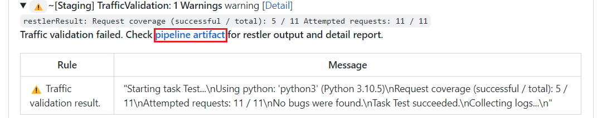
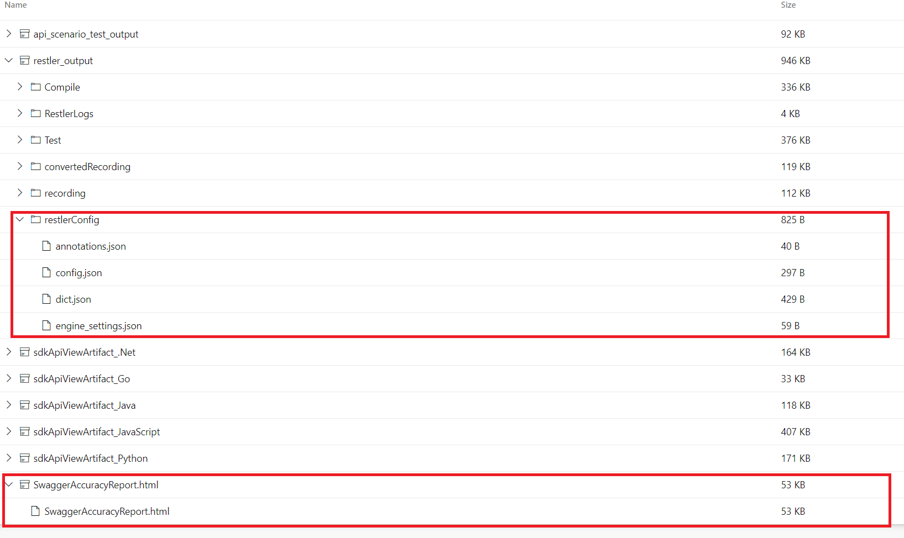
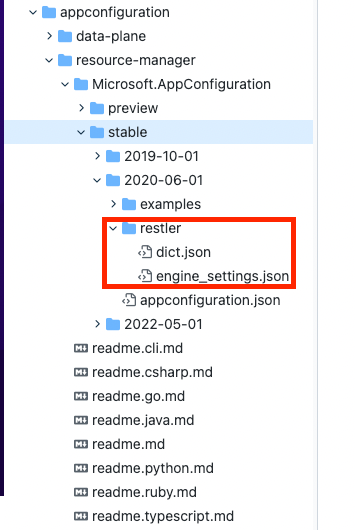

# Service Contract Accuracy Report

The purpose of the Service Contract (Swagger) Accuracy Report is to ensure that service contracts accuractly reflect true service behavior. It is critical that the contract be accurate because we use it to produce many assets such as documentation, SDKs (in many programming languages), and tools (Azure CLI & PowerShell). When the contract is incorrect, these assets are broken and fixing the contract later causes breaking changes and significant pain to all our customers.

Our tooling ([RESTler](https://github.com/microsoft/restler-fuzzer) and [OAV](https://github.com/azure/oav)) that produces this report tests all service operations and compares the actual requests/responses against the contract for accuracy.

---

**IMPORTANT: _All operations must be tested and pass before the PR contract can be merged._**

---

For any `Failed Operations`, use the error information (and links provided) to either fix the contract or fix the service behavior. Fix failed operations first as this may enable our tooling to test some of the currently untested operations.

For any `Untested Operations`, you must modify the RESTler configuration files to improve API coverage.

## Steps to improve API coverage

### 1. Download the RESTler configuration files

In swagger PR pipeline, traffic validation pipeline will generate RESTler configuration files as artifacts. You could click the **pipeline artifact** to download the configuration files.



Here is an example of the artifacts generated by the traffic validation pipeline:



The red block in the above image is the generated RESTler configuration files and swaggerAccuracyReport. After downloading the configuration files, you could modify the configuration files and run RESTler locally to improve API coverage.

### 1. Create an authentication script for RESTler

RESTler needs a way to obtain authentication tokens to pass on service requests.
For services that use AAD authentication, you can get tokens from the Azure CLI.
The following bash script will obtain a token from the Azure CLI and print it in the format needed by RESTler.

```sh
#!/bin/bash

find . -name 'token.json' -depth 1 -mtime -1h | grep . &> /dev/null || az account get-access-token --scope <AAD Scope for the service>> token.json

token=$(jq -r '.accessToken' token.json)

echo "{'user1':{}, 'user2':{}}"
echo "Authorization: bearer ${token}"
echo "Authorization: shadow_unit_test_token"
```

You can remove the `--scope` keyword from the `az account` command if the service does not require a specific scope.

Save this script in a file on your machine and include `--token_refresh_command <script file name>` when invoking RESTler locally.

### 2. Modify the configuration files to successfully execute more operations

In this CI pipeline, RESTler is running in [Test](https://github.com/microsoft/restler-fuzzer/blob/main/docs/user-guide/Testing.md) mode,
where it tries to execute each operation in the Swagger specification successfully once.
When an operation has dependencies (e.g. parent resources),
RESTler tries to infer these dependencies and create the required parent resource.
To learn more about how RESTler works, please refer to the [README](https://github.com/microsoft/restler-fuzzer).

You may either debug your changes locally by downloading RESTler, or for simpler fixes re-submit changes directly to the pipeline (in the latter case, refer to Step 3).
The advantage of a local setup is that you will get more familiar with RESTler, and can compare your known-good local setup
for testing the service with the setup in the CI pipeline to diagnose why a pipeline failure occurred.

<b>To run RESTler locally:</b>

**A. Download RESTler**

See the [README](https://github.com/microsoft/restler-fuzzer) for instructions.

**B. Go through each failed operation in the RESTler logs and fix the configuration to make it succeed**

There are 3 configuration files that you may need to modify:

- Dictionary (`dict.json`) - specify "magic constants" to assign to specific parameters. See [Dictionary](https://github.com/microsoft/restler-fuzzer/blob/main/docs/user-guide/FuzzingDictionary.md).
- Annotation file (`annotations.json`) - specify dependencies between requests. See [Annotations](https://github.com/microsoft/restler-fuzzer/blob/main/docs/user-guide/Annotations.md).
- Engine settings (`engine_settings.json`) - configure miscellaneous runtime testing parameters. See [Engine Settings](github).

For a general description of how to investigate failed operations, see [Improving Coverage](https://github.com/microsoft/restler-fuzzer/blob/main/docs/user-guide/ImprovingCoverage.md).
When testing a very large API, you may find it helpful to test one failed endpoint at a time and get it to succeed, which may be specified through the [Engine Settings](https://github.com/microsoft/restler-fuzzer/blob/main/docs/user-guide/EngineSettings.md).

**C. Test your changes by running RESTler locally.**

Compile the specifications using the command line below.  ```config.json``` will refer to your updated Swagger files and examples.

>Restler.exe compile config.json

Test the API using the exact command line taken from the _TrafficValidation_ step log in the CI pipeline (replace the ```token_refresh_command``` below with the authentication script on your local path).  For example:

>Restler.exe test --dictionary_file dict.json --grammar_file grammar.py --settings engine_settings.json --token_refresh_command "/local-scripts/get-token.sh" --token_refresh_interval 60

#### 3. Upload the modified RESTler configuration file so the PR pipeline can use it and re-run the Service Contract Accuracy report

After you have debug RESTler locally and improved API coverage, you can upload the modified configuration files to the azure-rest-api-specs repo so the pipeline can use them. For a specific resource provider, the RESTler config files is located at `RESTler` under the api-version folder. In swagger pipeline, the traffic validation check will load the customized RESTler config from the api-version folder and then run the RESTler test. 



When you uploaded the RESTler config files, the pipeline will re-run and re-generate the Service Contract Accuracy Report.
