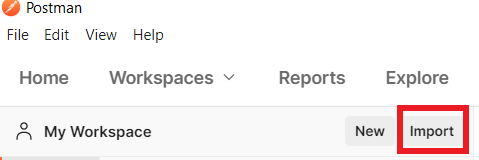

<!--
 Copyright (c) 2021 Microsoft Corporation

 This software is released under the MIT License.
 https://opensource.org/licenses/MIT
-->

# API test quick start

## Install

`oav` is an open-source powerful tool for swagger validation, example generation, and API testing. GitHub: https://github.com/Azure/oav.

```sh
npm install -g oav@latest
```
### OAV Features
- Very easy to use and run.
- Support postman collection format. Debug easily.
- Request response validation. `oav` implement a powerful validation algorithm and help developer to detect service issue in the early phase.
- Validation result report. After each run test scenario, developer will get a validation report which contains detect issue in api test.
- Integrate everywhere. Easily integrate with azure-pipeline, cloud-test.


## Create AAD app

To run API test, first please prepare an AAD app which is used for provisioning Azure resource. Please grant subscription contributor permission to this AAD app.

For how to create AAD app, please follow this doc https://docs.microsoft.com/en-us/azure/active-directory/develop/howto-create-service-principal-portal

## Authoring steps

We will write test scenario file for SignalR service as an example.

#### 1. Write your first test scenario file

First, create a folder `scenarios` under the api version folder. All test scenario files under the `scenarios` folder should bind with the api version.


Now write your basic test scenario. For more detail about test scenario file format, please refer to
[Test Scenario Definition Reference](../references/TestDefinitionReference.md).

```yaml
# yaml-language-server: $schema=https://raw.githubusercontent.com/Azure/azure-rest-api-specs/main/documentation/test-scenario/references/v1.0/schema.json

contentVersion: 1.0.0
scope: ResourceGroup
testScenarios:
  - description: Microsoft.SignalRService/signalR SignalR_CreateOrUpdate
    steps:
      - step: SignalR_CreateOrUpdate
        exampleFile: ../examples/SignalR_CreateOrUpdate.json
      - step: SignalR_Delete
        exampleFile: ../examples/SignalR_Delete.json
```

#### 2. create your env file

The `env.json` file contains required test scenario variables such as, subscriptionId, AAD applicationId, AAD applicationSecret.

```json
{
  "subscriptionId": "<my subscription id>",
  "location": "westus",
  "tenantId": "<AAD app tenantId>",
  "client_id": "<my add client_id>",
  "client_secret": "<my aad client_secret>"
}
```

#### 3. Run api test

```sh
oav run /home/user/azure-rest-api-specs/specification/signalr/resource-manager/Microsoft.SignalRService/preview/2020-07-01-preview/scenarios/signalR.yaml -e env.json
```

#### 4. Debug with postman

Sometimes the command `oav run` may fail due to non 2xx HTTP status code. Now you need to debug the test scenario with postman.

When run `run`, it automatically generate postman collection and postman env in `generated/<providerNamespace>/<testScenarioFile>/<runId>/<testScenario>` folder. Here is the generated file folder structure. The `collection.json` and `env.json` is generated postman collection file and environment file. `202105120922-5c3x5` is current runId. For each run command it will generated unique runId.

```
generated
└── Microsoft.SignalRService
    └── 2020-07-01-preview
        └── signalR
            └── 202105120922-5c3x5
                ├── signalR_0
                │   ├── collection.json
                │   └── env.json
                |   |__ report.json
                └── signalR_0.json
```

Postman is a widely used GUI API testing tool. And you could use Postman import the generated postman collection and env for your local debug.



After you import postman collection, you will get such requests. Now you could debug API test with postman locally.


#### 5. manual update example value

After debug with postman, you need to rewrite back all the updated values and run `oav run <test-scenario-file> -e <env.json>` again. The result should be successful.

## Feedback

If you have any question, feel free to send email to vscswagger@microsoft.com
