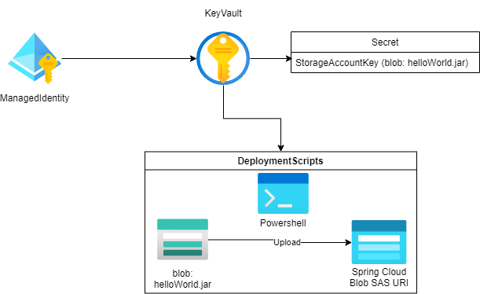

# Test scenario with deploymentScripts

## Background

There are some situations where you need ARM deploymentScripts. For example, populate a blob container in storage account with scripts and contents based on the location or environment type. Upload or create a keyVault certificate.

These tasks need some extras steps in PowerShell, CLI or via the portal. So in such situation, these scripts tasks are required steps of test scenario. The deploymentScript coming in. The purpose of deploymentScripts is to complete the last kilometer task which run theses extra step during deploying Azure resource.

For more details about deploymentScripts, pls refer to [Use deploymentScripts in ARM template](https://docs.microsoft.com/en-us/azure/azure-resource-manager/templates/deployment-script-template)

## Examples: Azure Spring cloud service upload app jar to Azure storage

In Azure Spring cloud service, After we create an app in Azure spring cloud service. Upload jar is a prerequisite step. So the steps are listed below.

- `Apps_GetResourceUploadUrl`: Get app upload jar blob SAS URI.
- `Upload_jar`: DeploymentScripts. Upload prepared jar to blob SAS URI.
- `Deployments_CreateOrUpdate`: Create and start deployments

#### Step 1: prerequisite

- ManagedIdentity: required for deploymentScripts. Azure use this managedIdentity to communicate with azure resource.
- StorageBlob: The main functionality is upload a helloWorld.jar to Spring Cloud blob SAS URI. This storage blob stored prepared helloWorld.jar.

Below is components architecture. In this case, we use Powershell to upload prepared 'helloWorld.jar' to Azure spring cloud service blob SAS URI.



#### Step 2: deploymentScripts

First, we need to write deploymentScripts ARMTemplate.

There are some required parameters which should be prepared in test scenario env.json or test scenario runtime variables.

- uploadUrl: Spring cloud SAS URI. runtime variables from `Apps_GetResourceUploadUrlGet_uploadUrl` step.
- userAssignedIdentity: ManagedIdentity for deploymentScripts
- scriptsContent: Powershell scripts to do upload task which is passed in from step variables.
- blobUrl: helloWorld.jar blob SAS Url

For more details about deploymentScripts, pls refer to [Use deploymentScripts in ARM template](https://docs.microsoft.com/en-us/azure/azure-resource-manager/templates/deployment-script-template)

```json
{
  "$schema": "https://schema.management.azure.com/schemas/2019-04-01/deploymentTemplate.json#",
  "contentVersion": "1.0.0.0",
  "parameters": {
    "utcValue": {
      "type": "string",
      "defaultValue": "[utcNow()]"
    },
    "uploadUrl": {
      "type": "string",
      "defaultValue": "$(uploadUrl)"
    },
    "userAssignedIdentity": {
      "type": "string",
      "defaultValue": "$(userAssignedIdentity)"
    },
    "scriptsContent": {
      "type": "string",
      "defaultValue": "$(scriptsContent)"
    },
    "blobUrl": {
      "type": "string",
      "defaultValue": "$(blobUrl)"
    }
  },
  "resources": [
    {
      "type": "Microsoft.Resources/deploymentScripts",
      "apiVersion": "2020-10-01",
      "name": "runPowerShellInlineWithOutput",
      "location": "[resourceGroup().location]",
      "kind": "AzurePowerShell",
      "identity": {
        "type": "userAssigned",
        "userAssignedIdentities": {
          "[parameters('userAssignedIdentity')]": {}
        }
      },
      "properties": {
        "forceUpdateTag": "[parameters('utcValue')]",
        "azPowerShellVersion": "6.2",
        "scriptContent": "[parameters('scriptsContent')]",
        "environmentVariables": [
          {
            "name": "uploadUrl",
            "secureValue": "[parameters('uploadUrl')]"
          },
          {
            "name": "blobUrl",
            "secureValue": "[parameters('blobUrl')]"
          }
        ],
        "timeout": "PT1H",
        "cleanupPreference": "OnSuccess",
        "retentionInterval": "P1D"
      }
    }
  ]
}
```

#### Step 3: Test scenario file

First, we need to write Powershell Scripts to download `helloWorld.jar` from prepared blob and upload to file share.

```PowerShell
$uploadUrl = ${Env:uploadUrl}
$BlobUri = ${Env:blobUrl}
$localFilePath = './helloWorld.jar'
function DownloadJarFromBlob([string]$blobUri, [string]$localOutputFilePath) {
  $Uri = [System.Uri]::New($blobUri.Split('?')[0])
  $SasToken = $blobUri.Split('?')[-1]

  $StorageCredentials = [Microsoft.WindowsAzure.Storage.Auth.StorageCredentials]::New($SasToken)
  $BlobFile = [Microsoft.WindowsAzure.Storage.Blob.CloudBlob]::new($Uri, $StorageCredentials)
  $DownLoadTask = $BlobFile.DownloadToFileAsync($localOutputFilePath, 4)
  $DownLoadTask
}

function UploadToFileShare([string]$uploadUrl, [string]$localFilePath) {
  $Uri = [System.Uri]::New($uploadUrl.Split('?')[0])

  $SasToken = $uploadUrl.Split('?')[-1]
  $StorageCredentials = [Microsoft.WindowsAzure.Storage.Auth.StorageCredentials]::New($SasToken)
  $CloudFile = [Microsoft.WindowsAzure.Storage.File.CloudFile]::New($Uri, $StorageCredentials)

  $UploadTask = $CloudFile.UploadFromFileAsync($localFilePath)
  $UploadTask
}

Connect-AzAccount -Identity
DownloadJarFromBlob $BlobUri $localFilePath
UploadToFileShare $uploadUrl $localFilePath

```

After write this scripts we could use this script as `scriptsContent` variables in test scenario file. Below is the part of test scenario file from Spring Cloud which includes three steps. The first step is `Apps_GetResourceUploadUrl` get blob SAS URI and write the URI as runtime variables. The second step is `Upload_jar` the scriptsContent is step variable which will be resolved in deploymentScripts. The scripts is to download `helloWorld.jar` from blob and upload to Spring cloud blob SAS URI. The third step is `Deployments_CreateOrUpdate` after upload `helloWorld.jar`, we could create a deployment.

```yaml
 - step: Apps_GetResourceUploadUrl
    exampleFile: ../examples/Apps_GetResourceUploadUrl.json
    outputVariables:
      uploadUrl:
        fromResponse: /uploadUrl
      relativePath:
        fromResponse: /relativePath

  - step: Upload_jar
    armTemplateDeployment: ./templates/uploadJar.json
    variables:
      scriptsContent: |
          $uploadUrl = ${Env:uploadUrl}
          $BlobUri = ${Env:blobUrl}
          $localFilePath = './helloWorld.jar'
          function DownloadJarFromBlob([string]$blobUri, [string]$localOutputFilePath) {
            $Uri = [System.Uri]::New($blobUri.Split('?')[0])
            $SasToken = $blobUri.Split('?')[-1]

            $StorageCredentials = [Microsoft.WindowsAzure.Storage.Auth.StorageCredentials]::New($SasToken)
            $BlobFile = [Microsoft.WindowsAzure.Storage.Blob.CloudBlob]::new($Uri, $StorageCredentials)
            $DownLoadTask = $BlobFile.DownloadToFileAsync($localOutputFilePath, 4)
            $DownLoadTask
          }

          function UploadToFileShare([string]$uploadUrl, [string]$localFilePath) {
            $Uri = [System.Uri]::New($uploadUrl.Split('?')[0])

            $SasToken = $uploadUrl.Split('?')[-1]
            $StorageCredentials = [Microsoft.WindowsAzure.Storage.Auth.StorageCredentials]::New($SasToken)
            $CloudFile = [Microsoft.WindowsAzure.Storage.File.CloudFile]::New($Uri, $StorageCredentials)

            $UploadTask = $CloudFile.UploadFromFileAsync($localFilePath)
            $UploadTask
          }

          Connect-AzAccount -Identity
          DownloadJarFromBlob $BlobUri $localFilePath
          UploadToFileShare $uploadUrl $localFilePath

  - step: Deployments_CreateOrUpdate
    exampleFile: ../examples/Deployments_CreateOrUpdate.json
    variables:
      deploymentName: blue    # this not work yet
    resourceName: deploymentBlue
    resourceUpdate:
      - replace: /sku/capacity
        value: 2
      - replace: /properties/source/type
        value: Jar
      - replace: /properties/source/relativePath
        value: "<default>"

```

## Summary

DeploymentScripts is to solve the last kilometer problem in test scenario. For debugging experience, you could use [cloudShell](https://ms.portal.azure.com/#cloudshell/).

## Reference

- [Use deployment scripts in ARM templates](https://docs.microsoft.com/en-us/azure/azure-resource-manager/templates/deployment-script-template)
- [An introduction to deployment scripts](https://dev.to/omiossec/an-introduction-to-deployment-scripts-resource-in-azure-resource-manager-m8g)
