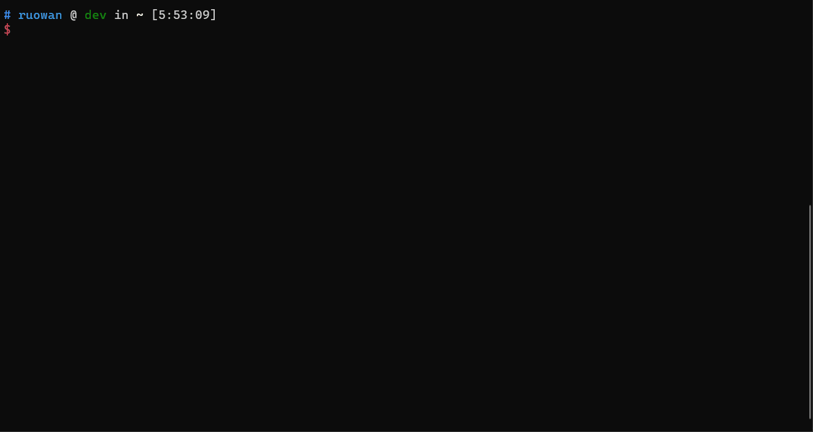

# Test Scenario Documentation

## Features

`oav` support run test scenario file.

- Very easy to use and run.
- Support postman collection format. Debug easily.
- Request response validation. `oav` implement a powerful validation algorithm and help developer to detect service issue in the early phase.
- Validation result report. After each run test scenario, developer will get a validation report which contains detect issue in api test.
- Integrate everywhere. Easily integrate with azure-pipeline, cloud-test.

#### Demo gif

## Quick start

- [Example: Write and run your first test scenario file](./QuickStart.md)
- [Example: Generate a basic test scenario file](./generateABasicTestScenario.md)
- [Example: use armTemplate to generate unique resourceName](./testScenarioWithARMTemplate.md)
- [Sample](../samplefiles/Microsoft.YourServiceName/stable/YYYY-MM-DD/scenarios/testYourService.yaml)

## References

[Test Scenario Definition Reference](./references/TestDefinitionReference.md)

[Test Scenario Variable Definition Reference](./references/Variables.md)

[Test Scenario Runner Reference](./references/Runner.md)

[Test Scenario Schema Reference](./references/TestDefinitionFileSchema.json)
