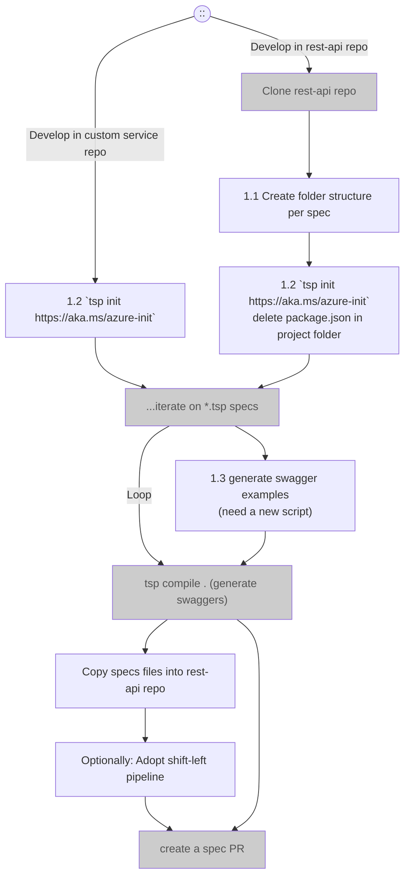
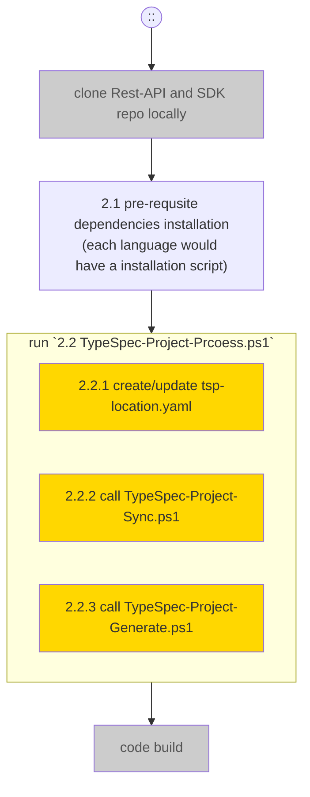
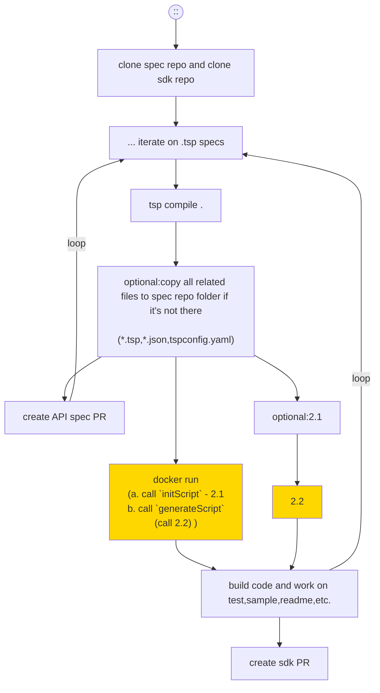
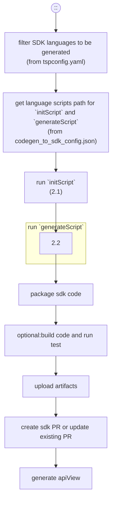
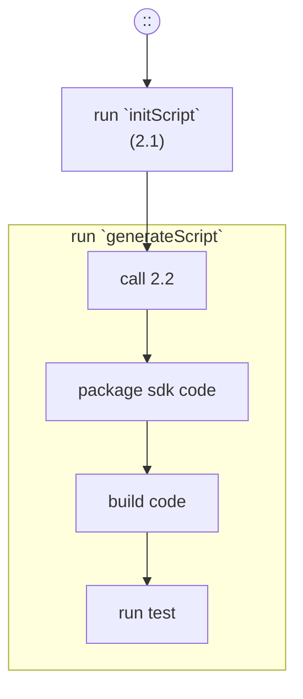

# TypeSpec end to end scenarios

## Scenario definitions

It is crucial having simple and smooth processes that allow developer to easily:

- [TypeSpec end to end scenarios](#typespec-end-to-end-scenarios)
  - [Scenario definitions](#scenario-definitions)
  - [Four main user scenarios to support](#four-main-user-scenarios-to-support)
      - [1. TypeSpec project scaffolding](#1-typespec-project-scaffolding)
        - [Flowchart](#flowchart)
        - [Remaining Tasks](#remaining-tasks)
        - [Details \& Open questions](#details--open-questions)
      - [2. SDK code generation](#2-sdk-code-generation)
        - [Flowchart](#flowchart-1)
        - [Remaining Tasks](#remaining-tasks-1)
      - [3. Inner Dev loop SDK generation local scenario](#3-inner-dev-loop-sdk-generation-local-scenario)
        - [Flowchart](#flowchart-2)
        - [Remaining Tasks](#remaining-tasks-2)
        - [Details \& Open questions](#details--open-questions-1)
      - [4.Dev Outer loop](#4dev-outer-loop)
        - [Use case](#use-case)
        - [4.1 Outer Dev loop azure-rest-api-specs pipeline](#41-outer-dev-loop-azure-rest-api-specs-pipeline)
          - [Flowchart](#flowchart-3)
          - [Details \& Open questions](#details--open-questions-2)
        - [4.2 Outer Dev loop SDK repo pipeline](#42-outer-dev-loop-sdk-repo-pipeline)
          - [Flowchart](#flowchart-4)
          - [Details \& Open questions](#details--open-questions-3)
      - [4. Outer loop Overall Status and tracking](#4-outer-loop-overall-status-and-tracking)
          - [Remaining Tasks](#remaining-tasks-3)

Aside from the developer process, we have a few goals on managing repo package version
- Should adopt a centralized package version control to avoid chaos
- Centralized package version control should give flexibility, freedom of relative independent emitter versions

## Four main user scenarios to support
#### 1. TypeSpec project scaffolding

##### Flowchart

##### Remaining Tasks
| Step | Step Detail | Assignee | Implemented | Verified |
|--|--|--|--:|--:|
| 1.1 | [Folder layout doc](./typespec-structure-guidelines.md) | Ray Chen | [X] | [X] |
| 1.2 | `tsp init`. <br> additional info may be collected for SDK | Allen Zhang | [X] | [ ] |
| 1.3 | Example generation instructions | Ray Chen | [ ] | [ ] |

##### Details & Open questions

#### 2. SDK code generation

##### Flowchart

- 2.1 Optional: Scripts should exist under `\eng\scripts\` folder on all repos.

- 2.2 `TypeSpec-Project-Process.ps1`
  - What does this script do?
    -	fetch `tspconfig.yaml` from remote if it doesn’t exist locally
    -	parse `tspconfig.yaml`
    - create an sdk project folder if none exists
    -	create/update `tsp-location.yaml`
    -	call `TypeSpec-Project-Sync.ps1`
    -	call `TypeSpec-Project-Generate.ps1`
  - input: 
    - typespecProjectDirectory (required)
      either a folder of `tspconfig.yaml` or a remoteUrl of `tspconfig.yaml`
    - commitSha (optional)
    - repoUrl (optional)
  - output: n/a

- 2.2.2 `TypeSpec-Project-Sync.ps1`
  - What does this script do?
    - fetch specs from remote spec repo or use a local spec repo
    - copy specs to temp location under the sdk project folder
    - support a local spec repo if one exists (TODO)
  - input: 
    - projectDirectory (required)
    - localSpecRepoPath (optional)
  - output: n/a

- 2.2.3 `TypeSpec-Project-Generate.ps1`
  - What does this script do?
    - create scaffolding for new project (use the folder created by 2.2)
    - generate sdk code
  - input: 
    - projectDirectory (required)
    - typespecAdditionalOptions (emitter options) (optional)

- 2.2.3.1 Function `Generate-{Language}-New-Project-Scaffolding`
  - What does this function do?
    - Create the folders and the files under SDK project folder, such as creating `test` folder, `sln` files that would vary between language repos. Eventually, this project scaffolding would be integrated into language emitter.
    - Create or update the files outside of the SDK project folder (CI.yml or pom.xml for java, etc.)
    - This function is called by generate script(2.4)
  - input: projectDirectory (required)

##### Remaining Tasks
| Step | Step Detail | Assignee | Implemented | Verified |
|--|--|--|--:|--:|
| 2.1 | Dependencies scripts | SDK owner | [ ] | [] |
| 2.2 | TypeSpec-Project-Process.ps1 | EngSys | [ ] | | [ ] |
| 2.2.2 | TypeSpec-Project-Sync.ps1 | EngSys | [ ] | | [ ] |
| 2.2.3 | TypeSpec-Project-Generate.ps1 | EngSys | [ ] | | [ ] |
| 2.2.3.1 | Generate-{Language}-New-Project-Scaffolding | SDK owner | [ ] | | [ ] |
| 2.3 | Language script to call common script | SDK owner | [] | []
| 2.4 | Update dotnet build target | Michael, Crystal | [] | []

#### 3. Inner Dev loop SDK generation local scenario
##### Flowchart

- Note: docker run command is
  ```
  docker run -it --privileged -v {local_spec_repo_path}:/spec-repo -v {local_work_folder}:/work-dir -v sdkgeneration.azurecr.io/sdk-generation:latest --typespec-project={relative_typespec_project} --sdk={sdk_to_generate}
  ```
##### Remaining Tasks
| Step | Step Detail | Assignee | Implemented | Verified |
|--|--|--|--:|--:|


##### Details & Open questions
Dev Inner Loop is defined as what spec/sdk developer does locally on the dev box.

Use case and design proposals
1. Optional: Create a TypeSpec self installer/package that will install all prerequisits such as node, npm, and TypeSpec
2. Spec writers [create recommended folder structures](https://github.com/Azure/azure-rest-api-specs/blob/main/documentation/typespec-structure-guidelines.md) under local clone of `azure-rest-api-specs` repo. 
3. In the correct folder, run `tsp init https://aka.ms/typespec/azure` to create TypeSpec project: ARM or DP. Project will not contain package.json but rather rely on the one in the root level. 
4. Author TypeSpec files and run `tsp compile .` to verify no errors in the TypeSpec project. It should only run `typespec-autorest` given that is the only emitter enabled via init template project. Genereated swagger would be placed in the appropriate folder. It is not expected to use --emit flag to run any SDK emitters. For that, see step 5.
5. Having a script to call OAV to generate swagger examples.
6. Optionally, after successful compile of TypeSpec project, spec author is able to run simple docker command to generate SDK for particular lanaguages locally.
7. Optionally, sdk developer can work on sdk sample, sdk test, readme, etc., locally.

#### 4.Dev Outer loop

Dev Outer Loop is defined as the experience of Spec writers sherparding the TypeSpec documents thru `azure-rest-api-sepcs` and its other depedency repos/branches like `-pr`, `-pr/RPSaasMain`, and `-pr/RPSaaSDev`, to different lanaguge SDK repos.

The experience should allow as much validations can be verified/debugged locally to ensure a clean CI for simple and fast PR reviews.

##### Use case
- With the correct inner loop setup, the spec writer should be able to submit all relevant files as PR to `azure-rest-api-specs-pr` repo or `azure-rest-api-specs` repo
- CI pipeline should verify TypeSpec compliation
- CI Pipeline should be able to generate key language SDKs (.net,java,js,python)
- Optionally CI generated key lanauge SDKs changes can be used to directly create PR on SDK public repo
- Optionally user can add customized code to the working branch created by CI pipeline.

##### 4.1 Outer Dev loop azure-rest-api-specs pipeline
###### Flowchart


###### Details & Open questions

- Step of "run `initScript`":
   - output: a string map of environment variables to be set in following scripts.
  
- Step of "run `generateScript`":
   - input: [GenerateInputSchema](https://github.com/Azure/azure-rest-api-specs/blob/main/documentation/sdkautomation/GenerateInputSchema.json)
     - specFolder
     - headSha
     - repoUrl
     - relatedTypeSpecProjectFolder

   - output: [GenerateOutputSchema](https://github.com/Azure/azure-rest-api-specs/blob/main/documentation/sdkautomation/GenerateOutputSchema.json)
   - packageName
   - result
   - path
   - changelog
   - artifacts

##### 4.2 Outer Dev loop SDK repo pipeline
###### Flowchart

###### Details & Open questions

#### 4. Outer loop Overall Status and tracking

CI pipeline implementation
  - [x] 4.1 TypeSpec validation components
    - [x] compile
    - [ ] tspconfig validation (TBA?)
    - [ ] breaking change detection (TBA?)
    - [x] generated swagger validation
  - [x] 4.2 TypeSpec SDK generation components
    - [x] code generation
    - [ ] code build and test (not all languages have)
    - [x] package generation
    - [x] API view generation
  
###### Remaining Tasks
| Step | Step Detail | Assignee | Implemented | Verified |
|--|--|--|--:|--:|
| 4.1 | Validation Component |  | [ ] | [ ] |
| 4.2 | SDK generation Component |  | [ ] | | [ ] |
