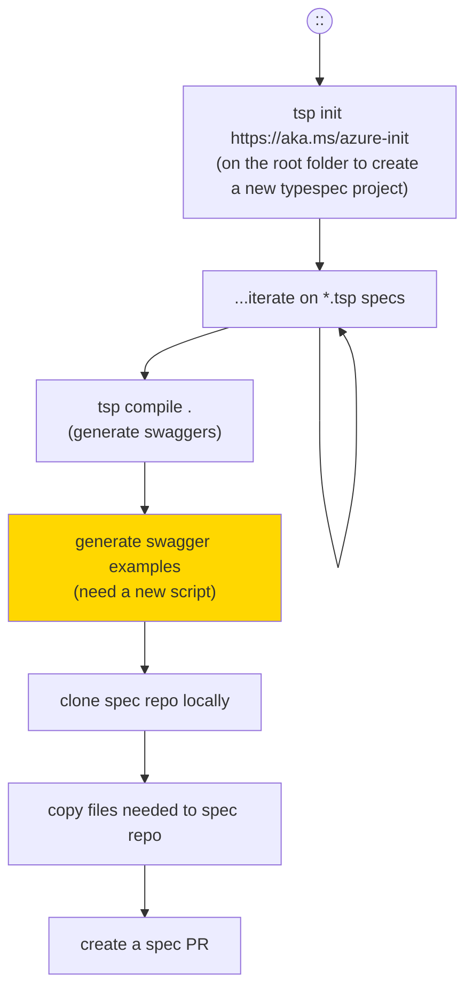
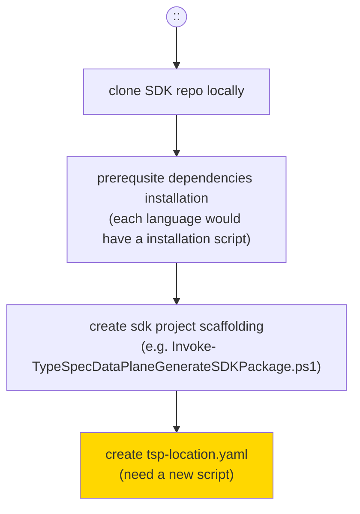
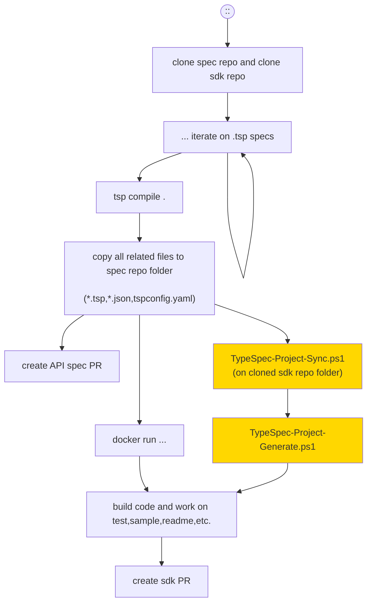
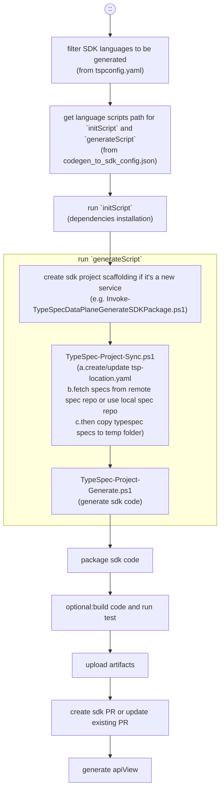

# TypeSpec end to end scenarios

## Intro
It is crucial having a simple and smooth process that allow developer to easily:

- create TypeSpec project locally
- iterate locally on TypeSpec
- locally preview generated Swagger file
- locally preview generated SDK files
- gather relevant files to generate rest-api-spec PRs with green CI results
- generating SDK PRs from checked in TypeSpec files in rest-api-spec with APIView
- any CI failures can be reproduced locally

Aside from the developer process, we have a few goals on managing repo package version

- Should adopt a centralized package version control to avoid chaos
- Centralized package version control should give flexibility, freedom of relative independent emitter versions

## Four main user scenarios to support
#### 1.TypeSpec project scaffolding


#### 2.SDK project scaffolding


#### 3.Inner Dev loop SDK generation local scenario


Dev Inner Loop is defined as what spec/sdk developer does locally on the dev box.

Use case and design proposals
1. Optional: Create a TypeSpec self installer/package that will install all prerequisits such as node, npm, and TypeSpec
2. Spec writers [create recommended folder structures](https://github.com/Azure/azure-rest-api-specs/blob/main/documentation/typespec-structure-guidelines.md) under local clone of `azure-rest-api-specs` repo. 
3. In the correct folder, run `tsp init https://aka.ms/typespec/azure` to create TypeSpec project: ARM or DP. Project will not contain package.json but rather rely on the one in the root level. 
4. Author TypeSpec files and run `tsp compile .` to verify no errors in the TypeSpec project. It should only run `typespec-autorest` given that is the only emitter enabled via init template project. Genereated swagger would be placed in the appropriate folder. It is not expected to use --emit flag to run any SDK emitters. For that, see step 5.
5. Having a script to call OAV to generate swagger examples.
6. Optionally, after successful compile of TypeSpec project, spec author is able to run simple docker command to generate SDK for particular lanaguages locally.
7. Optionally, sdk developer can work on sdk sample, sdk test, readme, etc., locally.

#### 4.Dev Outer loop
Dev Outer Loop is defined as the experience of Spec writers sherparding the TypeSpec documents thru `azure-rest-api-sepcs` and its other depedency repos/branches like `-pr`, `-pr/RPSaasMain`, and `-pr/RPSaaSDev`, to different lanaguge SDK repos.

The experience should allow as much validations can be verified/debugged locally to ensure a clean CI for simple and fast PR reviews.

##### Use case
- With the correct inner loop setup, the spec writer should be able to submit all relevant files as PR to `azure-rest-api-specs-pr` repo or `azure-rest-api-specs` repo
- CI pipeline should verify TypeSpec compliation
- CI Pipeline should be able to generate key language SDKs (.net,java,js,python)
- Optionally CI generated key lanauge SDKs changes can be used to directly create PR on SDK public repo
- Optionally user can add customized code to the working branch created by CI pipeline.

##### Implementation & design proposals
- CI pipeline implementation
  - [x] TypeSpec validation components
    - [x] compile
    - [ ] tspconfig validation (TBA?)
    - [ ] breaking change detection (TBA?)
    - [x] generated swagger validation
  - [x] TypeSpec SDK generation components
    - [x] code generation
    - [ ] code build and test (not all languages have)
    - [x] package generation
    - [x] API view generation

###### 4.1 Outer Dev loop azure-rest-api-specs pipeline

Step of "run `initScript`":
 - output: a string map of environment variables to be set in following scripts.
  
Step of "run `generateScript`":
 - input: [GenerateInputSchema](https://github.com/Azure/azure-rest-api-specs/blob/main/documentation/sdkautomation/GenerateInputSchema.json)
   - specFolder
   - headSha
   - repoUrl
   - relatedTypeSpecProjectFolder

 - output: [GenerateOutputSchema](https://github.com/Azure/azure-rest-api-specs/blob/main/documentation/sdkautomation/GenerateOutputSchema.json)
   - packageName
   - result
   - path
   - changelog
   - artifacts

`TypeSpec-Project-Sync.ps1`
 - input: 
   - projectDirectory
   - repo
   - commit
   - additionalDirectories
   - localMode (use local spec and don't fetch from remote)
   - localSpecRepoPath
Note: we might pull out tsp-location.yaml create/update part as single script to be used by #2 scenario

`TypeSpec-Project-Generate.ps1`
 - input: 
   - projectDirectory
   - typespecAdditionalOptions (emitter options)

###### 4.2 Outer Dev loop SDK repo pipeline
```mermaid
flowchart TD;
  classDef manualStep fill:#ffd700
  classDef automationStep fill:#7de188
  Pipeline((::))-->A
A["run `initScript`
(dependencies installation)"]-->C
subgraph B["run `generateScript`"]
  C
  D
  E
  F
  G
end
C["TypeSpec-Project-Sync.ps1
(a.use existing tsp-location.yaml
b.fetch specs from remote spec repo
c.then copy typespec specs to temp folder)"]-->D
D["TypeSpec-Project-Generate.ps1
(generate sdk code)"]-->E
E["package sdk code"]-->F
F["build code"]-->G
G["run test"]