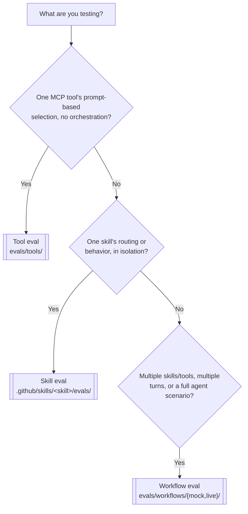

# Eval authoring guide

One guide for writing Vally evals in this repo, whatever you're testing: a single MCP **tool**, an Agent **skill**'s routing/behavior, or a multi-step **workflow**. Read this once. The three `azsdk-common-eval-authoring-*` skills exist only to route you here with the right category already identified — they don't duplicate this content.

This doc lives under `eng/common/knowledge/` because it's synced as-is to every repo that consumes the shared eval pipeline. Everything here is grader- and process-level, not tied to one repo's file layout — where **your** repo's evals actually live is one lookup away (Step 0 below), not hardcoded in this guide.

## Contents

1. [Which category is this?](#1-which-category-is-this)
2. [Naming convention](#2-naming-convention)
3. [Category requirements](#3-category-requirements)
4. [Glossary](#4-glossary)
5. [Four-layer grading pattern](#5-four-layer-grading-pattern)
6. [Grader catalog](#6-grader-catalog)
7. [Anti-patterns](#7-anti-patterns)
8. [Customization guidance](#8-customization-guidance)
9. [Worked examples](#9-worked-examples)
10. [Running evals locally](#10-running-evals-locally)

## Step 0: find out where evals live in *your* repo

Before anything else: find the pipeline file that extends `eng/common/pipelines/templates/stages/archetype-eval.yml` for the category you're authoring, and read its `vallyRoot`/`evalGlobs`. Do not assume this repo's paths are universal.

| Category | Azure SDK Tools example pipeline | Azure SDK Tools example `vallyRoot` |
| --- | --- | --- |
| Skill | `eng/common/pipelines/skill-eval.yml` | `.github/skills` |
| Tool / Workflow | `eng/common/pipelines/workflow-eval.yml`, `eng/common/pipelines/live-eval.yml` | `evals` |

These are source-repository examples, not a contract for consuming repos. A repo that scopes skill evals under `.github/skills` may equally scope tool/workflow evals under `.github/skills/evals/{tools,workflows}` instead of a root-level `evals/` — always confirm against that repo's own pipeline file, never assume.

## 1. Which category is this?



If you're unsure between skill and workflow: a **skill** eval has one target skill and checks its routing or behavior in isolation. Mount immediate competitors only for a boundary-routing stimulus. A **workflow** eval mounts every genuinely competing skill/tool together and checks orchestration across them (which one wins, in what order, across how many turns).

## 2. Naming convention

The point of a naming convention is that related files and results **sort and group together** — in a directory listing, in `vally eval` output, and when filtering by tag.

### Files

| Category | Filename pattern | Example |
| --- | --- | --- |
| Skill | `eval.yaml` (routing + capability stimuli together; split into `<behavior-in-kebab-case>.eval.yaml` only once coverage grows large) | `.github/skills/my-skill/evals/eval.yaml` |
| Tool | `prompt-to-tool-<area>.eval.yaml` (one per tool namespace/area) | `evals/tools/prompt-to-tool-pipeline.eval.yaml` |
| Workflow | `<scenario-in-kebab-case>.eval.yaml` | `evals/workflows/mock/release-planner-workflows.eval.yaml` |

### Stimuli (the `name:` field inside a file)

- Routing stimuli: prefix `trigger-...` / `anti-trigger-...` so a scan of results instantly separates "should activate" from "should not."
- Everything else: a short kebab-case description of the scenario, e.g. `create-then-generate-conversation`.

### Tags

- `tags.area` must equal the skill name or tool-area exactly — this is what lets `--tag area=X` and tag-scoped suites (`release-plan`, `typespec`, `pipeline`, `github`, ...) find your file.
- `tags.type`/`tags.tier` use the small fixed vocabulary already in use (`ci-gate`, `unit`, ...) — match an existing sibling file, don't invent a new value.

## 3. Category requirements

| | Tool | Skill | Workflow |
| --- | --- | --- | --- |
| **Purpose** | Given a prompt, is the right MCP tool selected? | Given a prompt, does the right skill activate, and does it call the right tools? | Given a scenario (possibly multi-turn), does the right combination of skills/tools reach the right outcome? |
| **Location** | `evals/tools/` | `.github/skills/<skill>/evals/` | `evals/workflows/{mock,live}/` |
| **Must have** | Realistic, concrete prompt (identifiers included, not left for the agent to discover); hermetic mock environment | Routing stimuli (trigger **and** anti-trigger, `skill-invocation` grader) alongside capability stimuli in `eval.yaml`; boundary anti-triggers mount **and require** a genuine competing skill | Every candidate skill mounted explicitly; bounded turns/tokens/timeout; choose the `vally eval --workers` value deliberately; mock by default, live only when the mock can't represent it |
| **Primary graders** | `tool-calls` | `skill-invocation` (+ `tool-calls`, `output-matches` for capability) | `skill-invocation` + `tool-calls` (ordering where it matters) + outcome graders |
| **Do NOT use for** | Orchestration, conversation state, live services → use Workflow | Single-tool selection → use Tool; multi-skill orchestration → use Workflow | Isolated single-tool or single-skill checks → use Tool/Skill instead |

## 4. Glossary

Plain-English definitions of the eval fields and CLI options you'll actually touch:

| Term | Meaning |
| --- | --- |
| **stimulus** | One test case: a `prompt` (or `turns`) plus the `graders` that judge the response. A file is a list of stimuli. |
| **trajectory** | The full recorded sequence of tool calls and messages the agent produced for a stimulus. Graders inspect this, not just the final reply. |
| **turns** | An ordered list of prompts within one stimulus, for scenarios where a later request depends on earlier session context. Omit it and use a single `prompt` unless you specifically need that. |
| **timeout** | Max wall-clock time one stimulus run may take before it's failed as timed out. Live/orchestration-heavy stimuli need more headroom than a single tool call. |
| **model** | Which LLM executes the stimulus (e.g. `claude-opus-4.6`, `gpt-5.4`). Use a stronger model where judgment matters; a cheaper/faster one is fine for high-volume routing suites. |
| **executor** | The harness driving the model + tools for a stimulus. `copilot-sdk` is the real Copilot Chat SDK loop used across this repo's suites. |
| **environment** | A named MCP server + skill-mount configuration (e.g. `azsdk-mcp-mock` vs `azsdk-mcp-live`) that a stimulus runs against. |
| **scoring.threshold** | The minimum aggregate score (0–1) for an eval suite to pass. A suite can clear its threshold even if an individual stimulus fails. Always set it explicitly — repo convention: `0.8`. |
| **scoring.weights** | Optional per-grader weighting. When present, must sum to `1.0` or the spec fails to load. |
| **workers** | How many stimuli `vally eval` runs in parallel. Live/write-side suites should use `--workers 1` to avoid racing real side effects. |

## 5. Four-layer grading pattern

Every stimulus verifies a *contract*. These are the dimensions of that contract — use as many as apply, minimum routing + tool-use for any capability stimulus:

1. **Routing** (`skill-invocation`) — did the right skill get loaded (and the wrong one not)?
2. **Tool-use** (`tool-calls`) — did the agent call the right MCP tool, and avoid the wrong one? `name` is matched as a regex against the trajectory; prefer bare tool names over server-prefixed forms.
3. **Output shape** (`output-matches`) — does the reply structurally address the request? Prefer a regex requiring two related concepts in proximity over a bare `output-contains` keyword — much harder to satisfy by accident.
4. **Judgment** (`prompt`) — anything the first three can't express. Use sparingly; LLM judges are expensive and non-deterministic.

| Stimulus kind | Required layers |
| --- | --- |
| Capability — happy path | Routing + Tool-use, optionally Output-shape |
| Capability — multi-tool flow | Routing + Tool-use (multiple required entries, optionally ordered) |
| Negative — wrong topic | Routing disallowed + Tool-use disallowed |
| Boundary — sibling skill should win instead | Routing required for the sibling / disallowed for this skill; mount both together |
| Trigger | Routing required only |
| Anti-trigger | Routing disallowed only |

## 6. Grader catalog

| Grader | Purpose | Typical use |
| --- | --- | --- |
| `skill-invocation` | `required` / `disallowed` skills loaded during the run | Trigger, anti-trigger, boundary tests |
| `tool-calls` | `required` / `disallowed` (optionally `ordered`) MCP tool calls; `name` is a regex | Every capability test |
| `output-contains` / `output-not-contains` | Substring search on the final assistant message | Cheap sanity check; never the sole grader |
| `output-matches` / `output-not-matches` | Regex search on the final assistant message | Preferred output-shape grader |
| `file-exists` | A file exists in the workspace after the run | Skills that scaffold files |
| `file-contains` / `file-matches` | Substring/regex search in a workspace file | Skills that edit or generate files |
| `run-command` | Executes a shell command; nonzero exit fails the grader | Build/lint/compile verification |
| `completed` | Trajectory finished without an unhandled error | Liveness baseline |
| `prompt` | Free-form LLM judge against a custom rubric | Last resort — expensive, non-deterministic |

Picking one:

```text
routing?                  -> skill-invocation
right tool fired?         -> tool-calls (required)
wrong tool did not?       -> tool-calls (disallowed)
call order matters?       -> tool-calls (ordered)
reply mentions X?         -> output-contains (secondary only)
reply structurally right? -> output-matches
file created/edited?      -> file-exists / file-contains / file-matches
build still passes?       -> run-command
nothing else fits?        -> prompt (last resort)
```

For multi-turn stimuli, a grader's `turn:` field slices the trajectory to that turn only (0-based, matching the `turns:` array index); omit it for a conversation-wide assertion. `skill-invocation`/`tool-calls` turn-scoping is reliable; `output-contains`/`output-matches` have been observed to not reliably isolate a single turn — keep those session-wide unless you've verified otherwise (per-turn grading design, tracked in microsoft/vally#481).

## 7. Anti-patterns

| # | Smell | Fix |
| --- | --- | --- |
| A1 | Single vacuous `output-contains` as the only grader — passes on almost any outcome | Add `skill-invocation`/`tool-calls`; keep the substring only as a secondary check |
| A2 | Negative test grades only output text, not tool absence — the tool can still fire silently | Add `tool-calls.disallowed` for every tool the skill could wrongly invoke |
| A3 | Stimulus prompt and grader substring are the same phrase — any cooperative reply parrots it | Use `output-matches` describing the response *shape*, or replace with `skill-invocation`/`tool-calls` |
| A4 | Missing/inconsistent `scoring.threshold` or `weights` not summing to `1.0` | Always set `threshold` explicitly (`0.8` convention); verify weights sum to `1.0` before adding them |
| A5 | No routing stimuli anywhere in a skill's `evals/` — routing regressions go undetected | Add ≥3 trigger + ≥3 anti-trigger stimuli (`skill-invocation` grader) to `eval.yaml` |
| A6 | Tool name typo in `required`/`disallowed` — the regex compiles, matches nothing, "passes" silently | Cross-check names against a real trajectory (`results.jsonl`) |
| A7 | Boundary anti-trigger with no competing skill mounted — trivially "passes" since nothing else was ever available | Mount every genuinely competing skill together, require the intended sibling, and disallow the skill under test |
| A8 | One environment for everything — mock can't catch contract drift against the real backend | Reserve a small live tier, run nightly, use `--workers 1` |

## 8. Customization guidance

- **Mock vs live**: default to mock (hermetic, PR-gate). Move to live only for behavior the mock genuinely can't represent (real auth, real backend contract) — document writes, cleanup, and run it nightly with `--workers 1`.
- **`defaults.runs`**: bump above `1` to stabilize a flaky stimulus before assuming the implementation is wrong.
- **`scoring.threshold`**: `0.8` is the starting convention for new suites; raise it as a suite's coverage and stability mature.
- **`model`**: cheaper/faster models are fine for high-volume routing suites; reserve stronger models for judgment-heavy (`prompt` grader) suites.
- **`timeout`/`--workers`**: give orchestration-heavy or live stimuli more headroom than a single tool call; `workers` is a `vally eval` CLI option, not an eval-spec field. Always serialize (`--workers 1`) anything with real side effects.

## 9. Worked examples

### Tool example

```yaml
# evals/tools/prompt-to-tool-example.eval.yaml
name: azsdk-mcp-tool-invocation-eval
description: Verify prompts invoke the expected MCP tools.
type: capability
environment: azsdk-mcp-mock
defaults:
  runs: 1
  timeout: "120s"
  model: gpt-5.4
  executor: copilot-sdk
tags:
  tier: unit
  area: example
stimuli:
  - name: invoke-expected-tool
    prompt: "Check the status of Azure DevOps pipeline build 6447834."
    graders:
      - type: tool-calls
        config:
          required:
            - name: azsdk_get_pipeline_status
          disallowed:
            - name: azsdk_analyze_pipeline
```

### Skill example

```yaml
# .github/skills/my-skill/evals/eval.yaml
name: my-skill-eval
description: Routing and capability tests for my-skill
type: capability
environment: azsdk-mcp-mock
tags:
  area: my-skill
  type: ci-gate
defaults:
  runs: 1
  timeout: "90s"
  model: claude-opus-4.6
  executor: copilot-sdk
scoring:
  threshold: 0.8
stimuli:
  # Routing
  - name: trigger-obvious-phrasing
    prompt: "help me do the thing my-skill exists for"
    graders:
      - type: skill-invocation
        config:
          required: ["my-skill"]
  - name: anti-trigger-unrelated-request
    prompt: "write a TypeSpec definition for a new resource"
    graders:
      - type: skill-invocation
        config:
          disallowed: ["my-skill"]
  # Capability — same file, once routing is confirmed
  - name: applies-the-expected-change
    prompt: "using my-skill, do the specific thing with these concrete identifiers: ..."
    graders:
      - type: skill-invocation
        config:
          required: ["my-skill"]
      - type: tool-calls
        config:
          required:
            - name: expected_tool_call
```

### Workflow example

```yaml
# evals/workflows/mock/example-multi-turn.eval.yaml
name: example-multi-turn-workflow
description: Turn 1 creates a release plan; turn 2 must reuse its result.
type: capability
environment: azsdk-mcp-mock
tags:
  tier: scenario
  area: release-plan
defaults:
  runs: 1
  timeout: "180s"
  model: gpt-5.4
  executor: copilot-sdk
stimuli:
  - name: create-then-generate-conversation
    environment:
      skills:
        - ../../../.github/skills/azsdk-common-prepare-release-plan
        - ../../../.github/skills/azsdk-common-generate-sdk-locally
    turns:
      - prompt: "Create a public preview release plan for the Contoso Widget Manager."
      - prompt: "Now generate the SDK for the plan you just created."
    graders:
      - type: skill-invocation
        config:
          required: ["azsdk-common-prepare-release-plan"]
        turn: 0
      - type: skill-invocation
        config:
          required: ["azsdk-common-generate-sdk-locally"]
        turn: 1
```

## 10. Running evals locally

Step 0's pipeline is the source of truth for this part: it tells you the repository's supported Vally installation, MCP build/setup command, `vallyRoot`, and eval glob. Do **not** copy Azure SDK Tools-specific paths into a consuming repo.

After completing that repository's documented setup, run the focused eval from the discovered `vallyRoot`:

```powershell
# Replace every <...> value with paths and commands from this repository's
# eval pipeline/configuration discovered in Step 0.
cd <vallyRoot>

# Skill eval (if this repository supports skill linting):
vally lint <skill-directory> --strict
vally eval -e <skill-directory>/evals/eval.yaml `
  --skill-dir <skills-directory> --workers <worker-count> `
  --output jsonl --output-dir <results-directory>

# Tool or mock-workflow eval:
vally eval -e <tool-or-workflow-eval-relative-to-vallyRoot> `
  --skill-dir <skills-directory-if-needed> --workers <worker-count> `
  --output jsonl --output-dir <results-directory>
```

Use `--workers 1` for live or write-side scenarios. Do not finish or open a PR until the focused local run passes. On failure, inspect `eval-results.md` and `results.jsonl` (they record every tool name/argument actually called) — fix the prompt, grader, or implementation, then rerun. Record the exact repository-specific command and pass count in the PR.
