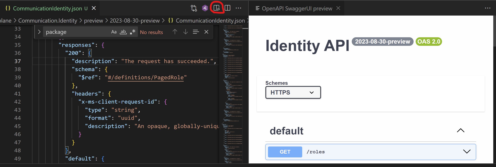

# Azure Communication Identity TypeSpec Specification

The TypeSpec and generated API specification for the Azure Communication Identity. For now, it only includes the definition for Roles APIs. 

## Development Environment

0. Change directory into the `specification\communication\Communication.Identity\` directory.

1. Install latest version of Node.js and ensure you are able to run the npm command in a command prompt:

   ```console
   npm --version
   ```

2. Install TypeSpec compiler and libraries:

   ```console
   npm install -g @typespec/compiler
   ```

3. (Optional) Install the TypeSpec extension for your editor of choice:

   - Visual Studio Code

     ``` console
     tsp code install
     ```

   - Visual Studio

     ``` console
     tsp vs install
     ```

4. Install node package dependencies:

   ```console
   tsp install
   ```

5. Compile TypeSpec to Swagger.  This will update the files in the directory `..\data-plane\Communication.Identity\<version-status>\<api-version>\CommunicationIdentity.json`:

   ```console
   npx tsp compile specification\communication\Communication.Identity
   ```

6. To re-generate examples, download and install the [OAV
   tool](https://github.com/Azure/oav) and run it: note: This directory is taken
   from [azure-rest-api-specs](https://github.com/Azure/azure-rest-api-specs),
   and the following commands should be run from there.

   ```console
   npm install -g oav@latest
   oav generate-examples <path to CommunicationIdentity.json>
   ```

## Testing and Viewing API as an Interface

1. Visit the official [Swagger Editor](https://editor.swagger.io/).

2. Copy the generated Swagger from `CommunicationIdentity.json` and paste it into the editor.

OR 

1. Install OpenAPI (Swagger) Editor extension in VS code 

2. Select the generated swagger `CommunicationIdentity.json` and open the swagger preview. 

