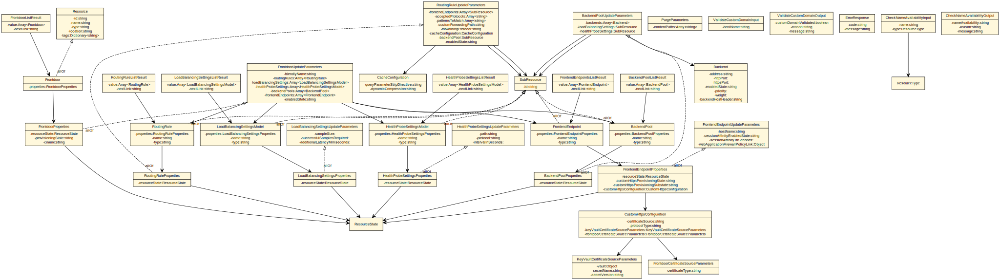

# General Availability API specification for FrontDoor Azure Resource
> see https://aka.ms/autorest

This directory contains the schema specifications for the Front Door Azure Resource.  The API will be added to support Front Door on Azure Resource Manager.

The base swagger document for new features for Frontdoor: [frontdoor.json](./frontdoor.json)

## Overview
The Front Door ARM API supports CRUD functionality on four objects in the resource schema:
`FrontDoor`, a collection of child objects `BackendPool`, a collection of child objects `FrontendEndpoints` and the primary child object `RoutingRule`, which each reference one `BackendPool` and `FrontendEndpoints` .  Each routing rule encapsulates
all of the settings needed to configure the AzureFD backend infrastructure to set up a 
reverse-proxy route to accelerate traffic, detect backend availability, 
and balance between healthy members of the pool.

## Generated object-model UML diagram
This diagram is generated from the swagger spec by "[`oav`](https://github.com/Azure/oav) `generate-uml`"

## Swagger and JSON specification reference and tools
- [OpenAPI specification v2.0 (aka Swagger 2.0)](https://github.com/OAI/OpenAPI-Specification/blob/master/versions/2.0.md)
- [Swagger.io online editor](https://editor.swagger.io/)
