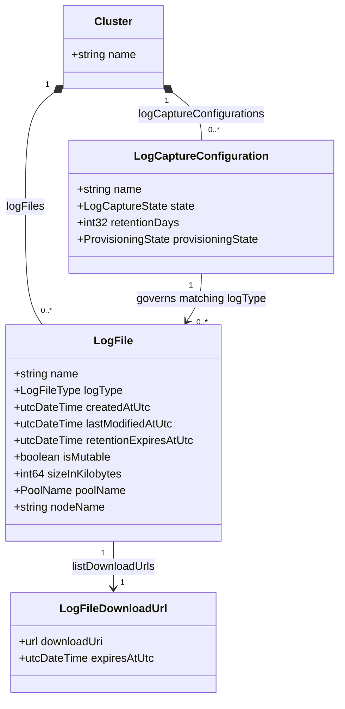
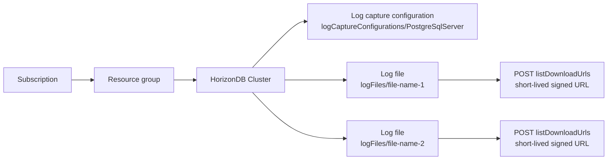
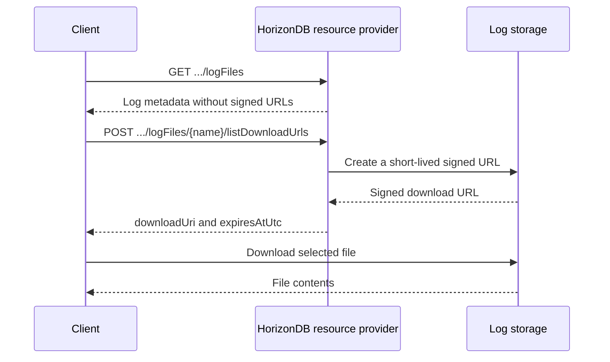
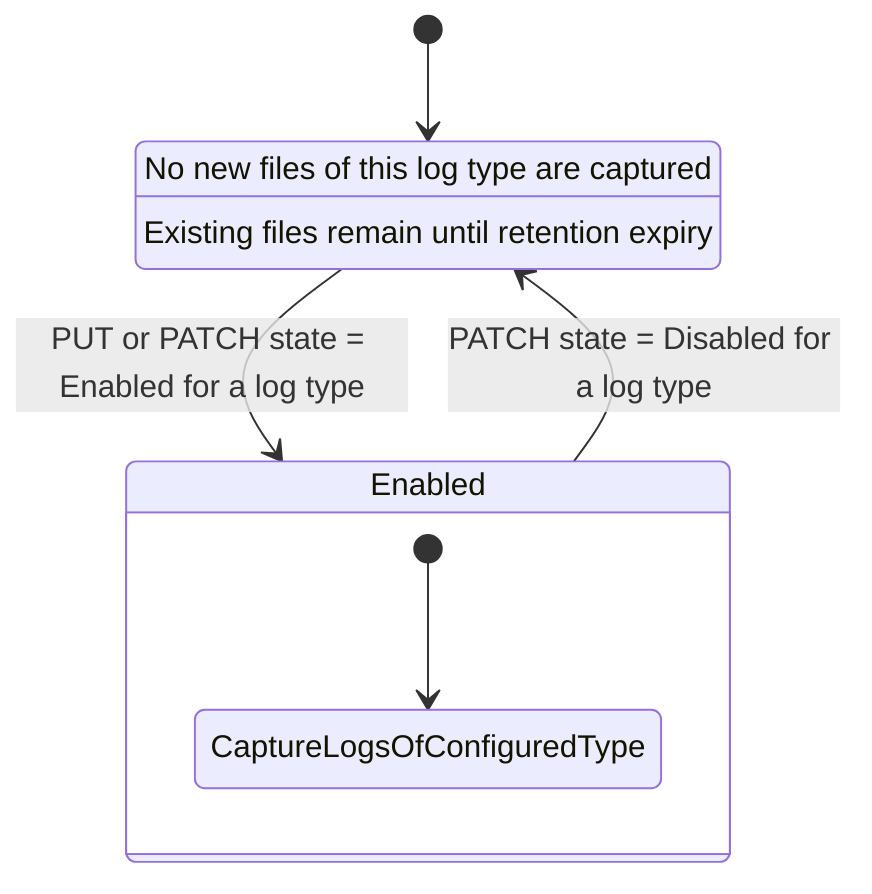

# HorizonDB log capture APIs

The `2026-10-01-preview` API adds Cluster child resources for configuring log capture by log type and for discovering generated log files.

Log compression and compressed log artifacts are not supported by this API version.

## Overview

A HorizonDB cluster can have multiple log capture configuration child resources and multiple service-generated log files. Each configuration independently controls whether one log type is captured and how long files of that type are retained.

The first version supports only the `PostgreSqlServer` configuration and log-file type. Future API versions can add `MajorVersionUpgrade` and other types as additional configuration child resources and `LogFileType` values.

The configuration resource name identifies the log type it governs. In this API version, the only supported name is `PostgreSqlServer`.

## Resource hierarchy

## Log capture configurations

Collection path:

`/subscriptions/{subscriptionId}/resourceGroups/{resourceGroupName}/providers/Microsoft.HorizonDb/clusters/{clusterName}/logCaptureConfigurations`

Individual resource path:

`/subscriptions/{subscriptionId}/resourceGroups/{resourceGroupName}/providers/Microsoft.HorizonDb/clusters/{clusterName}/logCaptureConfigurations/{logCaptureConfigurationName}`

The resource name is the configured log type. `PostgreSqlServer` is the only supported name in `2026-10-01-preview`. A future API version can introduce more names without changing the Cluster contract or requiring an array replacement.

A configuration is disabled by setting `state` to `Disabled`; it is not deleted. Disabling capture prevents new files of that type from being produced, while existing files remain available until their retention period expires.

### Properties

| Property | Type | Required on PUT | Description |
|---|---|---:|---|
| `state` | `Enabled` or `Disabled` | Yes | Enables or disables capture for the log type identified by the resource name. |
| `retentionDays` | Integer from 1 through 35 | Yes | Number of days files of this log type are retained. |
| `provisioningState` | Provisioning state | No | Read-only provisioning state of the configuration resource. |

`state` and `retentionDays` are optional on PATCH. An omitted PATCH property preserves its current value.

### Operations

| Method | Path | Operation | Behavior |
|---|---|---|---|
| GET | `.../logCaptureConfigurations` | `LogCaptureConfigurations_List` | Lists configured log types for a cluster. |
| GET | `.../logCaptureConfigurations/{logCaptureConfigurationName}` | `LogCaptureConfigurations_Get` | Gets one log-type configuration. |
| PUT | `.../logCaptureConfigurations/{logCaptureConfigurationName}` | `LogCaptureConfigurations_CreateOrUpdate` | Creates or replaces one log-type configuration. |
| PATCH | `.../logCaptureConfigurations/{logCaptureConfigurationName}` | `LogCaptureConfigurations_Update` | Updates selected settings for one log type. |

## Captured log files

Collection path:

`/subscriptions/{subscriptionId}/resourceGroups/{resourceGroupName}/providers/Microsoft.HorizonDb/clusters/{clusterName}/logFiles`

Log files are read-only, service-generated child resources. Customers cannot create, update, or delete individual files. Files expire according to the retention period of their matching log capture configuration.

### Properties

| Property | Type | Required | Description |
|---|---|---:|---|
| `logType` | `PostgreSqlServer` | Yes | Identifies the source category. Future API versions can add more values. |
| `createdAtUtc` | UTC date and time | Yes | Time at which the file was created. |
| `lastModifiedAtUtc` | UTC date and time | Yes | Most recent time at which the file was modified. |
| `retentionExpiresAtUtc` | UTC date and time | Yes | Retention deadline at which the captured file expires and becomes eligible for deletion. |
| `isMutable` | Boolean | Yes | Indicates whether the platform can still append to or modify the file. |
| `sizeInKilobytes` | Non-negative 64-bit integer | Yes | File size in KiB, where one kilobyte is 1024 bytes. |
| `poolName` | Pool name | Yes | Name of the pool that generated the file. |
| `nodeName` | String | Yes | Name of the node that generated the file. |

### Operations

| Method | Path | Operation | Behavior |
|---|---|---|---|
| GET | `.../logFiles` | `LogFiles_List` | Lists captured files and their metadata. |
| GET | `.../logFiles/{logFileName}` | `LogFiles_Get` | Gets metadata for one captured file. |
| POST | `.../logFiles/{logFileName}/listDownloadUrls` | `LogFiles_ListDownloadUrls` | Returns a short-lived signed download URL. |

## Download URL

The signed download URL is a bearer credential. It is excluded from routine GET and LIST responses and returned only by the `listDownloadUrls` POST action.

| Property | Type | Required | Description |
|---|---|---:|---|
| `downloadUri` | Secret URL | Yes | Short-lived signed URL for the captured log file. |
| `expiresAtUtc` | UTC date and time | Yes | Time at which the signed URL expires. |

`retentionExpiresAtUtc` on the log file is the file's retention deadline. `expiresAtUtc` in the action response applies only to the current signed URL. A client can request another signed URL while the file remains retained.

## Per-type capture behavior

